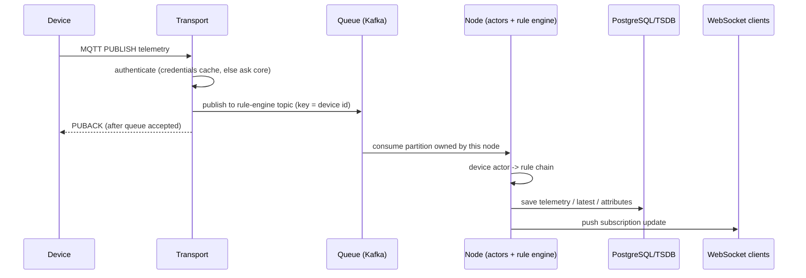

# 01 — ThingsBoard Deep Analysis (feature inventory, architecture teardown, opportunities)

> Baseline: ThingsBoard **4.3.x** (Active LTS), 4.2.x (Maintenance LTS), Edge 4.3, Mobile app 1.8.x. Sources: public ThingsBoard docs/release notes, checked Oct 2026. Items marked **(PE)** are Professional-Edition features. Anything under "Opportunities" is an *architectural hypothesis to validate with benchmarks*, not a measured claim.

---

## 1. Product family map

| Product | What it is | Licence | We need an equivalent? |
|---|---|---|---|
| ThingsBoard CE | Core platform: devices, telemetry, rule engine, dashboards, alarms | Apache-2.0 | Yes (P0) |
| ThingsBoard PE | CE + groups/roles, white-label, integrations, scheduler, reports, VCS, solution templates, SSO | Commercial | Selected (P1) |
| ThingsBoard Cloud | Managed PE on microservices, regions (NA/EU) | SaaS | Optional SaaS mode (P2) |
| ThingsBoard Edge (CE/PE) | Local ThingsBoard that syncs with cloud over gRPC | Apache-2.0 / commercial | Yes, reimagined in Go (P1) |
| IoT Gateway | Python agent bridging Modbus, OPC-UA, BLE, CAN, BACnet, etc. | Apache-2.0 | Yes, Go `field-gateway` (P1) |
| TBMQ | Separate high-throughput MQTT broker (CE/PE) | Apache-2.0 / commercial | Embedded broker + bridge (P1) |
| Trendz Analytics | Separate analytics/BI add-on | Commercial | Our analytics service (P2) |
| Mobile app (Flutter) + Mobile Center (PE) | Native app, branded app builder | Mixed | PWA first (P2) |
| IoT Hub | Marketplace for widgets, calculated fields, solutions | — | Plugin marketplace (P2) |

## 2. Feature timeline (tells you what the market demanded, in order)

| Release | Headline additions |
|---|---|
| 3.0 | SQL for entities (move off Cassandra-only), Angular 9 |
| 3.1 | Filters, alarm widget |
| 3.2 | **Tenant & device profiles**, OAuth2 |
| 3.3 | **Edge**, FOTA/OTA, LwM2M, SNMP |
| 3.4 | Git version control (PE), 2FA, queue configuration |
| 3.5 | **Notification center**, alarm assignment + comments |
| 3.6 | Isolated (per-tenant) queues, new card widgets |
| 3.7 | Java 17, new chart widgets |
| 3.8 | **SCADA**, dashboard layouts, timewindow redesign |
| 3.9 | Mobile app center, JS modules, high-performance SCADA symbols |
| 4.0 | **Calculated fields**, **EDQS**, new maps, Edge clustering |
| 4.1 | Cassandra 5, Valkey, unit conversion |
| 4.2 | Reporting 2.0, **AI rule node**, secrets management, wider VCS support |
| 4.3 | **Alarm Rules 2.0**, calculated fields (geofencing, propagation, aggregations), 2FA enforcement, API keys |

Reading: the trend is *profiles → edge → notifications → SCADA visuals → derived data (calculated fields) → AI → richer alarm model*. Our roadmap follows the same dependency order (stages 1–12).

---

## 3. Architecture teardown

### 3.1 Deployment modes
- **Monolith:** one JVM runs REST, WebSocket, actor system, rule engine, transports, with an in-memory queue.
- **Microservices:** *ThingsBoard Node* (REST, WebSocket, actors, rule engine, device connectivity state) + separate **transports** (MQTT, HTTP, CoAP, LwM2M, SNMP) + **JS executors** + **Web UI** + **Integration executor (PE)** + **VC executor (PE)** + **EDQS** (from 4.0) + **Kafka**, **Redis/Valkey**, **PostgreSQL** (+ optional Cassandra/Timescale for time-series), **service discovery** (ZooKeeper/Consul-style) for partition assignment.

### 3.2 Message path (device → dashboard)

Key properties to replicate: **partition by entity-ID hash → per-entity ordering**, ack to device after queue durability, transports are stateless apart from sessions, core pushes downlinks (attribute updates, RPC) to **the specific transport node holding the session** via a per-node topic.

### 3.3 Actor system
Hierarchy: *App actor → Tenant actor → Device actor / Rule chain actor → Rule node actors*. Each actor has a mailbox (ordering) and runs on a dispatcher pool. Device actors hold session subscriptions, pending RPCs, attribute caches and device-profile alarm state. Lesson: actors give ordering + isolation but cost memory per node/device; in Go we use **sharded executors** (see `services/09-rule-engine.md`).

### 3.4 Queues and processing semantics
- Named queues: Main, HighPriority, SequentialByOriginator (+ custom, + isolated per tenant since 3.6).
- **Submit strategies:** BURST, BATCH, SEQUENTIAL_BY_ORIGINATOR, SEQUENTIAL_BY_TENANT, SEQUENTIAL.
- **Processing strategies:** RETRY_ALL, RETRY_FAILED, RETRY_TIMED_OUT, RETRY_FAILED_AND_TIMED_OUT, SKIP_ALL_FAILURES, SKIP_ALL_FAILURES_AND_TIMED_OUT (with retries, pause between, pack size, pack processing timeout).
- Offsets committed per pack after processing → at-least-once.

### 3.5 EDQS (Entity Data Query Service, 4.0+)
Dashboards run entity/alarm queries constantly; executing them in SQL did not scale. EDQS builds an **in-memory read model** fed by Kafka topics (`edqs.events` ← core, `edqs.state` compacted snapshot, `edqs.requests` ephemeral queries). Takeaway: separate the **write model (Postgres)** from the **query model** early; see `services/03-core.md §EDQL`.

### 3.6 Storage
- **PostgreSQL:** entities, relations, attributes, alarms, events, audit, resources.
- **Time-series:** `ts_kv` (SQL, optionally Timescale hypertable or partitioned by day/month/year), `ts_kv_latest`, `ts_kv_dictionary` (key → int id); or Cassandra; or *hybrid* (entities in SQL, telemetry in Cassandra).
- **Cache:** Redis/Valkey + in-process caches (entities, credentials, attributes, latest values).
- **Events isolation:** debug/lifecycle events can go to a separate store so debug spikes don't hurt entity queries.

### 3.7 Edge sync (details we replicate and improve)
- Edge = full TB instance (PostgreSQL required) with its own rule engine/UI; one long-lived **bidirectional gRPC stream** to cloud (port 7070); handshake `ConnectRequestMsg` carries edge key/secret + protocol version.
- **Uplink:** edge writes events to local `cloud_event` queue → *Cloud Manager* sends batches (default 50) of `UplinkMsg`, cloud replies `UplinkResponseMsg` (ack) → ordered delivery after reconnect.
- **Downlink:** cloud writes assigned-entity changes to a per-edge downlink queue → `DownlinkMsg` → edge replies `DownlinkResponseMsg`.
- `SyncRequestMsg(fullSync=true)` re-pushes all assigned entities/rule chains/dashboards/credentials.
- Rule nodes **push to cloud / push to edge** bridge the two rule engines. Edge events may be stored in Kafka (3.9+); edge clustering (4.0+); message size cap (4 MB default).

---

## 4. Domain model inventory

| Group | Entities |
|---|---|
| Org | Tenant, TenantProfile, Customer (hierarchy in PE), User, UserCredentials |
| Things | Device, DeviceProfile, DeviceCredentials, Asset, AssetProfile, EntityView, Edge |
| Behaviour | RuleChain, RuleNode, Queue, CalculatedField, AlarmRule (2.0), Alarm, AlarmComment |
| UI | Dashboard, WidgetsBundle, WidgetType, Resource/Image, SCADA symbol, Mobile app/bundle |
| Lifecycle | OtaPackage, Rpc, Event, AuditLog, ApiUsageState |
| Comms | NotificationTarget/Template/Rule/Request/Notification, Integration & Converter (PE), OAuth2 client/Domain |
| PE | EntityGroup, Role, Scheduler event, Report, Blob entity, Solution template, White-label settings, Secret |

**Ownership:** every entity belongs to a tenant; customer-owned entities are visible to that customer's users. **Relations:** `(from, to, type, typeGroup, additionalInfo)` – free-form type names (`Contains`, `Manages`), queried by direction and depth.

---

## 5. Connectivity inventory

| Capability | ThingsBoard behaviour |
|---|---|
| Transports | MQTT (3.1/3.1.1, TLS, X.509), HTTP(S), CoAP(+DTLS), LwM2M (bootstrap, PSK/RPK/X.509, FOTA), SNMP (manager polling) |
| Credentials | ACCESS_TOKEN, X509_CERTIFICATE, MQTT_BASIC, LWM2M_CREDENTIALS |
| Payloads | JSON, Protobuf (schema in profile), custom topic filters, **Sparkplug B** in MQTT profile |
| Provisioning | DISABLED, ALLOW_CREATE_NEW_DEVICES, CHECK_PRE_PROVISIONED_DEVICES, X509 chain; bulk import; **claiming** by customer |
| Gateways | `v1/gateway/*` topics; one connection → many devices; gateway attributes/RPC |
| Device state | active/inactive via activity + inactivity timeout; events into rule engine |
| Profiles | Transport config, default rule chain/queue/dashboard, alarm rules, OTA defaults, provisioning |
| Mobile provisioning | BLE/SoftAP ESP32 provisioning (mobile app 1.6+) |

## 6. Data inventory

- **Data types:** bool, long, double, string, json.
- **Attributes:** scopes CLIENT (device-owned), SERVER (platform-only), SHARED (pushed to device).
- **Time-series APIs:** raw, latest, aggregated (MIN/MAX/AVG/SUM/COUNT/NONE) by interval, calendar interval types, limit/order, strict data types, delete ranges, TTL by tenant profile.
- **Persistence strategies (newer versions):** per message choose *persist*, *deduplicate* or *skip* for time-series, latest values and WebSocket updates.
- **Unit conversion (4.1):** store in base unit, present in user unit.
- **Query API:** entity filters (single, list, name, type, profile type, relations query, asset/device search queries…), key filters with predicates (string/numeric/boolean/complex, dynamic values), pagination, sorting by latest values; alarm queries; entity counts.
- **WebSocket API:** subscriptions for entity data (latest + time-series + history), alarm data, counts, notifications.

## 7. Rule engine inventory

| Category | Typical nodes |
|---|---|
| Filter | Script, switch, message-type filter/switch, originator-type filter/switch, check fields/relations/existence, GPS geofencing |
| Enrichment | Originator/customer/tenant/related attributes, originator telemetry (latest or range), entity details, device credentials, calculate delta |
| Transformation | Script, change originator, copy/rename/delete keys, JSON path, split array, deduplication, math function, aggregate latest/stream |
| Action | Save time-series/attributes, delete attributes, create/clear alarm, assign alarm, RPC request/reply, send email/SMS/notification, log, delay, generator, push to cloud/edge, create/delete relation, assign to customer, **send to calculated fields**, copy to view |
| External | REST API call, MQTT, Kafka, RabbitMQ, AWS SNS/SQS, Azure IoT Hub, GCP Pub/Sub, Slack, Twilio SMS, **AI request (4.2)** |
| Flow | Rule chain (nested), output, acknowledge, checkpoint |

Scripting: **TBEL** (fast expression language) or JavaScript. Debug mode captures input/output per node for a time window.

## 8. Calculated fields (4.0+) and Alarm Rules 2.0 (4.3)

| Calculated-field type | Behaviour |
|---|---|
| SIMPLE | One arithmetic expression over named arguments |
| SCRIPT | Multi-step logic, rolling windows, multiple outputs |
| GEOFENCING | INSIDE/OUTSIDE state + ENTERED/LEFT events vs zone groups |
| PROPAGATION | Copy/transform values up to parents or down to children along a relation path |
| RELATED_ENTITIES_AGGREGATION | min/max/avg/sum/count across related entities |
| ENTITY_AGGREGATION | Aggregate across all entities of a profile |

Arguments: attribute, latest telemetry, **time-series rolling window**. Output: telemetry or attribute, with an **output strategy** that can write directly to the database bypassing rule chains. Can chain via *Send to calculated fields*. AI-assisted configuration exists.

**Alarm Rules 2.0:** rules attach to device/asset **profiles or directly to a device, asset or customer**; severities; schedules; conditions (simple, duration, repeating, **"missing for"**, **script mode**); clear conditions; propagation; manage from the Alarms page; backwards compatible with profile rules.

## 9. Alarm inventory

Fields: type, originator, severity (CRITICAL/MAJOR/MINOR/WARNING/INDETERMINATE), status matrix (ACTIVE|CLEARED × UNACK|ACK), start/end/ack/clear timestamps, **assignee**, **comments**, details JSON, propagation flags (owner, tenant, relation types). One active alarm per *(originator, type)*; re-trigger updates severity/details.

## 10. Dashboards, widgets, maps

- **Layouts:** responsive grid, **SCADA fixed-column grid** (3.8), multiple *states* with per-state layouts, drill-down, popups.
- **Binding:** entity aliases (single, list, filter-by-type/profile/relations, state entity), filters, time window (real-time/history, quick/relative intervals, aggregation, grouping, timezone), data keys (time-series, attribute, entity field, alarm field, function).
- **Widget types:** timeseries, latest, RPC/control, alarm, static. Library groups: charts (line/bar/pie/range/state/radar), cards (value/progress/battery/signal/count), gauges, tables (entities, timeseries, alarms), maps (markers, polygons, routes, trip animation, image/floor-plan, heat), control (switch, button, slider, knob, terminal, LED), input forms, navigation, HTML/Markdown, **SCADA symbols**, gateway/edge widgets.
- **Actions:** navigate state, open dashboard, custom JS, update alias, mobile actions.
- **Management:** export/import JSON, public dashboards, customer assignment, iframe embedding, image library, JS modules, widget bundles; **Reporting 2.0 (PE)**; solution templates.

## 11. SCADA in ThingsBoard — what it is and is not

**Is:** SVG symbols + *tags* (named SVG elements), *behaviors* (value/action/widget-action bindings), *properties* (user-configurable), symbol editor, 100+ built-in symbols, high-performance variants (3.9), fixed-grid layout.
**Is not:** a SCADA *server*. There is no tag server/namespace, no driver layer beyond the gateway, no quality codes, no ISA-18.2 alarm lifecycle (shelving, suppression, flood KPIs), no select-before-operate control workflow with interlocks/four-eyes, no historian compression, no redundancy. → Large, defensible differentiation area (stage 10).

## 12. Users & security inventory

Roles: System admin, Tenant admin, Customer user (PE: custom roles on entity groups). Auth: JWT access+refresh, **2FA** (TOTP/SMS/email/backup; enforcement in 4.3), OAuth2 (Google, GitHub, Apple, custom), LDAP/SAML (PE), **API keys** (4.3), password policy, lockout, **secrets management** (4.2). Device security: token, basic, X.509, TLS/DTLS. Limits: per-tenant rate limits (transport msgs, REST, WebSocket, JS/rule executions), entity quotas, API-usage state (ENABLED → WARNING → DISABLED).

## 13. Notification center (3.5+)

Targets (platform users by filter, Slack, Teams), templates per channel (web inbox, email, SMS, Slack, Teams, mobile push), rules with triggers (alarm, alarm comment/assignment, device activity, entity action, rule-engine component lifecycle, rate-limit/API-usage/entity-limit, edge connection/communication failure, new platform version, resource shortage) and **escalation chains with delays**.

## 14. RPC, OTA, provisioning

- **RPC:** one-way/two-way; **persistent RPC** lifecycle QUEUED → SENT → DELIVERED → SUCCESSFUL | TIMEOUT | EXPIRED | FAILED; client-side RPC handled by rules.
- **OTA:** FIRMWARE/SOFTWARE packages (upload or URL), checksum algorithms, assigned via profile/device, device-reported state QUEUED → INITIATED → DOWNLOADING → DOWNLOADED → VERIFIED → UPDATING → UPDATED | FAILED, chunked download over MQTT/CoAP/HTTP/LwM2M.

## 15. PE and ecosystem features (candidates for stage 12)

Entity groups + roles; white-labeling (logo, colours, domain, login page, mail templates, translations); integrations & converters (HTTP, MQTT, Kafka, AWS, Azure, GCP, LoRaWAN servers, Sigfox, OPC-UA, TCP/UDP, CoAP, custom) with remote integrations; scheduler; reports; Git version control; solution templates; SSO; integration executor; mobile app builder.

## 16. Operations features

Events (lifecycle, error, debug, statistics), audit log, queue statistics, rule-node debug, tenant-profile limits and API usage dashboards, DB upgrade scripts, backups guidance, Prometheus metrics, health endpoints.

---

## 17. Opportunities (hypotheses to validate)

| Area | Observed limitation (architectural) | iotp response |
|---|---|---|
| Footprint | JVM + Postgres even at edge | Go static binary, SQLite/Pebble at edge |
| Edge autonomy | Edge is a full platform instance to operate and upgrade | Lightweight agent + optional full edge; A/B self-update |
| Rule engine DX | Debugging by sampling events; versioning/diff limited outside PE | Replayable traces, drafts/publish, Git-native, test harness |
| Timers | Delay/schedule semantics process-local | Durable timers (bus or DB backed) |
| Extensibility | New nodes need Java build; scripts are the main escape hatch | WASM plugins + SDKs, no core fork |
| SCADA | Visualization layer only | Tag server, quality, ISA-18.2, SBO, historian compression |
| OTA | Package assignment, limited rollout orchestration | Campaigns: waves, canary, gates, rollback, signing |
| Digital twin | Free-form relations | Typed schemas + graph queries |
| Time-series ops | Rollups/retention largely DIY on SQL | Built-in continuous aggregates, tiering, per-tenant TTL jobs |
| Multi-region | Separate regional deployments | Region-aware tenancy, data-residency tags |
| Observability | Metrics exist, tracing across services limited | OpenTelemetry end-to-end with trace-IDs in messages |
| RBAC (CE) | Three fixed roles | Policy-based RBAC/ABAC from day one |

---

## 18. Parity matrix (what we build, in what priority)

Legend: P0 MVP · P1 parity · P2 later/differentiator · Skip.

| Domain | Feature | Pri | Spec |
|---|---|---|---|
| Tenancy | Tenants, tenant profiles, quotas | P0 | services/03, 21 |
| Tenancy | Customers (hierarchy), users, roles | P0/P1 | services/02, 03, 26 |
| Auth | JWT, refresh, password policy, lockout | P0 | services/02 |
| Auth | 2FA, OAuth2/OIDC, API keys | P1 | services/02 |
| Auth | LDAP/SAML | P2 | services/26 |
| Entities | Devices, assets, profiles, relations, entity views | P0 | services/03, 04 |
| Entities | EDQL (entity data queries) + counts | P0 | services/03 |
| Devices | Credentials: token, basic, X.509 | P0 | services/04 |
| Devices | Provisioning (3 strategies), claiming, bulk import | P1 | services/04 |
| Transport | MQTT (JSON, gateway topics) | P0 | services/05 |
| Transport | HTTP | P0 | services/06 |
| Transport | CoAP, LwM2M, SNMP | P1/P2 | services/06 |
| Transport | Protobuf payloads, custom topics, Sparkplug B | P1 | services/05 |
| Data | Telemetry write/read/aggregate, latest | P0 | services/11 |
| Data | Attributes (3 scopes), shared push | P0 | services/11 |
| Data | Persistence strategies, TTL, unit conversion | P1 | services/11 |
| State | Device active/inactive | P0 | services/07 |
| Rules | Engine, queues, root chain, P0 nodes | P0 | services/09, 10 |
| Rules | Full node catalog, debug traces | P1 | services/10 |
| Rules | AI request node | P2 | services/10, 25 |
| Alarms | Lifecycle, ack/clear, assign, comments | P0/P1 | services/12 |
| Alarms | Alarm rules (profile + entity-level, missing-for, script) | P1 | services/12 |
| Notify | Email, SMS, Slack, Teams, push, inbox, escalation | P1 | services/13 |
| Realtime | WebSocket subscriptions (data, alarms, counts) | P0 | services/16 |
| UI | Dashboards, states, aliases, timewindow, ~60 widgets | P0/P1 | services/17, frontend/* |
| UI | Maps (markers, polygons, routes, image maps) | P1 | frontend/02 |
| RPC | One/two-way, persistent | P1 | services/14 |
| OTA | Packages, assignment, state tracking | P1 | services/15 |
| OTA | Campaigns, canary, rollback, signing | P2 | services/15 |
| Integrations | Converters + HTTP/MQTT/Kafka/cloud/LoRaWAN | P1 | services/18 |
| Gateway | Modbus, OPC-UA, BLE, CAN, BACnet connectors | P1/P2 | services/19 |
| Edge | Sync (full + delta), store-forward, local rules/UI | P1 | services/22, 23 |
| SCADA | Symbol editor + HMI widgets | P1 | frontend/04 |
| SCADA | Tag server, ISA-18.2, SBO, historian | P2 | services/24 |
| Analytics | Calculated fields (all 6 types) | P1 | services/25 |
| Analytics | Anomaly detection, forecasting, AI assistant | P2 | services/25 |
| Ops | Audit, events, usage/limits, metering | P1 | services/21 |
| Enterprise | Entity groups + roles, white-label, VCS, scheduler, reports | P1/P2 | services/20, 26 |
| Platform | Plugin SDK (WASM nodes, widgets, integrations) | P2 | stages/16 |
| Mobile | PWA; native later | P2 | frontend/01 |
