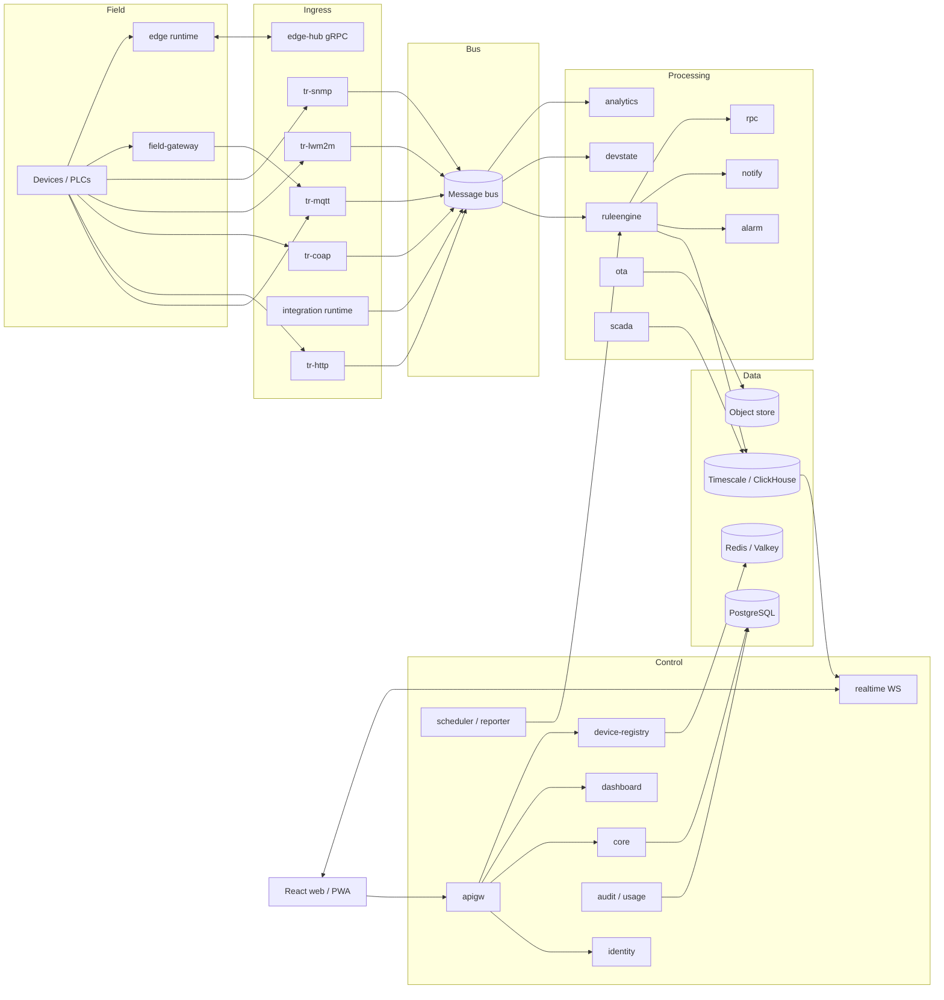
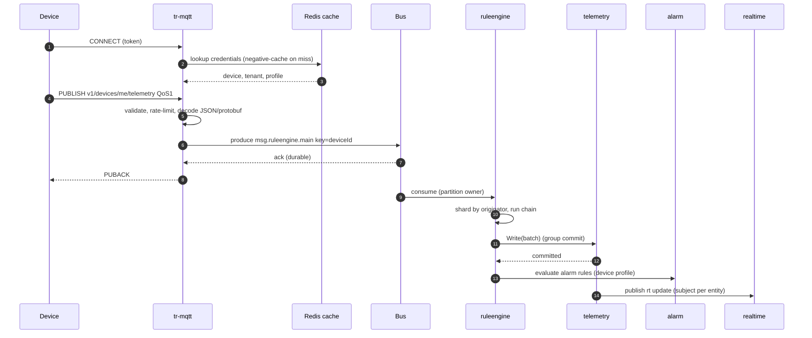
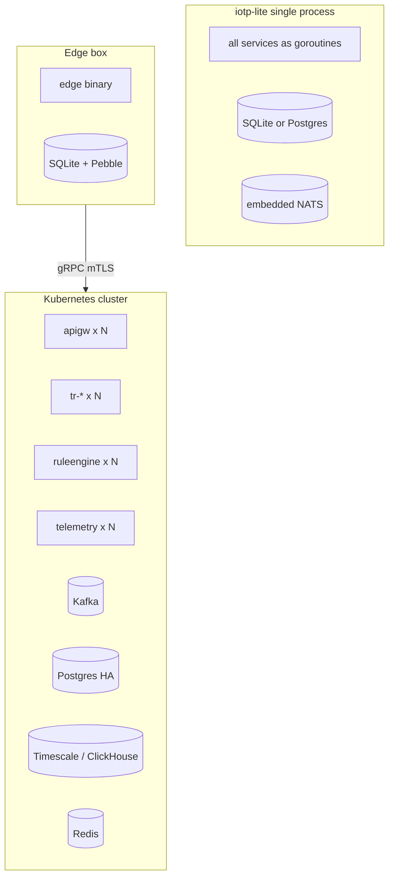

# 02 — Target Architecture

## 1. Design principles

1. **One codebase, three footprints:** lite (single process), cluster (microservices), edge (agent). Same domain packages, different composition roots.
2. **Event-driven core:** devices → bus → rule engine → stores. Synchronous calls only on control-plane paths.
3. **Partition by entity ID:** per-entity ordering and horizontal scale come from consistent partitioning, not distributed locks.
4. **Separate write model and query model:** Postgres is the system of record; read-heavy dashboard queries are served by indexes/read models (EDQL cache, latest-values store).
5. **Stateless where possible, partitioned-stateful where necessary:** transports and API are stateless (sessions excepted); rule engine, device-state and alarm evaluators own partitions.
6. **At-least-once + idempotent sinks.** Never "exactly-once" promises across services.
7. **Tenancy is enforced in three places:** auth token claims, repository layer (`tenant_id` in every query + Postgres RLS), and bus topic/headers.
8. **Everything observable:** trace-ID travels inside every message envelope.
9. **Pluggable infrastructure behind small interfaces:** `bus`, `tsstore`, `blobstore`, `cache`, `scriptengine`.
10. **Edge-first:** every cloud feature that matters on-site (rules, alarms, dashboards, SCADA) must run on the edge runtime from shared libraries.

## 2. Logical architecture

## 3. Service inventory

| Binary (`cmd/`) | Role | State | Scales by |
|---|---|---|---|
| `apigw` | REST/WS ingress, authn, rate limit, routing | stateless | requests |
| `identity` | Users, tokens, 2FA, OAuth2, permissions | Postgres + Redis | users |
| `core` | Entity domain, relations, EDQL, profiles, quotas | Postgres | entities |
| `devreg` | Credentials, provisioning, claiming (device-auth hot path) | Postgres + Redis | devices/auth rate |
| `tr-mqtt`, `tr-http`, `tr-coap`, `tr-lwm2m`, `tr-snmp` | Protocol transports | sessions | connections |
| `devstate` | Online/offline, last activity | partitioned memory | devices |
| `ruleengine` | Rule chains, queues, script sandbox | partitioned memory | msg/s |
| `telemetry` | Time-series + attributes write/read/aggregate | stores | data points/s |
| `alarm` | Alarm CRUD, lifecycle, rule evaluation hooks | Postgres | alarms |
| `notify` | Targets, templates, rules, delivery channels | Postgres | notifications |
| `rpc` | Persistent RPC, routing to session nodes | Postgres + bus | commands |
| `ota` | Packages, campaigns, chunk serving | object store | downloads |
| `realtime` | WebSocket subscriptions, fan-out | connections | WS sessions |
| `dashboard` | Dashboards, widgets, images, resources | Postgres + object store | — |
| `integration` | Converters + connector runtime (local or remote) | partitioned | integrations |
| `field-gateway` | Southbound protocol agent (on-prem) | local disk | devices per gateway |
| `scheduler`, `reporter` | Cron/timers, PDF/CSV reports | Postgres | jobs |
| `audit` (+usage) | Audit log, events, usage metering, limits | Postgres/ClickHouse | events |
| `edge-hub` | Cloud side of edge sync | per-edge cursors | edges |
| `edge` | Edge runtime | local DB | tags/devices |
| `scada` | Tags, historian, ISA-18.2 alarms, control | stores | tags |
| `analytics` | Calculated fields, stream analytics, ML hooks | partitioned | derived signals |

**Lite mode** links `core`, `devreg`, `tr-mqtt`, `tr-http`, `ruleengine`, `telemetry`, `alarm`, `notify`, `realtime`, `dashboard`, `identity`, `apigw` into one binary (`iotp-lite`) with the in-memory/NATS bus.

## 4. Primary flows

### 4.1 Telemetry ingestion

### 4.2 Downlink (RPC / shared attribute update)
`rpc` or `telemetry` finds the **session node** (Redis `session:{deviceId} → nodeId`), produces to `notify.transport.{nodeId}`; the transport writes to the MQTT/CoAP/HTTP session; ack/response flows back as a `msg.core` event. If the device is offline: RPC stays `QUEUED` (persistent) or fails fast (non-persistent).

### 4.3 Dashboard query
`UI → apigw → core(EDQL)`; cacheable results; live data via `realtime` subscription, not polling.

### 4.4 Edge sync
`edge ⇄ edge-hub` bidirectional gRPC stream with sequence numbers and acks (see `services/22-edge-hub.md`).

## 5. Partitioning and ownership

- **Unit of ownership = bus partition.** Key = `originatorId` (device/asset/tenant id). Hash: murmur3 over UUID bytes (same function in every producer).
- **Rule engine, devstate, analytics** consume partitions via consumer groups; each owns the in-memory state of the entities hashed to its partitions.
- **Rebalance protocol:** cooperative-sticky; on revoke → flush state, stop shards; on assign → lazy rebuild from Redis snapshot/DB. State is *derived and reconstructable*; durable truth is in stores.
- **Fencing:** state writers include `(partition, generation)`; stores reject writes from stale generations where relevant (device-state snapshots, alarm evaluator state).
- **Partition count:** choose ≥ 3× expected max consumer count (e.g. 48–96); changing it later re-maps keys — treat as a migration.

## 6. Delivery and ordering contract

| Hop | Guarantee |
|---|---|
| Device → transport | MQTT QoS 0 or 1; HTTP request/response; CoAP confirmable |
| Transport → bus | Ack-after-durable (acks=all / JetStream ack) |
| Bus → rule engine | At-least-once; commit offsets per pack after processing |
| Ordering | Per-originator, per-queue. No cross-originator order |
| Rule engine → stores | Idempotent upsert (`entity_id,key,ts`); alarms idempotent on `(originator,type)`; RPC on `rpc_id` |
| Retries | Per queue processing strategy; poison messages → DLQ topic after N attempts |

## 7. Storage layout

| Store | Holds | Notes |
|---|---|---|
| PostgreSQL | Entities, relations, profiles, alarms, RPC, audit, notifications, rule chains | RLS on `tenant_id`; Patroni/managed HA |
| TimescaleDB (default) / ClickHouse (scale) / SQLite (lite, edge) | Time-series + latest | Behind `tsstore.Store` |
| Redis/Valkey | Credential cache, session→node map, rate-limit counters, small hot caches | Cluster/Sentinel |
| Object store (S3/MinIO) | OTA binaries, images, resources, report outputs, exports | Signed URLs |
| Bus | Messages, snapshots (compacted), DLQ | Kafka (cluster), NATS JetStream (lite/edge) |
| Events DB (optional separate) | Debug/lifecycle events | Isolation from entity queries |

## 8. Tenancy and isolation levels

| Level | Isolation | Use |
|---|---|---|
| L1 | Shared everything + quotas/rate limits | Default SaaS |
| L2 | Dedicated rule-engine queue + worker pool + consumer group | Noisy tenants |
| L3 | Dedicated DB schema/database + time-series partition set | Compliance |
| L4 | Dedicated namespace/cluster/region | Regulated/enterprise |

`tenant_profile.isolation_level` drives routing; services read it from `core` via cache.

## 9. Deployment topologies

Multi-region: tenant → home region (data residency). Regions share only the identity directory (optional) and the plugin/marketplace catalogue.

## 10. Cross-cutting concerns

| Concern | Decision |
|---|---|
| Config | 12-factor env + file (`koanf`); typed structs; hot-reload only for limits/flags |
| Errors | Typed domain errors → HTTP/gRPC status mapping table in `pkg/errs` |
| Idempotency | `Idempotency-Key` header on mutating REST; message IDs in envelopes |
| Time | int64 epoch ms; monotonic clocks only for durations; device-ts sanity window (reject > now+10 min by default) |
| Backpressure | Bounded mailboxes; pause partitions when sinks slow; transports slow PUBACK / MQTT v5 quota reason codes |
| DLQ | `dlq.{domain}` topics with failure reason headers; replay tool in CLI |
| Rate limiting | Token bucket local + periodic Redis reconciliation; format `"1000:1,20000:60"` (N per T seconds) |
| Feature flags | Per tenant (`tenant_profile.features`) + global |
| Schema evolution | Protobuf with `buf breaking`; JSONB config with `schema_version` + migrators |

## 11. Capacity planning heuristics (validate with your own load tests)

| Component | Reference unit | Planning figure |
|---|---|---|
| `tr-mqtt` | 2 vCPU / 4 GB | 50–100 k idle connections; 10–20 k msg/s |
| `ruleengine` | 4 vCPU / 8 GB | 20–40 k msg/s for 3–5 node chains without external calls |
| Timescale primary | 16 vCPU / 64 GB NVMe | 50–100 k rows/s with batching + compression |
| ClickHouse node | 16 vCPU / 64 GB | 300 k–1 M rows/s ingest |
| `realtime` | 2 vCPU / 4 GB | ~50 k WebSockets; ~20 k updates/s fan-out |
| Kafka | 3 brokers | Partitions ≈ 3× peak consumers; replication 3 |

## 12. Failure modes

| Failure | Behaviour |
|---|---|
| Transport node dies | Devices reconnect (LB); sessions rebuilt; queued RPC re-routed to new node |
| Rule engine node dies | Partitions rebalance; uncommitted packs re-delivered; idempotent sinks absorb duplicates |
| Postgres failover | Control plane read-only briefly; ingestion continues (bus buffers); credentials served from Redis |
| TS store slow | Rule engine pauses consumption → lag grows → autoscale/alert; transports keep acking until bus quota |
| Redis down | Fallback to Postgres for credentials with per-node LRU; rate limits degrade to local |
| Cloud unreachable (edge) | Edge continues locally; store-and-forward with priority queues |
