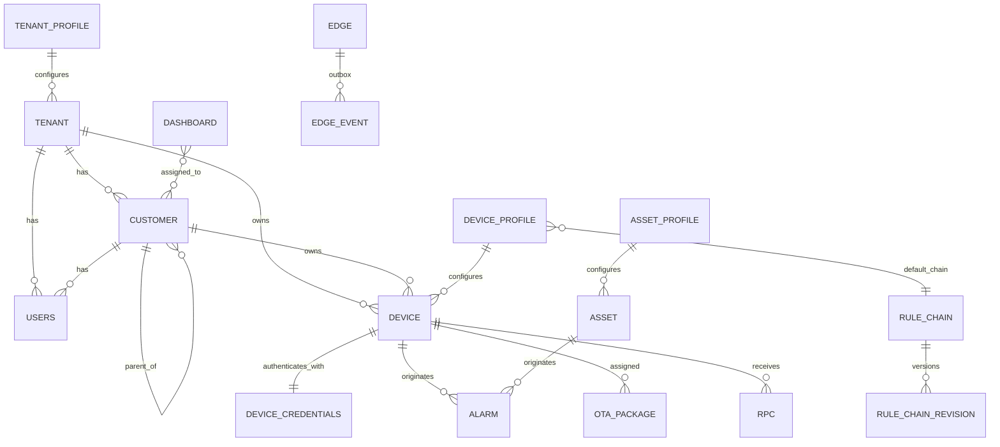

# 03 — Domain Data Model

> Authoritative reference for tables, JSON configuration schemas and tenancy rules. Service docs reference these names. DDL targets **PostgreSQL 16** (+ TimescaleDB for time-series). Migrations live in `db/migrations/` (goose or atlas); queries are generated with **sqlc**.

## 1. Conventions

| Rule | Detail |
|---|---|
| Primary keys | `uuid` generated in the application as **UUIDv7** (time-ordered → better index locality) |
| Tenancy | Every tenant-owned table has `tenant_id uuid NOT NULL` as the **first column of its main indexes**; Postgres **RLS** is a safety net, not the primary control |
| Time | `created_time bigint` = epoch ms. No `timestamptz` except in audit/operational tables where DB-side defaults help |
| Concurrency | `version integer NOT NULL DEFAULT 1` — optimistic locking (`UPDATE … WHERE id=$1 AND version=$2`) |
| Config blobs | `jsonb` with sibling `schema_version smallint`; migrators in code |
| Secrets | `*_enc bytea` envelope-encrypted (AES-256-GCM, data key wrapped by KMS key id stored alongside) |
| Soft delete | Not used for entities (hard delete + audit + events); use `deleted_at` only for users when GDPR retention requires |
| Names | `snake_case`, singular table names |
| Text search | `search_text tsvector` generated + GIN index on searchable entities |

## 2. Entity overview



Relations (`relation` table) connect *any two* entities of the same tenant (free-form `relation_type`, e.g. `Contains`, `Manages`).

## 3. Core DDL

```sql
-- ===== Extensions =====
CREATE EXTENSION IF NOT EXISTS pg_trgm;
CREATE EXTENSION IF NOT EXISTS btree_gin;
-- CREATE EXTENSION IF NOT EXISTS timescaledb;   -- when using Timescale

-- ===== Tenancy =====
CREATE TABLE tenant_profile (
  id uuid PRIMARY KEY, created_time bigint NOT NULL, name text NOT NULL,
  description text, is_default boolean NOT NULL DEFAULT false,
  isolation_level smallint NOT NULL DEFAULT 1,           -- 1..4 (see 02-architecture §8)
  profile_data jsonb NOT NULL,                           -- limits, features, queues (§5.2)
  schema_version smallint NOT NULL DEFAULT 1, version integer NOT NULL DEFAULT 1
);

CREATE TABLE tenant (
  id uuid PRIMARY KEY, created_time bigint NOT NULL,
  tenant_profile_id uuid NOT NULL REFERENCES tenant_profile(id),
  title text NOT NULL, region text, country text, state text, city text, address text,
  zip text, phone text, email text, additional_info jsonb,
  search_text tsvector GENERATED ALWAYS AS (to_tsvector('simple', coalesce(title,'')||' '||coalesce(email,''))) STORED,
  version integer NOT NULL DEFAULT 1
);

CREATE TABLE customer (
  id uuid PRIMARY KEY, created_time bigint NOT NULL,
  tenant_id uuid NOT NULL REFERENCES tenant(id) ON DELETE CASCADE,
  parent_customer_id uuid REFERENCES customer(id),
  title text NOT NULL, email text, phone text, country text, city text, address text,
  is_public boolean NOT NULL DEFAULT false, additional_info jsonb, version integer NOT NULL DEFAULT 1,
  UNIQUE (tenant_id, title)
);
CREATE INDEX customer_parent_idx ON customer (tenant_id, parent_customer_id);

-- ===== Identity =====
CREATE TABLE users (
  id uuid PRIMARY KEY, created_time bigint NOT NULL,
  tenant_id uuid REFERENCES tenant(id) ON DELETE CASCADE,     -- NULL for system admins
  customer_id uuid REFERENCES customer(id) ON DELETE CASCADE,
  authority text NOT NULL CHECK (authority IN ('SYS_ADMIN','TENANT_ADMIN','CUSTOMER_USER')),
  email text NOT NULL, first_name text, last_name text, phone text,
  additional_info jsonb, version integer NOT NULL DEFAULT 1,
  UNIQUE (email)
);
CREATE TABLE user_credentials (
  user_id uuid PRIMARY KEY REFERENCES users(id) ON DELETE CASCADE,
  password_hash text,                                     -- argon2id PHC string
  enabled boolean NOT NULL DEFAULT true,
  activate_token_hash text, reset_token_hash text, token_expires_at bigint,
  failed_attempts integer NOT NULL DEFAULT 0, locked_until bigint,
  password_changed_time bigint, last_login_time bigint,
  token_version integer NOT NULL DEFAULT 1                -- bump to revoke all JWTs
);
CREATE TABLE user_mfa (
  user_id uuid NOT NULL REFERENCES users(id) ON DELETE CASCADE,
  provider text NOT NULL CHECK (provider IN ('TOTP','SMS','EMAIL','BACKUP_CODE')),
  config_enc bytea NOT NULL, is_default boolean NOT NULL DEFAULT false,
  PRIMARY KEY (user_id, provider)
);
CREATE TABLE api_key (
  id uuid PRIMARY KEY, created_time bigint NOT NULL, tenant_id uuid NOT NULL, user_id uuid NOT NULL,
  name text NOT NULL, prefix text NOT NULL, key_hash bytea NOT NULL,   -- sha256(secret)
  scopes text[] NOT NULL, expires_at bigint, last_used_at bigint, revoked boolean NOT NULL DEFAULT false
);

-- ===== Profiles, devices, assets =====
CREATE TABLE device_profile (
  id uuid PRIMARY KEY, created_time bigint NOT NULL,
  tenant_id uuid NOT NULL REFERENCES tenant(id) ON DELETE CASCADE,
  name text NOT NULL, description text, image text, is_default boolean NOT NULL DEFAULT false,
  transport_type text NOT NULL DEFAULT 'DEFAULT',          -- DEFAULT|MQTT|COAP|LWM2M|SNMP
  provision_type text NOT NULL DEFAULT 'DISABLED',         -- DISABLED|ALLOW_CREATE_NEW_DEVICES|CHECK_PRE_PROVISIONED_DEVICES|X509_CERTIFICATE_CHAIN
  provision_device_key text,
  default_rule_chain_id uuid, default_edge_rule_chain_id uuid, default_dashboard_id uuid,
  default_queue_name text NOT NULL DEFAULT 'main',
  firmware_id uuid, software_id uuid,
  profile_data jsonb NOT NULL,                             -- transport/provisioning/alarm cfg (§5.1)
  schema_version smallint NOT NULL DEFAULT 1, version integer NOT NULL DEFAULT 1,
  UNIQUE (tenant_id, name)
);
CREATE UNIQUE INDEX device_profile_provision_key_uq ON device_profile (provision_device_key) WHERE provision_device_key IS NOT NULL;

CREATE TABLE device (
  id uuid PRIMARY KEY, created_time bigint NOT NULL,
  tenant_id uuid NOT NULL REFERENCES tenant(id) ON DELETE CASCADE,
  customer_id uuid REFERENCES customer(id) ON DELETE SET NULL,
  device_profile_id uuid NOT NULL REFERENCES device_profile(id),
  name text NOT NULL, label text, is_gateway boolean NOT NULL DEFAULT false,
  firmware_id uuid, software_id uuid, external_id text,
  additional_info jsonb, tags text[] NOT NULL DEFAULT '{}',
  search_text tsvector GENERATED ALWAYS AS (to_tsvector('simple', name||' '||coalesce(label,''))) STORED,
  version integer NOT NULL DEFAULT 1,
  UNIQUE (tenant_id, name)
);
CREATE INDEX device_customer_idx ON device (tenant_id, customer_id);
CREATE INDEX device_profile_idx  ON device (tenant_id, device_profile_id);
CREATE INDEX device_search_idx   ON device USING gin (search_text);
CREATE INDEX device_tags_idx     ON device USING gin (tags);

CREATE TABLE device_credentials (
  id uuid PRIMARY KEY, created_time bigint NOT NULL, tenant_id uuid NOT NULL,
  device_id uuid NOT NULL UNIQUE REFERENCES device(id) ON DELETE CASCADE,
  credentials_type text NOT NULL,                          -- ACCESS_TOKEN|X509_CERTIFICATE|MQTT_BASIC|LWM2M_CREDENTIALS
  lookup_id bytea NOT NULL UNIQUE,                         -- HMAC-SHA256(pepper, token) | cert sha256 | HMAC(clientId:username)
  credentials_enc bytea,                                   -- optional reversible copy for UI display
  basic_password_hash bytea                                -- HMAC for MQTT_BASIC password verification
);

CREATE TABLE asset_profile ( LIKE device_profile INCLUDING DEFAULTS );  -- simplified; own columns in real DDL
CREATE TABLE asset (
  id uuid PRIMARY KEY, created_time bigint NOT NULL,
  tenant_id uuid NOT NULL REFERENCES tenant(id) ON DELETE CASCADE,
  customer_id uuid REFERENCES customer(id) ON DELETE SET NULL,
  asset_profile_id uuid NOT NULL, name text NOT NULL, label text, additional_info jsonb,
  tags text[] NOT NULL DEFAULT '{}', version integer NOT NULL DEFAULT 1, UNIQUE (tenant_id, name)
);

CREATE TABLE entity_view (
  id uuid PRIMARY KEY, created_time bigint NOT NULL, tenant_id uuid NOT NULL, customer_id uuid,
  entity_id uuid NOT NULL, entity_type text NOT NULL, name text NOT NULL, type text NOT NULL,
  keys jsonb NOT NULL,          -- {"timeseries":[..],"attributes":{"cs":[..],"ss":[..],"sh":[..]}}
  start_ts bigint, end_ts bigint, additional_info jsonb, version integer NOT NULL DEFAULT 1
);

-- ===== Relations =====
CREATE TABLE relation (
  tenant_id uuid NOT NULL,
  from_id uuid NOT NULL, from_type text NOT NULL,
  to_id   uuid NOT NULL, to_type   text NOT NULL,
  relation_type_group text NOT NULL DEFAULT 'COMMON',      -- COMMON|DASHBOARD|RULE_CHAIN|EDGE...
  relation_type text NOT NULL, additional_info jsonb,
  PRIMARY KEY (from_id, relation_type_group, relation_type, to_id)
);
CREATE INDEX relation_to_idx ON relation (to_id, relation_type_group, relation_type, from_id);
CREATE INDEX relation_tenant_idx ON relation (tenant_id);
```

## 4. Data, alarms, rules, operations DDL

```sql
-- ===== Key dictionary (shared by attributes + time-series) =====
CREATE TABLE key_dictionary (key text PRIMARY KEY, key_id integer GENERATED ALWAYS AS IDENTITY UNIQUE);

-- ===== Attributes =====
CREATE TABLE attribute_kv (
  entity_id uuid NOT NULL, scope smallint NOT NULL,        -- 1=CLIENT 2=SERVER 3=SHARED
  key_id integer NOT NULL,
  bool_v boolean, str_v text, long_v bigint, dbl_v double precision, json_v jsonb,
  last_update_ts bigint NOT NULL, version bigint NOT NULL DEFAULT 0,
  PRIMARY KEY (entity_id, scope, key_id)
);

-- ===== Time-series (Timescale variant; see services/11) =====
CREATE TABLE ts_kv (
  entity_id uuid NOT NULL, key_id integer NOT NULL, ts bigint NOT NULL,   -- epoch ms
  bool_v boolean, str_v text, long_v bigint, dbl_v double precision, json_v jsonb,
  PRIMARY KEY (entity_id, key_id, ts)
);
-- SELECT create_hypertable('ts_kv','ts', chunk_time_interval => 86400000);
-- CREATE FUNCTION unix_now_ms() RETURNS bigint LANGUAGE sql STABLE AS $$ SELECT (extract(epoch FROM now())*1000)::bigint $$;
-- SELECT set_integer_now_func('ts_kv','unix_now_ms');
-- ALTER TABLE ts_kv SET (timescaledb.compress, timescaledb.compress_segmentby='entity_id,key_id', timescaledb.compress_orderby='ts DESC');
-- SELECT add_compression_policy('ts_kv', compress_after => 604800000);   -- syntax varies by Timescale version

CREATE TABLE ts_kv_latest (
  entity_id uuid NOT NULL, key_id integer NOT NULL, ts bigint NOT NULL,
  bool_v boolean, str_v text, long_v bigint, dbl_v double precision, json_v jsonb,
  PRIMARY KEY (entity_id, key_id)
);

-- ===== Alarms =====
CREATE TABLE alarm (
  id uuid PRIMARY KEY, created_time bigint NOT NULL, tenant_id uuid NOT NULL, customer_id uuid,
  type text NOT NULL, originator_id uuid NOT NULL, originator_type text NOT NULL,
  severity text NOT NULL CHECK (severity IN ('CRITICAL','MAJOR','MINOR','WARNING','INDETERMINATE')),
  acknowledged boolean NOT NULL DEFAULT false, cleared boolean NOT NULL DEFAULT false,
  assignee_id uuid, start_ts bigint NOT NULL, end_ts bigint, ack_ts bigint, clear_ts bigint, assign_ts bigint,
  details jsonb, propagate boolean NOT NULL DEFAULT false, propagate_to_owner boolean NOT NULL DEFAULT false,
  propagate_to_tenant boolean NOT NULL DEFAULT false, propagate_relation_types text[],
  isa_state text,                                          -- ISA-18.2 extension (stage 10), nullable
  version integer NOT NULL DEFAULT 1
);
-- exactly one ACTIVE alarm per (originator,type):
CREATE UNIQUE INDEX alarm_active_uq ON alarm (originator_id, type) WHERE cleared = false;
CREATE INDEX alarm_tenant_time_idx ON alarm (tenant_id, created_time DESC);
CREATE INDEX alarm_assignee_idx ON alarm (tenant_id, assignee_id) WHERE assignee_id IS NOT NULL;

CREATE TABLE entity_alarm (                                -- propagation index
  tenant_id uuid NOT NULL, entity_id uuid NOT NULL, alarm_id uuid NOT NULL, alarm_type text NOT NULL,
  customer_id uuid, created_time bigint NOT NULL, PRIMARY KEY (entity_id, alarm_id)
);
CREATE TABLE alarm_comment (
  id uuid PRIMARY KEY, created_time bigint NOT NULL, alarm_id uuid NOT NULL REFERENCES alarm(id) ON DELETE CASCADE,
  user_id uuid, type text NOT NULL, comment jsonb NOT NULL
);
CREATE TABLE alarm_rule (                                  -- Alarm Rules 2.0 style
  id uuid PRIMARY KEY, created_time bigint NOT NULL, tenant_id uuid NOT NULL, name text NOT NULL,
  scope text NOT NULL CHECK (scope IN ('DEVICE_PROFILE','ASSET_PROFILE','DEVICE','ASSET','CUSTOMER')),
  target_id uuid NOT NULL, enabled boolean NOT NULL DEFAULT true,
  config jsonb NOT NULL, schema_version smallint NOT NULL DEFAULT 1, version integer NOT NULL DEFAULT 1
);

-- ===== Rule engine =====
CREATE TABLE rule_chain (
  id uuid PRIMARY KEY, created_time bigint NOT NULL, tenant_id uuid NOT NULL,
  name text NOT NULL, type text NOT NULL DEFAULT 'CORE',   -- CORE|EDGE
  is_root boolean NOT NULL DEFAULT false, published_revision integer, additional_info jsonb,
  version integer NOT NULL DEFAULT 1, UNIQUE (tenant_id, type, name)
);
CREATE TABLE rule_chain_revision (
  rule_chain_id uuid NOT NULL REFERENCES rule_chain(id) ON DELETE CASCADE,
  revision integer NOT NULL, status text NOT NULL CHECK (status IN ('DRAFT','PUBLISHED','ARCHIVED')),
  definition jsonb NOT NULL,                                -- nodes + connections (§5.4)
  author_id uuid, comment text, created_time bigint NOT NULL,
  PRIMARY KEY (rule_chain_id, revision)
);
CREATE TABLE queue (
  id uuid PRIMARY KEY, tenant_id uuid NOT NULL, name text NOT NULL, topic text NOT NULL,
  partitions integer NOT NULL, submit_strategy jsonb NOT NULL, processing_strategy jsonb NOT NULL,
  consumer_per_partition boolean NOT NULL DEFAULT true, pack_size integer NOT NULL DEFAULT 100,
  pack_timeout_ms integer NOT NULL DEFAULT 2000, UNIQUE (tenant_id, name)
);

-- ===== Device operations =====
CREATE TABLE rpc (
  id uuid PRIMARY KEY, created_time bigint NOT NULL, tenant_id uuid NOT NULL, device_id uuid NOT NULL,
  request jsonb NOT NULL, response jsonb, status text NOT NULL, expiration_time bigint NOT NULL,
  retries smallint NOT NULL DEFAULT 0, one_way boolean NOT NULL DEFAULT false, persistent boolean NOT NULL DEFAULT true,
  additional_info jsonb
);
CREATE INDEX rpc_device_status_idx ON rpc (tenant_id, device_id, status);

CREATE TABLE ota_package (
  id uuid PRIMARY KEY, created_time bigint NOT NULL, tenant_id uuid NOT NULL, device_profile_id uuid,
  type text NOT NULL CHECK (type IN ('FIRMWARE','SOFTWARE')), title text NOT NULL, version text NOT NULL, tag text,
  url text, storage_key text, file_name text, content_type text,
  checksum_algorithm text, checksum text, data_size bigint, signature text, additional_info jsonb,
  UNIQUE (tenant_id, device_profile_id, type, title, version)
);

-- ===== Events & audit (partition by day) =====
CREATE TABLE event (
  id uuid NOT NULL, tenant_id uuid NOT NULL, entity_id uuid NOT NULL, event_type text NOT NULL,
  ts bigint NOT NULL, body jsonb NOT NULL, PRIMARY KEY (id, ts)
) PARTITION BY RANGE (ts);
CREATE TABLE audit_log (
  id uuid NOT NULL, created_time bigint NOT NULL, tenant_id uuid NOT NULL, customer_id uuid,
  entity_id uuid, entity_type text, entity_name text, user_id uuid, user_name text,
  action_type text NOT NULL, action_data jsonb, action_status text NOT NULL, failure_details text,
  prev_hash bytea, hash bytea,                              -- tamper-evident chain per tenant
  PRIMARY KEY (id, created_time)
) PARTITION BY RANGE (created_time);

-- ===== Edge outbox (cloud -> edge) =====
CREATE TABLE edge (
  id uuid PRIMARY KEY, created_time bigint NOT NULL, tenant_id uuid NOT NULL, customer_id uuid,
  name text NOT NULL, type text NOT NULL, label text, routing_key text NOT NULL UNIQUE, secret_hash bytea NOT NULL,
  root_rule_chain_id uuid, cert_fingerprint bytea, protocol_version integer, additional_info jsonb,
  version integer NOT NULL DEFAULT 1, UNIQUE (tenant_id, name)
);
CREATE TABLE edge_event (
  seq bigint GENERATED ALWAYS AS IDENTITY PRIMARY KEY, tenant_id uuid NOT NULL, edge_id uuid NOT NULL,
  event_type text NOT NULL, action text NOT NULL, entity_id uuid, body jsonb, ts bigint NOT NULL
);
CREATE INDEX edge_event_cursor_idx ON edge_event (edge_id, seq);
```

## 5. JSON configuration schemas

### 5.1 `device_profile.profile_data` (excerpt)
```json
{
  "transportConfiguration": {
    "type": "MQTT",
    "deviceTelemetryTopic": "v1/devices/me/telemetry",
    "deviceAttributesTopic": "v1/devices/me/attributes",
    "deviceAttributesSubscribeTopic": "v1/devices/me/attributes",
    "payload": { "type": "JSON" },
    "sparkplug": false,
    "sendAckOnValidationException": false
  },
  "provisioningConfiguration": { "type": "DISABLED", "provisionDeviceSecret": null },
  "dataPolicy": {
    "timeseries": { "strategy": "PERSIST", "dedupWindowMs": 0 },
    "latest":     { "strategy": "PERSIST" },
    "realtime":   { "strategy": "PERSIST" }
  },
  "defaultInactivityTimeoutSec": 600,
  "units": { "temperature": "degC" }
}
```

### 5.2 `tenant_profile.profile_data` (limits)
```json
{
  "entities": { "maxDevices": 10000, "maxAssets": 5000, "maxCustomers": 100, "maxUsers": 200, "maxDashboards": 500, "maxRuleChains": 50 },
  "rate": {
    "transportTenantMsg": "1000:1,20000:60",
    "transportDeviceMsg": "10:1,300:60",
    "transportTenantDataPoints": "5000:1",
    "restRequests": "100:1,2000:60",
    "wsUpdatesPerSession": "50:1,500:60",
    "customerRestRequests": "50:1"
  },
  "monthly": { "transportMsg": 50000000, "ruleEngineExecutions": 100000000, "scriptExecutions": 10000000, "dataPoints": 500000000 },
  "retention": { "timeseriesDays": 365, "alarmDays": 730, "eventDays": 7, "auditDays": 365 },
  "limits": { "maxWsSessionsPerTenant": 500, "maxRpcTimeoutSec": 3600, "maxOtaSizeMb": 512 },
  "features": { "edge": true, "scada": false, "customRuleNodes": true },
  "queues": [ { "name": "main" }, { "name": "highprio" } ]
}
```

### 5.3 `alarm_rule.config` (excerpt)
```json
{
  "alarmType": "High temperature",
  "createRules": {
    "CRITICAL": {
      "condition": { "type": "DURATION", "durationMs": 60000,
        "filters": [ { "key": {"type":"TIME_SERIES","key":"temperature"}, "valueType":"NUMERIC",
                       "predicate": {"op":"GREATER","value":{"constant":90,"dynamic":null}} } ] },
      "schedule": { "type": "ANY_TIME" }, "details": "Temp ${temperature}"
    }
  },
  "clearRule": { "condition": { "type": "SIMPLE", "filters": [ /* temperature <= 80 */ ] } },
  "propagate": { "toOwner": true, "toTenant": false, "relationTypes": ["Contains"] }
}
```
Condition types: `SIMPLE`, `DURATION`, `REPEATING`, `MISSING_FOR`, `SCRIPT`.

### 5.4 `rule_chain_revision.definition`
```json
{
  "firstNodeId": "n1",
  "nodes": [
    { "id": "n1", "type": "msg.type.switch", "name": "Route by type", "config": {}, "debug": {"failures": true, "all": false, "untilTs": 0}, "ui": {"x": 200, "y": 120} },
    { "id": "n2", "type": "action.save.timeseries", "name": "Save TS", "config": {"ttlSec": 0, "strategy": "PERSIST"}, "ui": {"x": 480, "y": 80} }
  ],
  "connections": [ { "from": "n1", "to": "n2", "label": "Post telemetry" } ],
  "ruleChainRefs": []
}
```

## 6. Tenancy enforcement snippet

```sql
ALTER TABLE device ENABLE ROW LEVEL SECURITY;
CREATE POLICY tenant_isolation ON device
  USING (tenant_id = current_setting('app.tenant_id', true)::uuid);
-- service role used by background workers: BYPASSRLS; API role: RLS on.
```
```go
// pkg/db: set tenant GUC at transaction start
func WithTenant(ctx context.Context, tx pgx.Tx, tenantID uuid.UUID) error {
    _, err := tx.Exec(ctx, "SELECT set_config('app.tenant_id', $1, true)", tenantID.String())
    return err
}
```

## 7. Credential lookup design (hot path)

1. Token → `lookup_id = HMAC_SHA256(pepper, token)`; cert → SHA-256 fingerprint; MQTT basic → `HMAC(pepper, clientId||0x00||username)`.
2. `devreg` caches `lookup_id → {deviceId, tenantId, profileId, type}` in Redis + process LRU (TTL 5–15 min, explicit invalidation on credential change).
3. **Negative cache** (30–60 s) for unknown IDs; per-IP failed-auth rate limit.
4. Raw tokens are never logged; stored only encrypted (optional) for UI display.

## 8. Index/retention checklist

- Partition `event`, `audit_log` by day or week; pre-create partitions via a job; drop by retention.
- Time-series: chunk interval 1 day (raise to 7 days for sparse data); compress after 7 days; per-tenant TTL via batched deletes keyed by tenant retention (hypertable retention policies are table-wide).
- Monitor bloat on `ts_kv_latest` and `attribute_kv` (high update rate) → `fillfactor=80`, aggressive autovacuum.
