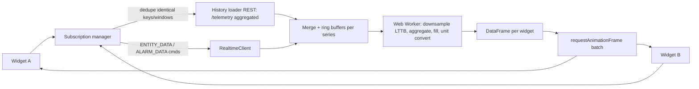

# Frontend 02 — Dashboard Widget Runtime & SDK

> **Stage:** 6 · **Packages:** `packages/widgets`, `packages/sdk`, `packages/charts` · **Server counterpart:** `services/17-dashboard-resources.md`

## 1. Concepts
| Term | Meaning |
|---|---|
| **Datasource** | Entity alias (or single entity) + list of **data keys** |
| **Data key** | `{type: TIME_SERIES | ATTRIBUTE | ENTITY_FIELD | ALARM_FIELD | FUNCTION, name, label, unit, decimals, color, postProcess}` |
| **Subscription** | Live stream + history for a widget's datasources under a **timewindow** |
| **Widget type** | `latest`, `timeseries`, `rpc` (control), `alarm`, `static` (+ `scada`) |
| **Timewindow** | Realtime (window, interval) or History (fixed/quick/relative), aggregation (`NONE, MIN, MAX, AVG, SUM, COUNT`), grouping interval, limit, timezone |
| **Alias / Filter** | Dashboard-level entity resolution and key filters (shared across widgets) |

## 2. Module contract (ESM)
```ts
export interface WidgetModule {
  init(ctx: WidgetContext): void | Promise<void>;       // mount into ctx.container
  onData?(frame: DataFrame, change: DataChange): void;  // batched per animation frame
  onResize?(size: { w: number; h: number }): void;
  onSettingsChanged?(settings: unknown): void;
  onThemeChanged?(theme: Theme): void;
  onEditModeChanged?(edit: boolean): void;
  destroy?(): void;
}

export interface WidgetContext {
  container: HTMLElement;                 // sandboxed host element or iframe body
  settings: unknown;                      // validated against manifest.settingsSchema
  data: DataFrame;                        // columnar, see §4
  timewindow: Timewindow;
  theme: Theme; i18n: I18n; units: Units; log: Logger;
  permissions: { canWrite(key?: string): boolean; canControl(key?: string): boolean };
  api: {
    rpc: { send(method: string, params?: unknown, opts?: { timeoutMs?: number; persistent?: boolean }): Promise<unknown> };
    attributes: { save(scope: 'SERVER'|'SHARED', kv: Record<string, unknown>): Promise<void> };
    scada?: { write(tagPath: string, value: unknown, reason?: string): Promise<WriteResult> }; // via control policy
  };
  actions: { trigger(name: string, event: { entity?: EntityRef; value?: unknown }): void };
  state: { go(stateId: string, params?: Record<string, unknown>): void; popup(dashboardId: string, state?: string): void };
}
```
Manifest (`manifest.json`): `fqn`, `name`, `type`, `version`, `defaultSize`, `dataKeys` constraints, `settingsSchema` (JSON Schema) + `settingsUi` (layout hints), `dataKeySettingsSchema`, `actions` (supported action sources: `onClick`, `onValueChange`…), `permissions`, `trust`, `i18n`.

## 3. Data pipeline

- **Dedup:** same `(entity, key, timewindow, agg)` shared by many widgets → one server subscription, many consumers.
- **Real-time window:** keep points within `[now - window, now]`; trim on a timer; **history prefill** then append updates with `ts > lastTs` (late/out-of-order points merged by binary search).
- **Aggregation on server** for history; **client-side aggregation** only for realtime tail when `interval` is set.
- **Downsampling:** `maxPoints = 2 × plotWidthPx`; LTTB for lines, min/max-per-bucket for envelopes; never downsample bar/state charts below their bucket size.
- **Units:** conversion through `ctx.units.convert(value, fromUnit, toUnit)` using the shared registry; display rounding uses `decimals`.
- **Backpressure:** if a frame exceeds budget (~8 ms), skip intermediate frames and deliver only the last `DataFrame`.

## 4. `DataFrame` (columnar, zero-copy to charts)
```ts
interface Series { key: string; label: string; entity: EntityRef; unit?: string;
                   ts: Float64Array; v: Float64Array | (string|boolean|object)[]; length: number; }
interface DataFrame { series: Series[]; latest: Map<string, LatestValue>; alarms?: AlarmPage; version: number; }
```
Latest widgets read `latest`; timeseries widgets read `series`; typed arrays feed uPlot directly.

## 5. Trust levels and sandboxing
| Level | Where it runs | Capabilities |
|---|---|---|
| `first-party` | Same realm (reviewed, signed, versioned in repo) | Full SDK, DOM access to its container |
| `tenant` (custom) | **Sandboxed iframe** `sandbox="allow-scripts"` (opaque origin) | SDK via postMessage bridge only |
| `marketplace` | Sandboxed iframe + per-widget capability prompt | Bridge with explicit scopes (e.g. `data.read`, `rpc.send:setSpeed`) |
**Bridge protocol:** structured-clone messages `{id, type, payload}`; host validates origin/source window, schema, capability and rate (default 200 msg/s); data frames sent as transferable typed arrays; widget gets no cookies/tokens; network blocked by iframe CSP (`default-src 'none'; script-src blob:`); watchdog kills widgets exceeding CPU/memory heuristics (long-task monitor) and shows a recoverable error tile. Widget bundles are fetched by hash and **signature-verified** before execution.

## 6. Actions
Sources: `onClick(row/point/marker)`, `onValueChange`, header button, cell button. Types: `openState`, `openPopup`, `openDashboard`, `updateAlias`, `setAttribute`, `rpcCall`, `scadaWrite` (control policy), `openUrl` (allow-list), `custom` (sandboxed function with limited ctx). Parameters can use `${entity.name}`, `${value}`, `${key:foo}`; **permission checks happen in the host** before executing.

## 7. First-party widget library (target ≈ 60)
| Group | Widgets |
|---|---|
| Charts | Line/area/bar (time), stacked, step, **range**, **state timeline**, heatmap, scatter, pie/doughnut, radar, candlestick, histogram |
| Cards (latest) | Value, value with trend/sparkline, progress, battery, signal strength, count/alarm count, range indicator, status LED, key-value list, entity count |
| Gauges | Radial, linear, digital, compass, thermometer |
| Tables | Entities, time-series table, alarms (with ack/clear/assign), attributes, entity hierarchy tree |
| Maps | Markers (clustered), polygons/circles (geofences), routes/trip animation, heatmap, **image map** (floor plans, relative coords), tracking by alias |
| Control | Switch, button, slider, knob, round switch, setpoint input, RPC terminal, command history, multi-state selector |
| Input | Update attribute form, date/time pickers, entity selector, JSON editor |
| Navigation/static | Navigation cards, markdown/HTML (sanitised), image, iframe (allow-list), clock, weather |
| Platform | Notifications inbox, device state summary, OTA progress, edge status, usage cards, audit tail |
| SCADA | Symbol runtime widget, alarm banner, alarm summary, trend pens, control faceplate |

## 8. Chart engines
- **uPlot** for high-rate numeric time-series (100 k points, canvas, synchronised cursors across charts, streaming append, thresholds/markers, zoom/pan with history reload).
- **ECharts** for non-time-series and rich types (pie, radar, heatmap, candlestick, sankey).
- Shared **chart theme** from design tokens; legends with show/hide, stats (min/max/avg/last); accessibility: data table fallback + keyboard focus on points.
- **Perf targets:** 10 series × 10 k points render < 16 ms per update; 20 charts on a dashboard sustain 1 update/s without jank.

## 9. Maps
MapLibre GL (vector tiles; OSM/Protomaps; custom styles; **offline tile packs** for edge), layer API for markers/clusters/polygons/routes; marker content via sanitised HTML templates with `${key}`; route playback with time slider; geofence editor (draw polygon/circle → save to attribute/zone group); image-map uses a flat CRS with pixel coordinates and optional rotation.

## 10. Developer experience (extensions)
`iotp-widget` CLI: `create` (templates: latest/timeseries/rpc/alarm), `dev` (Vite dev server **mounted inside a live dashboard** of a chosen tenant with HMR and mock-data mode), `build` (ESM + manifest validation + size budget), `test` (mock `ctx` harness), `pack` (`.iotpwidget`), `publish` (sign + upload). Typed `@iotp/widget-sdk` with docs and examples; Storybook stories per widget; a compatibility matrix (`sdkVersion` range in manifest).

## 11. Testing
Unit tests per widget with mock ctx; golden **DataFrame** pipeline tests (merge, trim, late data, aggregation, units); visual regression for each widget (light/dark, sizes); sandbox escape tests (attempt `fetch`, `window.parent`, storage, cookies); fuzz bridge messages; perf benchmarks in CI with thresholds.

## 12. Task checklist
- [ ] SDK types + manifest schema + module contract
- [ ] Subscription manager + dedupe + history/realtime merge + worker pipeline
- [ ] Timewindow model + aliases/filters resolver
- [ ] Sandbox host (iframe bridge, capability checks) + signature verification
- [ ] Actions engine with permission gate
- [ ] Core widgets: value card, line chart, gauge, entities table, alarms table, switch/button, map markers
- [ ] Remaining library groups; image map; trip animation
- [ ] CLI + dev-in-dashboard + docs site
- [ ] Perf/visual/sandbox test suites
