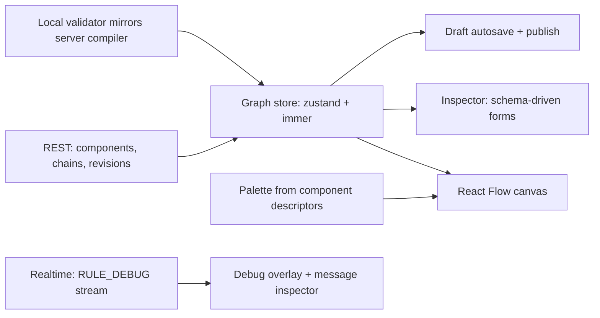
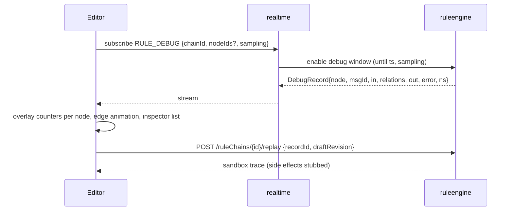

# Frontend 03 — Rule Chain Editor

> **Stage:** 4 (basic), 6 (debug/replay), later (collab) · **Package:** `packages/rule-editor` · **Server counterpart:** `services/09-rule-engine.md`, `services/10-rule-nodes-catalog.md`

## 1. Goals
A fast, keyboard-friendly visual editor for rule chains that is **schema-driven** (new nodes appear without UI releases), makes **debugging first-class** (live traces, replay), and supports **versioned drafts** with diffs.

## 2. Architecture

- **Descriptor-driven:** `GET /components` returns `Descriptor{type, name, category, relations, configSchema, uiSchema, docs, version, sideEffects}` → palette, node rendering (ports = relations), inspector forms (JSON Schema → RJSF with custom widgets).
- **Store model:** normalised maps `nodes{id→Node}`, `edges{id→Edge}`, `selection`, `viewport`, `dirty`, `validation`, `history` (undo/redo via patches; cap 200 steps), `debugOverlay{nodeId→counters}`.

```ts
interface RuleNode { id: string; type: string; name: string; config: unknown; debug: DebugSettings; ui: { x: number; y: number }; }
interface RuleEdge { id: string; from: string; to: string; label: string; }  // label = relation name
interface Descriptor { type: string; name: string; category: Category; relations: string[] | 'dynamic';
                       configSchema: JSONSchema; uiSchema?: UiSchema; docs?: string; version: number; }
```

## 3. Editing UX
| Feature | Behaviour |
|---|---|
| Canvas | Pan/zoom, minimap, snap-to-grid, multi-select (box/shift), align/distribute, group move, fit-to-view |
| Palette | Searchable by name/category/keyword; drag-drop or **quick-add** (double-click canvas → type to filter → Enter); recently used |
| Connections | Drag from relation port; **label picker** limited to the node's valid relations; multiple labels on the same edge pair allowed; prevent duplicates; hover shows label |
| Inspector | Tabs: *Config* (schema form), *Debug*, *Docs*; script fields open **Monaco** with type hints for `msg`, `metadata`, `msgType` and template autocompletion for `${…}` / `$[…]` |
| Custom field widgets | script editor, key/value list, relation-query builder, entity selector, template string, JSON path, duration, secret picker (`${secret:name}`) |
| Validation | Live: unreachable nodes, missing required config, invalid relation labels, disconnected `Failure` leaf warnings, cycle detection, nested-chain reference checks; issues panel with click-to-focus; **Publish disabled** while errors exist |
| Undo/redo | Patch-based; grouped by interaction; survives inspector edits |
| Clipboard | Copy/paste nodes (+ internal edges) as JSON, cross-chain and cross-tab; paste-as-new-chain |
| Auto layout | `elkjs` layered layout (left→right), preserves manual pins |
| Search / command palette | Find nodes by name/type/config text; jump to node; run commands (`⌘K`) |
| Nested chains | `flow.rule_chain` node shows link; double-click opens target in a breadcrumb stack; output labels derived from target's `flow.output` nodes |
| Shortcuts | `Del` delete, `⌘Z/⇧⌘Z`, `⌘C/V`, `⌘D` duplicate, `⌘S` save draft, `⌘Enter` publish, `/` search, arrows move selection |
| Import/Export | JSON (our format; optional ThingsBoard rule-chain import mapper for migration), PNG/SVG snapshot, share link to a specific revision |

## 4. Revisions: draft → publish
- **Autosave** draft every 3 s of inactivity (`PUT /ruleChains/{id}/draft` with `If-Match`); conflicts show a merge dialog (3-way on JSON by node id).
- **Publish** → server compiles/validates → returns errors mapped to node ids; success increments revision, hot-reloads engines.
- **History:** list of revisions (author, comment, time); **diff view**: side-by-side visual (added/removed/changed nodes highlighted, edge changes) + JSON diff; restore as new draft; tag revisions (`prod-2026-10`).
- **Edit lock** (soft): `lock` heartbeat shows who is editing; steal-lock with notice; optional real-time collaboration via Yjs (P2).

## 5. Debugging and testing

- **Overlay:** per-node badges (msgs/s, failures, p95 ms), red outline for failing nodes, animated edges for last N messages.
- **Message inspector:** table of recent records with filters (failures only, by device); expand → side-by-side input/output (JSON viewer with diff), metadata, relations taken, duration, error stack-safe text.
- **Replay:** pick a recorded input → run against the **draft** in a sandbox (external effects stubbed using `sideEffects`) → compare trace with production behaviour; **Test script** dialog for script nodes (sample msg/metadata → output/logs).
- **Debug controls:** enable *failures only* / *all* for 15 min (default) per node or whole chain with sampling slider; auto-off countdown visible.

## 6. Performance and a11y
- React Flow with `onlyRenderVisibleElements`, memoised node components, edge label virtualisation, throttled drag updates; target 500 nodes at 60 fps pan/zoom; layout offloaded to worker.
- Keyboard navigation across nodes (arrow keys by spatial neighbour), ARIA labels (`Node X, type filter.script, 2 outputs`), focus ring, screen-reader announcements for validation changes; high-contrast theme; no colour-only encoding of relations (labels + line styles).

## 7. Testing
Unit: store reducers, validator parity with server (shared JSON fixtures of valid/invalid chains → same errors), clipboard round-trip; component tests for inspector forms from sample schemas; E2E (Playwright): build a chain via keyboard only, publish, send test message, see trace; visual snapshots of canvas states; perf test generating 500-node chains.

## 8. Task checklist
- [ ] Descriptor fetch + palette + canvas + store
- [ ] Schema-driven inspector with custom widgets (script/Monaco, templates, secrets)
- [ ] Connection rules + validator parity + issues panel
- [ ] Undo/redo, clipboard, auto-layout, search/palette, shortcuts
- [ ] Draft autosave, revisions, diff, publish flow, edit lock
- [ ] Debug stream overlay + message inspector + replay + script tester
- [ ] Nested chain navigation; import/export (+ TB importer stretch)
- [ ] A11y pass; perf benchmark; E2E suite
