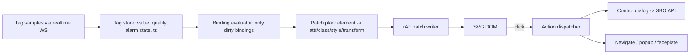

# Frontend 04 — SCADA Symbols, HMI Runtime & Editor

> **Stage:** 6 (symbol widget, parity with TB SCADA), 10 (HMI studio, ISA-101 operator UX) · **Package:** `packages/scada` · **Server counterpart:** `services/24-scada.md`

## 1. Goals
(1) Parity with ThingsBoard-style **SVG symbols with tags, behaviours and properties**; (2) a real **HMI runtime** (screens, faceplates, alarm banner/summary, trends, safe control dialogs) bound to the **tag namespace**; (3) an **HMI studio** for engineers; (4) smooth rendering of 1 000+ animated elements.

## 2. Symbol format (`.iotpsym` = SVG + metadata)
```xml
<svg xmlns="http://www.w3.org/2000/svg" viewBox="0 0 200 120" data-iotp-symbol="1">
  <metadata id="iotp-meta">
  {
    "title": "Pump",
    "category": "pumps",
    "tags": [
      { "name": "body",  "role": "shape",  "elementId": "pump-body" },
      { "name": "label", "role": "text",   "elementId": "pump-label" },
      { "name": "impeller", "role": "shape", "elementId": "impeller" }
    ],
    "properties": [
      { "id": "runColor",  "type": "color",  "default": "#2e7d32", "label": "Running color" },
      { "id": "faultColor","type": "color",  "default": "#c62828", "label": "Fault color" },
      { "id": "title",     "type": "string", "default": "P-101" }
    ],
    "behaviors": [
      { "id": "running",  "kind": "value",  "valueType": "BOOL",   "label": "Running" },
      { "id": "fault",    "kind": "value",  "valueType": "BOOL",   "label": "Fault" },
      { "id": "speed",    "kind": "value",  "valueType": "DOUBLE", "label": "Speed (%)" },
      { "id": "start",    "kind": "action", "label": "Start", "control": { "sbo": true, "confirm": "Start pump?" } },
      { "id": "openFace", "kind": "widgetAction", "label": "Open faceplate" }
    ],
    "animations": [
      { "target": "pump-body", "when": "fault", "set": { "fill": "prop:faultColor" } },
      { "target": "pump-body", "when": "running && !fault", "set": { "fill": "prop:runColor" } },
      { "target": "impeller",  "when": "running", "rotate": { "rpm": "speed * 30" } }
    ]
  }
  </metadata>
  <g id="pump-body">…</g><text id="pump-label">P-101</text><g id="impeller">…</g>
</svg>
```
- **Tags** name SVG elements; **properties** are instance settings; **behaviours** are the symbol's inputs/outputs (value bindings, actions, widget actions); **animations** declare reactions (kept declarative so the runtime can optimise).
- **Sanitiser:** server and client strip scripts, event handlers, external refs, `foreignObject`; metadata validated by JSON Schema; max size 1 MB, max 5 000 elements.
- **Libraries:** built-in sets (pumps, valves, tanks, pipes, motors, sensors/instruments, conveyors, HVAC, electrical one-line, building/floor, process equipment) in **two styles**: *standard* and **high-performance (ISA-101)**: greyscale, colour only for abnormal/alarm, minimal gradients. Tenants can upload/derive their own.

## 3. Expression language (shared between server and client)
Single dialect for animation conditions, derived tags and interlocks: arithmetic/boolean/ternary, comparisons, `in`, string/number helpers (`round`, `clamp`, `format`, `abs`, `min`, `max`), `quality(tag)`, `alarmState(tag)`, `now()`. **Go side:** `expr-lang/expr`. **Browser side:** a small interpreter over the same validated AST (server returns compiled AST on save → client never `eval`s strings). Conformance suite shares test vectors across both implementations.

## 4. Runtime binding engine

- **Dependency index:** `tag → [binding ids]`; a sample marks only affected bindings dirty; evaluation results diffed against last applied values; **no React re-render per update** — React hosts the container, a vanilla engine mutates the SVG.
- **Animation primitives:** fill/stroke/opacity by value/state/range (colour maps with thresholds), **visibility**, rotate/scale/translate (CSS transforms, GPU), **fill level** (clipPath or rect height), **blink** (CSS animation class, 1 Hz/2 Hz per ISA priority), **flow** (`stroke-dashoffset` animation with speed mapped to value), text formatting (units, decimals), bar/gauge needle.
- **Quality visuals:** `Bad` → hatch overlay/`?` badge, `Uncertain` → dimmed with outline, stale → grey + age tooltip; never rely on colour alone.
- **Alarm visuals:** per ISA-18.2 state: unacknowledged = flashing outline + priority shape; acknowledged = steady; RTN-unack = outline with checkmark; shelved/suppressed/out-of-service badges.
- **Performance rules:** max 30 fps apply loop (adaptive: 60 when < 200 dirty), pause when tab hidden/screen off-canvas (IntersectionObserver), reuse `<use>` for repeated symbols, CSS variables for colour themes, avoid layout-triggering properties, `will-change: transform` only on rotating elements, limit simultaneous flow animations (budget 200). **Target:** 1 000 animated elements @ 30 fps on a mid-range laptop; 300 on a Raspberry Pi 4 kiosk.

## 5. HMI screens and navigation
- **Screen** = fixed-resolution canvas (e.g., 1920×1080, scaled to fit with letterbox) or responsive grid (TB-style SCADA layout) + layers + background (image/drawing).
- **Hierarchy:** Overview → Area → Equipment faceplate; breadcrumbs; screen tree mirrors the tag namespace; **templates** and **faceplates** (UDT-bound popups with parameters like `{{pump}}`) so 500 pumps share one faceplate.
- **Operator chrome:** top **alarm banner** (N highest-priority unacknowledged alarms, ack button), left/bottom nav, status bar (user, access level, comms status, time sync), **alarm summary** (filter/sort/shelve), **alarm history/SOE**, **trend popups** (pens preset per equipment), **control dialogs** (select → confirm text → reason → optional approver → operate; shows feedback state pending/confirmed/failed), **lock/mode indicators** (Auto/Manual/Maintenance/Lockout).
- **Modes:** Operator (read/control per permissions), Engineer (live edit), Kiosk (fullscreen, idle lock, no browser UI), Multi-monitor (screen pinning via URL), Touch (min 44 px targets).

## 6. ISA-101 style guide (built into theme)
Neutral grey background; colour reserved for **abnormal states and alarms**; consistent priority colours **plus shapes** (Critical ◆, Major ▲, Minor ■, Advisory ●) for colour-blind safety; no 3D/gradients/animated decoration; numeric values with units and limits visible; consistent placement of navigation, alarms, and control areas. Provide a **lint** in the studio flagging violations (low contrast, too many colours, missing units, unlabeled controls).

## 7. HMI studio (editor)
| Area | Features |
|---|---|
| Canvas | Pan/zoom, rulers, snap/guides, layers, lock/hide, grouping, alignment/distribution, multi-select, rubber-band, keyboard nudging |
| Library | Browse/search symbols by category/style; drag in; recent; import SVG (sanitised) with auto-tagging helper; export |
| Binding panel | Bind symbol behaviours to **tag paths** (tag browser with search by path/type/UDT), expression editor with autocomplete and live preview; bulk-bind by naming pattern (`Pump*/Run`) |
| Animation designer | Visual rules builder (conditions → style changes) writing to the declarative `animations` model; thresholds editor with colour ramps |
| Properties inspector | Symbol properties (schema forms), size/position, z-order |
| Faceplates/templates | Create parametrised templates from selected objects; parameter table; instantiate N copies from a tag list (UDT instances) |
| Preview/simulator | Runtime preview with **mock tag values** (sliders, random walks, scenario scripts), alarm simulation, quality/comm-loss toggles |
| Validation | Unbound behaviours, missing tags, type mismatches, stale expressions, unlabeled controls, ISA-101 lint, performance budget estimate (elements, animations) |
| Versioning | Draft/publish with diff, rollback, Git export (JSON + SVG), screen-level permissions |
| Collaboration | Edit lock per screen; comments (P2) |
Tech: custom SVG scene graph with a normalised store (nodes, transforms, bindings), `immer` patches for undo/redo, Selection/Transform handles (own implementation or `moveable`), Monaco for expressions, worker-based SVG optimisation (SVGO profile that preserves ids/metadata).

## 8. Safety in the UI
UI never writes raw device values: every control action goes through `scada.write` (**SBO API**) with server-side policy; the UI shows **why** a control is disabled (permission, interlock text, mode, comms bad); critical actions require **recent re-auth** (step-up) and display an irreversible-action warning; dialogs time out; all actions return a trace id shown in the audit link.

## 9. Testing
Visual regression for every library symbol in all animation states (Playwright snapshots); binding-engine unit tests (dirty-set minimality, expression parity vectors); performance benchmarks (1 000 elements, synthetic 5 000 updates/s; Pi 4 profile in CI hardware lab); a11y (colour-blind simulation snapshots, keyboard operation of control dialogs); E2E scenarios (alarm raise → banner → ack → shelve; control with four-eyes approval; comms loss visuals); fuzz SVG sanitiser with XSS corpora.

## 10. Task checklist
- [ ] Symbol spec + JSON Schema + sanitiser (shared server/client)
- [ ] Expression dialect: Go (`expr`) + TS interpreter + shared conformance vectors
- [ ] Binding engine (dirty index, patch plan, rAF writer) + animation primitives
- [ ] SCADA symbol widget for dashboards (TB-parity) + first 40 symbols (standard + ISA-101)
- [ ] HMI screens/runtime: navigation, faceplates, alarm banner/summary, trends
- [ ] Control dialogs (SBO, reason, approvals, feedback) wired to `scada` API
- [ ] HMI studio: canvas, library, binding/animation designers, simulator, validation
- [ ] Versioning + Git export; edit locks
- [ ] Perf/visual/a11y/E2E suites; kiosk/touch/multi-monitor modes
