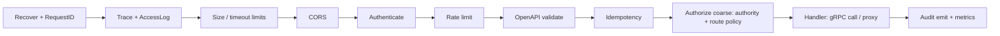

# Service 01 — API Gateway (`apigw`)

> **Stage:** 1 · **Binary:** `cmd/apigw` · **Scales by:** requests · **State:** stateless (Redis for limits) · **Priority:** P0

## 1. Purpose
Single public HTTP/WebSocket ingress for the management plane. Terminates TLS (or sits behind an LB), authenticates, injects tenant context, rate-limits, routes to services, and serves the OpenAPI document. **No business logic.**

## 2. ThingsBoard reference
ThingsBoard Node serves REST + WebSocket itself (monolithic with the rule engine). Per-tenant REST/WS limits come from the tenant profile (e.g. `"100:1,2000:60"`), and the HTTP API returns `429` on breach. iotp separates the edge concern so identity/limits/CORS/audit are uniform and services stay simple.

## 3. Responsibilities
| Capability | Detail |
|---|---|
| Routing | Path-prefix → service (gRPC clients for core/devreg/dashboard/…; reverse proxy for `realtime` WS) |
| AuthN | `Authorization: Bearer <JWT>` (EdDSA/RS256 via JWKS from `identity`, cached) or `X-Api-Key` (introspected, cached 60 s) |
| Tenancy | Builds `Principal{userId, tenantId, customerId, authority, scopes, sessionId, impersonator}`; passes to services via gRPC metadata |
| Rate limiting | Multi-scope token buckets (§5) |
| Validation | Request size caps, JSON depth/size limits, OpenAPI request validation (`kin-openapi`) in strict mode |
| Idempotency | `Idempotency-Key` store (Redis, 24 h) for POST/PUT/DELETE with side effects |
| CORS/CSP | Per-tenant allowed origins (white-label domains), strict defaults |
| Audit hook | Emits `audit.events` for mutating calls (actor, route, entity, status) |
| Observability | Request ID, W3C trace context, access logs without bodies |
| Docs | Serves `/api/v1/openapi.json`, Swagger/Redoc UI (disabled in prod by flag) |

## 4. Middleware chain

Fine-grained authorisation (entity-level) stays in the owning service.

## 5. Rate limiting
- **Config grammar** (ThingsBoard-compatible): `"N:T,N2:T2"` = at most N requests per T seconds *and* N2 per T2 seconds.
- **Scopes:** per-IP (unauthenticated: login, activation, public dashboards), per-user, per-customer, per-tenant, per-API-key, per-route-class (heavy queries, exports).
- **Algorithm:** local token bucket (fast path, ~ns) + periodic Redis reconciliation (every 200 ms) so cluster-wide limits are approximate but cheap; strict mode available for login endpoints via a Redis Lua script (`INCR` + `PEXPIRE` sliding window).
- **Response:** `429` + `Retry-After` + `X-RateLimit-*`; `problem+json` body with `errorCode=RATE_LIMITED`.

```go
type Limiter interface {
    Allow(ctx context.Context, key string, rules []Rule, n int) (ok bool, retryAfter time.Duration)
}
// middleware
func RateLimit(l Limiter, rf RulesFor) func(http.Handler) http.Handler {
    return func(next http.Handler) http.Handler {
        return http.HandlerFunc(func(w http.ResponseWriter, r *http.Request) {
            p := principal.From(r.Context())
            for _, s := range scopesFor(p, r) {           // ip | user | customer | tenant | key | routeclass
                if ok, ra := l.Allow(r.Context(), s.Key, rf(s, p), 1); !ok {
                    problem.TooManyRequests(w, ra); return
                }
            }
            next.ServeHTTP(w, r)
        })
    }
}
```

## 6. Calling services
- gRPC clients with **deadlines** (propagate client deadline minus 50 ms), retries on idempotent calls (jittered, max 2), **circuit breakers** (`gobreaker`) per upstream, connection pools with keepalive.
- **BFF endpoints** where the UI would otherwise make N calls (e.g. `GET /api/v1/home` aggregating counts, alarms, recent dashboards).
- Error mapping table (`pkg/errs`): `NotFound→404`, `AlreadyExists→409`, `FailedPrecondition→409/412`, `PermissionDenied→403`, `Unauthenticated→401`, `InvalidArgument→400/422`, `ResourceExhausted→429`, `Unavailable→503`, `DeadlineExceeded→504`.

## 7. WebSocket proxying
`/api/v1/ws` is upgraded at the gateway, JWT validated once at connect, then proxied to `realtime` (consistent hash by session ID for LB stickiness-less fan-out). The gateway enforces per-tenant WS connection caps and forwards re-auth frames. Idle timeout 70 s with ping/pong.

## 8. Security
HSTS, `X-Content-Type-Options`, `Referrer-Policy`, strict CSP for served docs; JSON body limit 1 MB default (per-route overrides: import 50 MB, OTA upload via presigned URL to object store); request header size caps; slowloris protection (read-header timeout 10 s); no stack traces; user enumeration-safe auth errors; refresh-token cookie option (`HttpOnly; Secure; SameSite=Strict`) with CSRF double-submit for cookie mode.

## 9. Configuration (env)
| Var | Default | Notes |
|---|---|---|
| `APIGW_LISTEN` | `:8080` | |
| `APIGW_JWKS_URL` | identity `/.well-known/jwks.json` | cached, background refresh |
| `APIGW_REDIS_URL` | – | limits, idempotency |
| `APIGW_UPSTREAMS` | – | service discovery (DNS/Consul/K8s) |
| `APIGW_MAX_BODY` | 1MiB | |
| `APIGW_CORS_DEFAULT` | `[]` | + per-tenant domains from `core` |

## 10. Observability
`iotp_apigw_requests_total{route,method,status}`, `…_request_seconds{route}`, `…_ratelimited_total{scope}`, `…_upstream_errors_total{upstream}`, `…_inflight`. Route labels use the **OpenAPI route template**, never raw paths. Alerts: 5xx > 1 %, p99 > 1 s, limiter Redis errors.

## 11. Failure modes
Redis down → local-only limiting (fail-open for reads, fail-closed for login); identity down → keep serving valid cached JWKS, new logins fail; upstream slow → breaker opens, `503` with `Retry-After`.

## 12. Testing
OpenAPI conformance (schemathesis), limiter property tests, chaos on Redis/upstreams, authz matrix tests per route, fuzz JSON depth/size.

## 13. Task checklist
- [ ] Router + middleware chain + error mapping
- [ ] JWT/JWKS + API-key auth; principal propagation
- [ ] Limiter (local + Redis) + config grammar parser
- [ ] OpenAPI validation + docs endpoint
- [ ] Idempotency store
- [ ] Audit emission + metrics + tracing
- [ ] WS proxy + caps
- [ ] Per-tenant CORS; security headers
- [ ] BFF aggregate endpoints
