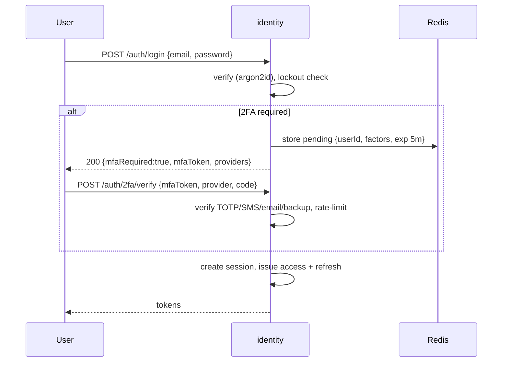

# Service 02 — Identity & Access (`identity`)

> **Stage:** 1 (core), 12 (RBAC groups, SSO) · **Binary:** `cmd/identity` · **State:** Postgres + Redis · **Priority:** P0 (P1 for 2FA/OAuth2/API keys)

## 1. Purpose
Users, credentials, sessions/tokens, multi-factor, federation (OAuth2/OIDC, later SAML/LDAP), API keys, impersonation, and the **authorisation model** (permissions + scopes) used by every service.

## 2. ThingsBoard reference
Authorities: `SYS_ADMIN`, `TENANT_ADMIN`, `CUSTOMER_USER` (PE: custom roles via entity groups). JWT access + refresh tokens (access default ≈ 2.5 h, refresh ≈ 7 d, configurable); activation/reset links; password policy + lockout; 2FA (TOTP, SMS, email, backup codes; enforcement option in 4.3); OAuth2 clients with mappers; API keys (4.3); sysadmin can *log in as* tenant admin, tenant admin as customer user; public customer for public dashboards.

## 3. Capabilities
| Area | Spec | Pri |
|---|---|---|
| Credentials | argon2id (m=64 MiB, t=3, p=2; tunable), pepper from KMS, rehash on login when params change | P0 |
| Password policy | min length, classes, history N, max age, breached-password check (k-anonymity), lockout (N fails → T min, exponential) | P0 |
| Activation/reset | Single-use random 256-bit tokens (hash stored), TTL, rate-limited, uniform responses (no enumeration) | P0 |
| Tokens | Access JWT (EdDSA, **15 min default**), rotating opaque refresh tokens (family id, reuse detection), JWKS + key rotation | P0 |
| Sessions | `session` rows (device/IP/UA/last seen), list + revoke, `token_version` bump = revoke-all | P0 |
| 2FA | TOTP (RFC 6238), SMS, email, backup codes; tenant/system enforcement; step-up for sensitive actions | P1 |
| OAuth2/OIDC | Auth-code + PKCE; providers: Google, GitHub, Apple, Microsoft, generic OIDC; mappers (email → user, auto-create, tenant/customer/role mapping rules, group sync) | P1 |
| API keys | `iotp_<8-char prefix>_<secret>`; hashed; scopes; expiry; last-used; per-key rate limits | P1 |
| Impersonation | Sysadmin→tenant admin, tenant admin→customer user; token carries `impersonator`; always audited; no further impersonation | P1 |
| Public access | `public_id` (random) → limited principal for public dashboards | P1 |
| LDAP / SAML | Enterprise SSO | P2 |

## 4. Token design
```go
type Claims struct {
    jwt.RegisteredClaims                       // iss, sub=userId, aud, exp, iat, jti
    TenantID    uuid.UUID `json:"tid,omitempty"`
    CustomerID  uuid.UUID `json:"cid,omitempty"`
    Authority   string    `json:"auth"`        // SYS_ADMIN | TENANT_ADMIN | CUSTOMER_USER | PUBLIC | API_KEY
    SessionID   uuid.UUID `json:"sid"`
    TokenVer    int       `json:"tv"`          // compared with user_credentials.token_version (cached)
    Scopes      []string  `json:"scp,omitempty"`
    Impersonator *uuid.UUID `json:"imp,omitempty"`
    MFA         bool      `json:"mfa"`         // second factor satisfied
    AuthTime    int64     `json:"atm"`         // step-up freshness
}
```
- Refresh: opaque `rt_<random>`; DB stores `sha256`; **rotation** on every use; reuse of a retired token → revoke the whole family + audit alert.
- Revocation check: `tv` and session status cached in Redis (TTL 30 s) so access tokens die within ≤ 30 s of revoke without a DB hit per request.
- JWKS at `/.well-known/jwks.json`; keys rotate every 30 d with 2 overlapping.

## 5. Login flow with 2FA


## 6. Authorisation model
**Permission = (Resource, Operation)** evaluated against a **scope**.
| Resources | Operations |
|---|---|
| TENANT, CUSTOMER, USER, DEVICE, DEVICE_PROFILE, ASSET, ASSET_PROFILE, ENTITY_VIEW, DASHBOARD, WIDGET, RULE_CHAIN, ALARM, ALARM_RULE, OTA_PACKAGE, EDGE, INTEGRATION, CONVERTER, NOTIFICATION, SCADA_TAG, SCADA_CONTROL, CALCULATED_FIELD, AUDIT_LOG, API_USAGE, ROLE, ENTITY_GROUP, … | READ, WRITE, CREATE, DELETE, RPC_CALL, READ_CREDENTIALS, WRITE_CREDENTIALS, READ_ATTRIBUTES, WRITE_ATTRIBUTES, READ_TELEMETRY, WRITE_TELEMETRY, CLAIM, ASSIGN, UNASSIGN, ACK, CLEAR, PUBLISH, CONTROL_WRITE, APPROVE, … |

**Scope:** tenant-wide, customer subtree, entity group, or single entity. **v1 (stage 1)** implements the three authorities as fixed role templates; **v2 (stage 12)** adds custom `role` + `role_binding(principal, role, scope)`.

```go
type Authorizer interface {
    Can(ctx context.Context, p Principal, op Operation, res Resource, ref EntityRef) error
    Filter(ctx context.Context, p Principal, op Operation, res Resource) (Scope, error) // for list/EDQL queries
}
```
`Filter` returns a SQL-friendly predicate (tenant id, customer id set, group id set) so **lists and queries are scoped in the database**, not post-filtered. Decisions are cached per `(principal, op, resource, scope-version)`; scope-version bumps on role/ownership changes.

## 7. API (excerpt)
`POST /auth/login | /auth/token | /auth/logout | /auth/2fa/{setup,verify,disable} | /auth/oauth2/{provider}/{start,callback} | /auth/password/{forgot,reset,change} | /auth/activate`; `GET /auth/user`, `GET/DELETE /auth/sessions`; `CRUD /api-keys`; `POST /users/{id}/impersonate`; `GET /.well-known/jwks.json`; admin: `/auth/settings` (policy, lockout, 2FA enforcement, OAuth2 clients, domains).

## 8. Data model
`users`, `user_credentials`, `user_mfa`, `api_key` (see `03-data-model.md`) + `session(id, user_id, created, last_seen, ip, ua, revoked)`, `refresh_token(family_id, hash, session_id, issued, used, replaced_by)`, `oauth2_client(id, tenant_id, provider, config_enc, mapper jsonb, domains)`, `user_federated_identity(user_id, provider, subject)`, later `role`, `role_permission`, `role_binding`.

## 9. Threat controls
| Threat | Control |
|---|---|
| Credential stuffing | Per-IP + per-account rate limits, lockout, breached-password check, CAPTCHA hook after N failures |
| Token theft | Short access TTL, rotating refresh with reuse detection, optional device-bound cookies, session list/revoke |
| Enumeration | Uniform responses/timing for login/forgot/activate |
| Phishing of reset links | Single-use, short TTL, bound to user agent hash (soft), notify user of resets |
| Privilege escalation via impersonation | Explicit permission, banner in UI, audit, no chaining |
| OAuth misuse | PKCE, state/nonce, strict redirect URI allowlist, email-verified claim required for auto-link |
| Secrets in DB | Envelope encryption for MFA seeds/OAuth secrets |

## 10. Observability
Metrics: `iotp_identity_login_total{result}`, `…_lockouts_total`, `…_refresh_reuse_total`, `…_mfa_total{provider,result}`, `…_token_issue_seconds`. Security alerts: refresh-reuse > 0, login failures spike, impersonation events. All auth events → `audit.events`.

## 11. Testing
Unit: password policy, TOTP window, refresh rotation state machine; integration: full login/2FA/OAuth flows against a mock IdP; security: token tampering, replay, alg-none, key rotation overlap; load: 2 k logins/s (argon2 CPU budget — dedicate cores or use admission control).

## 12. Task checklist
- [ ] Credentials + policy + lockout + activation/reset mail
- [ ] JWT issue/verify, JWKS, key rotation
- [ ] Refresh rotation + sessions + revoke-all
- [ ] `Authorizer` interface + fixed-role matrix + scope `Filter`
- [ ] 2FA (TOTP, email, SMS, backup) + enforcement + step-up
- [ ] OAuth2/OIDC + mappers
- [ ] API keys + scopes
- [ ] Impersonation + public principal
- [ ] Admin settings API; audit events; metrics
- [ ] (Stage 12) custom roles, groups, SAML/LDAP
