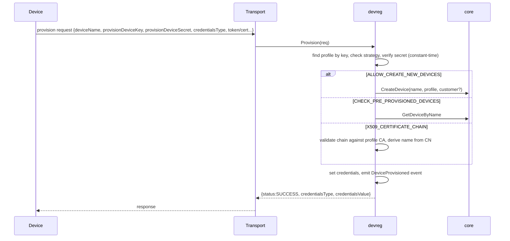

# Service 04 — Device Registry (`devreg`)

> **Stage:** 2 · **Binary:** `cmd/devreg` · **Scales by:** auth rate · **State:** Postgres + Redis/LRU caches · **Priority:** P0 (provisioning/claiming P1)

## 1. Purpose
The **device-facing control path**: authenticate credentials on the hot path, provision devices, claim them for customers, validate device-profile transport configuration, and generate connectivity instructions. Separated from `core` so connection storms scale independently.

## 2. ThingsBoard reference
- **Credential types:** `ACCESS_TOKEN`, `X509_CERTIFICATE`, `MQTT_BASIC`, `LWM2M_CREDENTIALS`.
- **Provisioning strategies (device profile):** `DISABLED`, `ALLOW_CREATE_NEW_DEVICES` (device presents `provisionDeviceKey` + `provisionDeviceSecret`), `CHECK_PRE_PROVISIONED_DEVICES` (device must already exist), `X509_CERTIFICATE_CHAIN` (cert chain validated against profile CA).
- **Claiming:** device publishes a claim request with a secret key + duration; a customer later claims by device name + secret; ownership moves to that customer.
- Device profiles define transport config, alarm rules, default rule chain/queue/dashboard, OTA defaults.

## 3. Hot-path authentication
```go
type AuthRequest struct {
    Kind        CredKind  // TOKEN | BASIC | X509
    Token       string
    ClientID, Username, Password string
    CertSHA256  []byte    // from TLS handshake
    Transport   string    // MQTT|HTTP|COAP|LWM2M|SNMP
}
type AuthResult struct {
    DeviceID, TenantID, CustomerID, ProfileID uuid.UUID
    DeviceName, DeviceType string
    IsGateway bool
    Limits    DeviceLimits       // from tenant profile (rate strings)
    ProfileVersion int
}
```
**Lookup:** `lookup_id = HMAC_SHA256(pepper, material)` (token | `clientId\x00username` | cert fingerprint) → cache → DB `device_credentials.lookup_id` unique index. MQTT basic: verify password HMAC in constant time after lookup. **SLO:** p99 < 5 ms warm; DB fallback p99 < 30 ms.
**Caches:** Redis (TTL 10 min) + per-pod LRU (TTL 60 s, 100 k entries) + **negative cache** (30–60 s). Invalidation events on bus: `DeviceCredentialsChanged`, `DeviceDeleted`, `DeviceProfileUpdated`, `TenantSuspended`.
**Protection:** per-IP and per-lookup-prefix failed-auth limiter; global kill-switch per tenant (suspend); audit sampling of failures.

## 4. Credentials
| Type | Storage | Notes |
|---|---|---|
| ACCESS_TOKEN | `lookup_id` + optional encrypted token (for UI display) | Generated 24 URL-safe chars (~143 bits) default; user-supplied allowed (min 16) |
| MQTT_BASIC | `lookup_id` (clientId+username) + `basic_password_hash` | Either field may be empty but not both |
| X509_CERTIFICATE | PEM (public), SHA-256 fingerprint | Optional CN-pattern rule per profile; **mTLS handshake validates chain** against tenant CA bundle |
| LWM2M | Endpoint + security mode data (PSK identity/key, RPK, X.509) | Encrypted at rest |
Rotation: new credentials active immediately; optional overlap window (both valid for T) for fleet rotations; bulk rotation job with progress.

## 5. Provisioning

- **TB-compatible responses:** `{"status":"SUCCESS","credentialsType":"ACCESS_TOKEN","credentialsValue":"…"}` or `{"status":"FAILURE","errorMsg":"…"}`.
- **Idempotency:** same `deviceName` again → `FAILURE` (TB behaviour, default) or return existing credentials if `provisionIdempotent=true` **and** the same secret/nonce within window.
- Limits: provisioning attempts rate-limited per key + IP; secret rotation; optional approval queue (manual approve in UI) — P2.
- Emits `DeviceProvisioned` (→ rule engine message `ENTITY_CREATED` with metadata `provisioned=true`).

## 6. Claiming
1. Device sends `v1/devices/me/claim {"secretKey":"…","durationMs":60000}` (HTTP/CoAP equivalents) → stored hashed with expiry (Redis + DB).
2. Customer calls `POST /devices/claim {deviceName, secretKey}`; `devreg` verifies (constant-time), checks expiry, and calls `core.AssignDevice(customer)`.
3. Secret is consumed; replay → `CLAIM_ALREADY_USED`. Profile flag `claimable`; rate-limited; audited.
Re-claim (reclaim by tenant admin) available as explicit action.

## 7. Profile transport validation
On profile save, validate: topic filters (publish topics may contain `+`/`#` per MQTT rules, subscribe topics restricted), protobuf descriptors compile (`protocompile`) and match message names, Sparkplug flag compatibility, LwM2M model list, SNMP OIDs/mappings, provisioning key uniqueness, payload size limits, timezone/units config. Dry-run endpoint `POST /deviceProfiles/validate` returns structured errors for the UI.

## 8. Connectivity helper
`GET /devices/{id}/connectivity` returns ready-to-run snippets (mosquitto_pub/sub, curl, Python paho, ESP32/Arduino, Node, Go) per enabled transport, with host/ports/TLS notes and the device's token **only if the caller may read credentials**.

## 9. Bulk operations
CSV import (name, label, profile, customer, credentials type/value, attributes) with dry-run, per-row errors, chunked transactions, resumable job; CSV export; bulk credential rotation; bulk assign/delete.

## 10. Security
Tokens never logged; constant-time compares; HMAC pepper in KMS with versioned rotation (`pepper_id` column when rotating); cert fingerprints SHA-256; failed-auth telemetry without secrets; tenant suspension propagates in ≤ 5 s via event + cache bust.

## 11. Observability
`iotp_devreg_auth_total{kind,result}`, `…_auth_seconds{cache}`, `…_cache_hit_ratio`, `…_provision_total{strategy,result}`, `…_claim_total{result}`, `…_failed_auth_banned_total`. Alert on auth failure ratio spikes (credential stuffing) and cache-miss storms.

## 12. Testing
Auth correctness matrix (all kinds × valid/invalid/expired/rotated); cache invalidation tests; timing-attack tests (constant-time); provisioning contract tests with TB-compatible simulators; load test 20 k auth/s warm; chaos: Redis loss.

## 13. Task checklist
- [ ] Credentials CRUD + `lookup_id`/HMAC scheme + pepper rotation
- [ ] `Authenticate` gRPC + caches + negative cache + limiter
- [ ] Invalidation events + tenant suspend
- [ ] Provisioning (3 strategies) over MQTT/HTTP; idempotency option
- [ ] Claiming flow
- [ ] Profile transport validation + dry-run
- [ ] Connectivity snippet generator
- [ ] Bulk import/export/rotation jobs
- [ ] Metrics, alerts, audit
