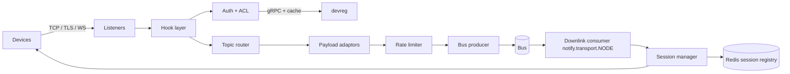

# Service 05 — `tr-mqtt` (MQTT Transport)

> **Stage:** 2 (core), 7 (gateway/OTA), 8 (Sparkplug, protobuf) · **Binary:** `cmd/tr-mqtt` · **Scales by:** connections · **State:** sessions only · **Priority:** P0

## 1. Purpose and scope
Terminates device MQTT connections, authenticates via `devreg`, decodes payloads, publishes to the bus, delivers downlinks (attribute updates, RPC, OTA chunks) to live sessions, and reports session events.
**Non-goals:** general pub/sub between clients (device topics are *never* routed to other clients), retained-message storage, offline queues (persistent RPC covers offline delivery).

## 2. ThingsBoard reference
- Separate MQTT transport microservice (cluster mode) implementing the topic map in `04-protocols-and-api.md §1`; QoS 0/1; TLS one-way/mutual; X.509 auth; gateway topics; JSON/Protobuf per device profile; custom topic filters; Sparkplug B per profile.
- Transport ↔ core coupling is queue-based; core routes downlinks to the **node that owns the session** via a per-node notifications topic.
- ThingsBoard also ships **TBMQ**, a standalone broker — evidence that a decoupled broker is a valid scaling path.

**iotp changes:** MQTT v5 reason codes/quotas, ack-after-durable guarantee, per-tenant connection caps, optional binary batch topic, hook-based embedded broker (no external broker needed).

## 3. Architecture


## 4. Embedded broker choice
**`mochi-mqtt/server`** (Go, MQTT 3.0/3.1.1/5.0, hook system). We use it as a *protocol engine*, not as a pub/sub bus: hooks authenticate, authorise, intercept PUBLISH and suppress fan-out.
Trade-offs: (+) single static binary, full control; (−) must verify hook semantics per pinned version (notably *when PUBACK is written relative to `OnPublish`*). **Risk R-MQTT-1:** if the library acks before async work completes, either (a) block inside the hook until the bus acks (simple; per-connection backpressure; fine for devices), or (b) patch/fork for deferred acks. Write a conformance test for ack ordering on day one.
Escape hatch: run EMQX/TBMQ-like external broker and bridge into the bus (`integration` service) for > 1 M connections.

## 5. Behaviour specification
### 5.1 Connect/auth
| Credentials | Mapping |
|---|---|
| `username=<token>`, empty password | ACCESS_TOKEN |
| `clientId` + `username` + `password` | MQTT_BASIC |
| Client certificate (mTLS) | X509 (fingerprint → device) |
Rules: one active session per device (new connect **kicks** the old one; configurable `allow_multi`); keep-alive bounds `[10 s, 3600 s]`; clean-start/ session expiry honoured for v5 but **no offline message queue**; auth failure → CONNACK 0x86/0x87 (v5) / 4/5 (v3).

### 5.2 Topic router
| Pattern | Handler |
|---|---|
| `v1/devices/me/telemetry` | decode → `TelemetryUp` |
| `v1/devices/me/attributes` | decode → `AttributesUp` |
| `v1/devices/me/attributes/request/{id}` | request → `AttributesRequest` (response via downlink) |
| `v1/devices/me/rpc/request/{id}` | client RPC |
| `v1/devices/me/rpc/response/{id}` | reply to server RPC (correlate with `rpc` service) |
| `v1/devices/me/claim`, `/provision/request` | claim / provision |
| `v1/gateway/*` | gateway handlers (§5.5) |
| Profile custom filters | user-defined topic → telemetry/attributes (wildcards allowed for publish filters only via `+`/`#` match, never for subscribe ACL widening) |
Subscriptions are allowed only to: attributes, attribute response, rpc request, rpc response, provision response, OTA response (+ profile custom attribute-subscribe topic). Everything else → SUBACK failure.

### 5.3 Payload adaptors
- **JSON** fast path: hand-rolled scanner (`jsonparser`/`fastjson`), no reflection, no map allocations; emits `[]KV{Key, Kind, Value}` with explicit `ts`.
- **Protobuf:** descriptor from profile compiled with `protodesc` → `dynamicpb`; cached by `(profileId, version)`.
- **Sparkplug B:** decode Tahu protobuf; cache NBIRTH/DBIRTH metric aliases per edge node; map metrics → telemetry; `NCMD/DCMD` for writes; `STATE` handling.
- Validation errors: v5 → PUBACK reason `0x99` (payload format invalid) or disconnect after threshold; v3 → drop + metric (`sendAckOnValidationException` profile flag controls ack).

### 5.4 Ack & delivery contract
QoS 1 PUBACK is written **only after** the bus confirms durability (`acks=all` / JetStream ack). QoS 0 is fire-and-forget through a bounded in-memory queue (drop-oldest, counted). On bus unavailability: stop reading from sockets of affected connections (TCP backpressure) rather than buffering unbounded; after `bus_timeout` return PUBACK reason `0x97` (quota exceeded) in v5 or close the connection in v3.

### 5.5 Gateway mode
`v1/gateway/connect {"device":"A","type":"default"}` → resolve/create child device (auto-create only if the gateway's profile allows) → child session bound to the gateway connection; telemetry/attributes per child; `v1/gateway/disconnect` ends child session (emits DISCONNECT event for the child). Name→id cache per gateway. RPC to children delivered on `v1/gateway/rpc` with device name envelope.

### 5.6 Downlink consumer
Consumes `notify.transport.{nodeId}` (key = deviceId). Message types: `AttributesUpdate`, `AttributesResponse`, `RpcRequest`, `RpcResponse` (client RPC reply), `SessionClose`, `ProvisionResponse`, `OtaChunk`. QoS 1 publish to device; **PUBACK from device ⇒ emit `RPC_DELIVERED`** event; no PUBACK within `redelivery_timeout` ⇒ retry up to N then report failure to `rpc`.

### 5.7 Session registry
`Session{ID, DeviceID, TenantID, ProfileID, NodeID, ClientID, Gateway, ConnectedAt, Subs}` kept in memory; Redis key `sess:{deviceId}` → `{nodeId, sessionId}` with TTL = 2× keepalive, refreshed on activity (batched). Emits `SessionEvent{CONNECT|DISCONNECT|ACTIVITY}` to `devstate.activity` (activity coalesced: ≤ 1 event / device / 10 s).

### 5.8 Rate limiting and protection
| Limit | Default | Action on breach |
|---|---|---|
| Connect rate per IP | 20/s burst 100 | reject (v5 0x9F connection rate exceeded) |
| Failed auth per IP | 10/min | temp-ban 5 min (Redis) |
| Messages per connection | 50/s | drop/ack-with-quota-reason; disconnect after 100 violations |
| Per device / per tenant | from tenant profile (`"10:1,300:60"`) | same; tenant limits are local token buckets reconciled via Redis |
| Max packet | 64 KB (profile ≤ 1 MB) | disconnect (v5 0x95) |
| Max inflight/queued per session | 64 / 256 | oldest dropped |
| Connections per tenant | tenant profile | reject new |

### 5.9 TLS
TLS 1.2+ (1.3 preferred), modern cipher suites, ALPN `mqtt`; optional **SNI → per-tenant certificate**; mTLS with CA bundle per tenant/profile; certificate revocation via `devreg` denylist (fingerprint); PROXY protocol v2 for real client IP behind L4 LB.

## 6. Performance engineering
| Topic | Guidance |
|---|---|
| Memory | Target ≤ 15–20 KB per idle connection (goroutine stacks + buffers) → 50–100 k conns in 1–2 GB; `GOMEMLIMIT` at 80 % of container limit |
| Allocation | `sync.Pool` for read buffers/KV slices; reuse JSON scanner state; avoid `fmt` in hot path |
| Syscalls | Large socket buffers only where needed; `SO_REUSEPORT` listeners per core |
| OS | `ulimit -n 1048576`, `net.core.somaxconn`, `tcp_keepalive_*`, conntrack sizing on LB |
| Backpressure | Bounded channels everywhere; metrics on queue depth |
| Batching | Producer batches by partition (linger 5–20 ms) but PUBACK waits for ack of that batch |

## 7. Hook skeleton (adapt signatures to your pinned `mochi-mqtt` version)
```go
type deviceHook struct {
    mqtt.HookBase
    auth   devreg.Client
    router *Router
    sess   *SessionManager
}

func (h *deviceHook) ID() string { return "iotp-device" }
func (h *deviceHook) Provides(b byte) bool {
    return slices.Contains([]byte{mqtt.OnConnectAuthenticate, mqtt.OnACLCheck, mqtt.OnPublish,
        mqtt.OnSessionEstablished, mqtt.OnDisconnect}, b)
}

func (h *deviceHook) OnConnectAuthenticate(cl *mqtt.Client, pk packets.Packet) bool {
    ctx, cancel := context.WithTimeout(context.Background(), 2*time.Second)
    defer cancel()
    res, err := h.auth.Authenticate(ctx, credsFrom(cl, pk)) // token | basic | x509 fingerprint
    if err != nil { metrics.AuthFail(err); return false }
    h.sess.Bind(cl.ID, res)
    return true
}

func (h *deviceHook) OnACLCheck(cl *mqtt.Client, topic string, write bool) bool {
    return h.router.Allowed(h.sess.Get(cl.ID), topic, write)
}

func (h *deviceHook) OnPublish(cl *mqtt.Client, pk packets.Packet) (packets.Packet, error) {
    s := h.sess.Get(cl.ID)
    if err := h.router.Handle(context.Background(), s, pk); err != nil { // blocks until bus ack for QoS1
        return pk, mapErr(err)                                             // v5 reason codes
    }
    return pk, packets.CodeSuccessIgnore // do not fan out to other subscribers
}
```

## 8. Configuration (env)
| Variable | Default | Meaning |
|---|---|---|
| `TRMQTT_NODE_ID` | hostname | Used for `notify.transport.{nodeId}` |
| `TRMQTT_LISTEN_TCP` / `_TLS` / `_WS` | `:1883` / `:8883` / `:8083` | Listeners |
| `TRMQTT_TLS_CERT`, `_KEY`, `_CLIENT_CA` | – | TLS / mTLS |
| `TRMQTT_PROXY_PROTOCOL` | false | Accept PROXY v2 |
| `TRMQTT_MAX_PACKET` | 65536 | bytes |
| `TRMQTT_DEVREG_ADDR` | – | gRPC target |
| `TRMQTT_BUS_*` | – | bus driver config |
| `TRMQTT_REDELIVERY_TIMEOUT` | 10s | RPC/attr downlink retry |

## 9. Observability
Metrics: `iotp_trmqtt_connections`, `…_connect_total{result}`, `…_publish_total{topic_class,result}`, `…_publish_to_ack_seconds` (histogram), `…_bytes_in/out`, `…_ratelimited_total{scope}`, `…_downlink_lag_seconds`, `…_sessions_kicked_total`. Logs: connect/disconnect with reason, never payloads. Traces: sampled spans from PUBLISH → bus ack with `trace-id` propagated in the envelope.

## 10. Failure modes
| Failure | Behaviour |
|---|---|
| `devreg` down | Serve from LRU (TTL); unknown devices rejected; alarm on cache miss rate |
| Redis down | Sessions still work locally; downlink routing degrades (log + retry) |
| Bus down | Backpressure, then reject with quota reason; no silent loss |
| Pod drain | Stop accepting, send DISCONNECT (v5 0x9C "use another server"), wait grace, exit |
| Reconnect storm | Server-side connect throttle with jitter hint (v5 server reference / delay) |

## 11. Testing
Contract transcripts for every v1 topic; ack-ordering conformance; fault-injection (kill bus during burst, assert no acked loss); fuzz payload decoders; `emqtt-bench`/custom loadgen for 100 k connections; soak 24 h; TLS interoperability matrix (mosquitto, paho, ESP32 mbedTLS).

## 12. Task checklist
- [ ] Bootstrap `cmd/tr-mqtt`, listeners, graceful shutdown
- [ ] Hooks: auth/ACL/publish/disconnect + session manager
- [ ] Router + JSON adaptor + KV model; property tests
- [ ] Bus producer with ack propagation; ack-order conformance test
- [ ] Downlink consumer + RPC delivered tracking
- [ ] Rate limiter (local + Redis reconcile); failed-auth ban
- [ ] TLS/mTLS/SNI, PROXY protocol
- [ ] Gateway topics + child sessions
- [ ] Protobuf + custom topic filters (P1)
- [ ] Sparkplug B (P1/P2)
- [ ] MQTT v5 properties/reason codes
- [ ] Load/soak/chaos suites + dashboards
