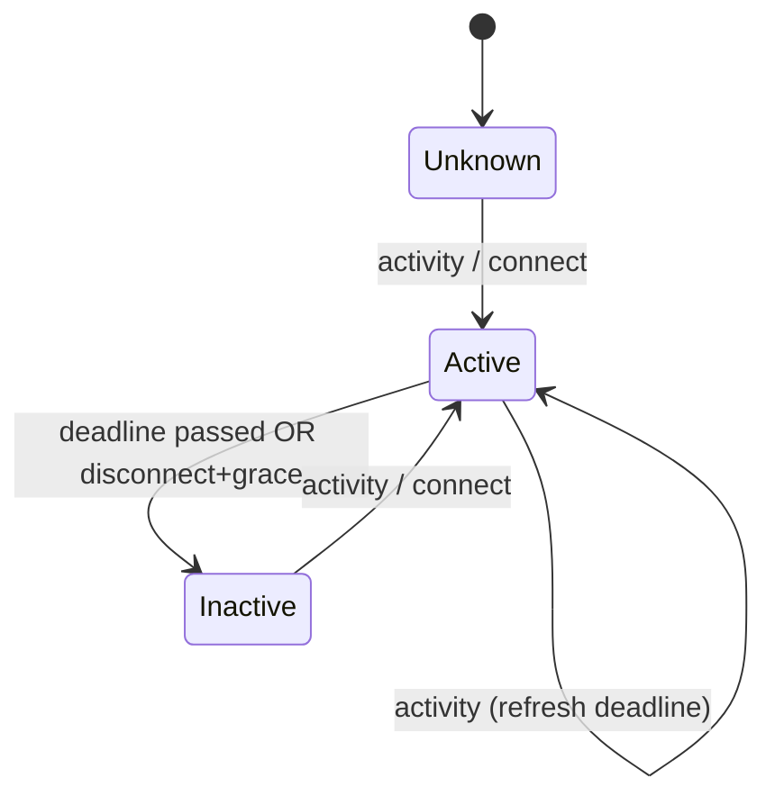

# Service 07 — Device State (`devstate`)

> **Stage:** 3 · **Binary:** `cmd/devstate` (library `pkg/devstate` reused at edge) · **Scales by:** devices (partitioned memory) · **Priority:** P0

## 1. Purpose
Tracks whether each device is **active/inactive** (connectivity/activity), records connect/disconnect/activity timestamps, and raises lifecycle events into the rule engine (`CONNECT_EVENT`, `DISCONNECT_EVENT`, `ACTIVITY_EVENT`, `INACTIVITY_EVENT`). Feeds dashboards, alarms ("device offline") and notifications.

## 2. ThingsBoard reference
State attributes (server scope): `active`, `lastActivityTime`, `lastConnectTime`, `lastDisconnectTime`, `inactivityAlarmTime`. Inactivity timeout from server attribute `inactivityTimeout` → profile default → platform default (600 s). A periodic checker evaluates devices; events flow into rule chains. Option to persist state as telemetry as well.

## 3. Inputs
| Source | Event | Notes |
|---|---|---|
| Transports | `SessionEvent{CONNECT|DISCONNECT|ACTIVITY}` on `devstate.activity` | ACTIVITY coalesced ≤ 1 per device per 10 s |
| Rule engine / ingestion | Telemetry/attribute received (activity) | Optional (when devices are stateless HTTP) |
| Gateways | Child connect/disconnect, child activity | Child state independent of gateway socket |
| Edge sync | Activity uplinked from edge | Timestamps from edge, quality-flagged |
| Admin | Force-offline/online (maintenance) | Audited |

## 4. State machine

Fields kept per device (≈ 64–80 bytes): `deviceId, tenantId, profileId, active, lastActivity, lastConnect, lastDisconnect, inactivityTimeout, deadline, inactivityEventSentAt, seq`.
**Timeout resolution order:** device server attr `inactivityTimeout` → profile `defaultInactivityTimeoutSec` → tenant profile default → platform default 600 s. `disconnectGrace` (default 0–30 s) prevents flapping on transient reconnects: MQTT disconnect schedules inactivity at `now + grace` unless the device reconnects.

## 5. Algorithm and memory design
- **Partition ownership:** consume `devstate.activity` with the same hash as ingestion; each instance owns states of its partitions.
- **Timer wheel** (hashed, 1 s resolution, 24 h horizon + overflow heap): each device has one scheduled deadline; activity reschedules (O(1)).
- **Sharded maps** (`N = 64` shards, RW locks) hold states; batch persistence coalesces writes: persist on **transitions** immediately; persist `lastActivityTime` at most every `persistInterval` (default 60 s) or on graceful shutdown.
- **Rebuild on assignment:** consume the compacted `devstate.snapshot` topic for newly assigned partitions (key = deviceId) to restore states in seconds; fallback scan of `attribute_kv` filtered by partition hash for first boot. Snapshots are published on transitions and every 10 min for active devices.
- **Event emission:** transitions publish to the rule-engine queue as messages with metadata (`deviceName`, `deviceType`, `ts`, previous state) and originator = device. De-duplicated by `(deviceId, seq)` to survive rebalances.

```go
type State struct {
    Active                  bool
    LastActivity, LastConnect, LastDisconnect, Deadline int64
    Timeout                 int64 // ms
    InactSentAt             int64
    Seq                     uint32
}
func (s *Service) onActivity(ev Activity) {
    st := s.shard(ev.Device).get(ev.Device)
    wasActive := st.Active
    st.LastActivity = max(st.LastActivity, ev.Ts)
    st.Active = true
    st.Deadline = st.LastActivity + st.Timeout
    s.wheel.Reschedule(ev.Device, st.Deadline)
    if !wasActive { s.emit(ActivityEvent, ev.Device, st) } // + persist transition
}
func (s *Service) onTimer(dev uuid.UUID, at int64) {
    st := s.shard(dev).get(dev)
    if st.Active && at >= st.Deadline { st.Active = false; s.emit(InactivityEvent, dev, st) }
}
```

## 6. Persistence and APIs
- Attributes (server scope) written through `telemetry` batch API: `active`, `lastActivityTime`, `lastConnectTime`, `lastDisconnectTime`, `inactivityAlarmTime`; optional `persistToTelemetry` flag writes the same keys to time-series.
- REST: `GET /devices/{id}/state`, `POST /devices/{id}/state/override`, `GET /devstate/summary` (counts active/inactive by profile/customer for dashboards).
- Realtime: state attributes ride the normal attribute update stream, so dashboards need no special case.

## 7. Edge cases
| Case | Handling |
|---|---|
| Clock skew device vs server | Use server receive time for deadlines; keep device ts only for data |
| Gateway drops | Children stay active until their own deadline unless the gateway sent explicit disconnect |
| Transport crash | Session registry TTL expiry emits synthetic DISCONNECT (grace applies) |
| Mass reconnect | Activity coalescing + batching; emissions rate-limited per tenant |
| Edge/cloud double reports | Max timestamp wins; seq dedupe |
| Timeout change | Re-evaluate deadlines on attribute/profile update events |

## 8. Observability
`iotp_devstate_devices{state}`, `…_events_total{type}`, `…_wheel_lag_seconds`, `…_persist_batch_seconds`, `…_rebuild_seconds`, `…_activity_lag_seconds`. Alert on wheel lag > 5 s or rebuild > 60 s.

## 9. Testing
Timer wheel property tests (monotonic, no lost deadlines); rebalance simulation with snapshot restore; fake-clock tests for grace/timeouts; load: 5 M devices memory ≤ 600 MB, 50 k activity events/s.

## 10. Task checklist
- [ ] Activity topic contract + transport emitters (coalescing)
- [ ] State machine + shards + timer wheel
- [ ] Snapshot topic + rebuild on assign
- [ ] Event emission + dedupe; rule-engine message mapping
- [ ] Persistence via telemetry batch API
- [ ] Timeout resolution + re-evaluation on config change
- [ ] REST/summary endpoints; override
- [ ] Metrics, tests, load test
