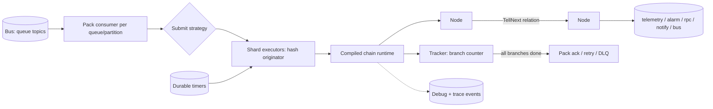

# Service 09 — Rule Engine (`ruleengine`)

> **Stage:** 4 · **Binary:** `cmd/ruleengine` (+ library `pkg/rules` reused by edge) · **Scales by:** partitions of the bus · **State:** in-memory chain runtimes + durable timers · **Priority:** P0

## 1. Purpose
Executes **rule chains** — directed graphs of nodes — over every message (telemetry, attributes, connectivity events, RPC, alarm and entity lifecycle events). It is the programmable heart of the platform: filtering, enrichment, transformation, persistence, alarming, notifications, integrations.

## 2. ThingsBoard semantics we must reproduce
| Concept | Behaviour |
|---|---|
| Root rule chain | Receives messages unless the device/asset profile names another default chain |
| Rule chain nodes | A node can call a nested chain (`rule chain` node) and return through `output` nodes |
| Relations | Named edges (`Success`, `Failure`, `True`, `False`, `Post telemetry`, …); a node emits on one or more relations |
| Message | `id, ts, type, originator, customerId, metadata (string map), dataType, data` |
| Templates | `${metadataKey}` and `$[dataKey]` substitution inside node configs |
| Queues | Named queues with *submit* and *processing* strategies; isolated queues per tenant |
| Debug | Per-node debug that records input/output for a time window |
| Scripting | Fast expression language (TBEL) or JS for filter/transform/switch |
| Ordering | Per originator within a queue partition |
| Failure | Unconnected `Failure` relation ⇒ message marked failed ⇒ processing strategy decides retry/skip |

## 3. Runtime architecture

**Sharded executors replace actors.** `N = 2 × GOMAXPROCS` shard goroutines, each with a bounded mailbox. A message is routed to `shard[hash(originator) % N]`, so one originator is always handled by one goroutine at a time (ordering without locks); all follow-up node executions for that message are re-enqueued on the *same shard*. Async nodes (HTTP, DB) call back by re-enqueuing a continuation.

## 4. Core types (Go)
```go
type Message struct {
    ID         uuid.UUID
    TenantID   uuid.UUID
    Ts         int64
    Type       string               // POST_TELEMETRY_REQUEST, ATTRIBUTES_UPDATED, ...
    Originator EntityRef
    CustomerID uuid.UUID
    Metadata   map[string]string
    DataType   DataType             // JSON | TEXT | BINARY
    Data       []byte
    Queue      string
    ChainID    uuid.UUID
    Hops       uint8                // loop guard
    Trace      trace.SpanContext
    ack        func(error)          // set by the pack consumer
}

type Node interface {
    Init(cfg json.RawMessage, env Env) error      // compile scripts, validate
    OnMsg(ctx NodeCtx, msg *Message)              // MUST call exactly one Tell* (or Schedule) per message
    Close()
}

type NodeCtx interface {
    TellNext(msg *Message, relations ...string)
    TellSuccess(msg *Message)
    TellFailure(msg *Message, err error)
    Schedule(after time.Duration, msg *Message)   // durable timer (§10)
    Services() Services                           // telemetry, attrs, alarm, rpc, notify, entities...
    Script() script.Engine
    Log() *slog.Logger
    TenantID() uuid.UUID
}

// Node implementations register a descriptor so the UI can render forms
type Descriptor struct {
    Type, Name, Category string
    Relations            []string          // static or "dynamic"
    ConfigSchema         json.RawMessage   // JSON Schema
    UISchema             json.RawMessage
    Version              int
}
```

### Executor sketch
```go
func (e *Engine) Submit(m *Message) {
    s := e.shards[murmur3(m.Originator.ID[:])%uint32(len(e.shards))]
    select {
    case s.in <- func() { e.chains.Get(m.TenantID, m.ChainID).Start(m) }:
    case <-time.After(e.cfg.SubmitTimeout):
        m.ack(ErrOverloaded) // consumer pauses / retries -> natural backpressure
    }
}

func (c *compiledChain) Start(m *Message) {
    t := newTracker(m)           // counts outstanding branches
    c.enter(c.first, m, t)
}
func (c *compiledChain) enter(id nodeID, m *Message, t *tracker) {
    n := c.nodes[id]
    t.add(1)
    n.impl.OnMsg(&nodeCtx{chain: c, node: n, t: t}, m.Clone())   // cheap copy-on-write of metadata
}
func (x *nodeCtx) TellNext(m *Message, rels ...string) {
    defer x.t.done()
    delivered := false
    for _, r := range rels {
        for _, to := range x.node.out[r] { x.chain.enterOnShard(to, m, x.t); delivered = true }
    }
    if !delivered { x.t.leaf(m, rels) } // leaf: Failure leaf => tracker marks failure
}
```
`tracker` completes when outstanding branches reach 0 → `msg.ack(nil)` or `msg.ack(err)` per failure rules.

## 5. Chain compilation and validation
Input: `rule_chain_revision.definition` (nodes + labelled connections). Compile steps: resolve node factories → `Init` each node (compile scripts, validate config) → build adjacency `node → relation → []node` → validate: single entry node, no unreachable nodes, relation labels valid for node type, required configs, **DAG** (cycles allowed only if `allowCycles` and hop guard `Hops ≤ 100`), nested chain references resolve and don't recurse beyond depth 8. Compile errors block publish; the editor shows them inline.

## 6. Execution semantics
| Topic | Rule |
|---|---|
| Ordering | Per `(queue, originator)`; across originators undefined |
| Fan-out | Multiple outgoing connections on one relation run as parallel branches on the same shard (interleaved, not concurrent) |
| Completion | A message is *complete* when all branches finish; failure if any branch ends on an unconnected `Failure` or panics |
| Panics | `recover` per node call → `TellFailure(ErrNodePanic)`; node auto-disabled after N panics/min with notification |
| Timeouts | Node soft timeout (default 5 s for sync nodes; external nodes carry own timeouts); message hard timeout = pack timeout |
| Hop guard | Increment on nested chain entry and cycle edges |
| Ack | Pack-level: consumer commits offsets after all messages in the pack complete or are DLQ'd |

## 7. Queues
| Submit strategy | Behaviour |
|---|---|
| `BURST` | Submit whole pack concurrently |
| `BATCH` | Submit `batchSize`, wait for completion, next batch |
| `SEQUENTIAL_BY_ORIGINATOR` | One in-flight message per originator (gate per originator) |
| `SEQUENTIAL_BY_TENANT` | One in-flight per tenant |
| `SEQUENTIAL` | One in-flight overall (use sparingly) |

| Processing strategy | On failure/timeout |
|---|---|
| `RETRY_ALL` | Re-submit entire pack |
| `RETRY_FAILED` / `RETRY_TIMED_OUT` / `RETRY_FAILED_AND_TIMED_OUT` | Re-submit only those |
| `SKIP_ALL_FAILURES` / `SKIP_ALL_FAILURES_AND_TIMED_OUT` | Drop, count, optionally DLQ |
Params: `retries` (0 = unlimited), `failurePercentage`, `pauseBetweenRetries`, `maxPauseBetweenRetries`; after final failure → **DLQ** `dlq.re.{queue}` with reason headers. Sinks are idempotent (telemetry upsert, alarm key, rpc id), so redelivery is safe.

## 8. Scripting
| Engine | Use | Safety |
|---|---|---|
| `expr` (default) | Filters, transforms, switch, math, templates | Loop-free language, no I/O, compile-time type check, cached program per node |
| `goja` (JS) | Compatibility with user JS | Interrupt timer (default 50 ms), memory via worker pool + process `GOMEMLIMIT`, no host objects except `msg/metadata/msgType` |
| `wazero` (WASM) | Third-party plugin nodes | Fuel/time limit, linear-memory cap, capability-based host functions |
Function library for `expr` (TBEL-like): `parseJson, toJson, toFixed, round, isNaN, hex/base64/bytes helpers, now(), regexMatch, geoDistance, pointInPolygon, lookup(attr)`. Script nodes expose **Test** endpoint (sample message → output + logs) used by the UI.

## 9. Hot reload and versioning
Chains have `DRAFT → PUBLISHED → ARCHIVED` revisions. Publish emits `RuleChainPublished{chainId, revision}`; each engine compiles the new revision, **atomically swaps** the runtime pointer; in-flight messages finish on the revision they started with (pinned in tracker); old runtime `Close()`s after drain. Rollback = publish an older revision. Diff view and Git sync use the same JSON.

## 10. Durable timers
`Schedule()` and the *delay* node persist to `rule_timer(fire_at, tenant_id, chain_id, node_id, msg bytes)` (or a delay topic). A timer loop on each partition owner polls `WHERE fire_at <= now() AND partition IN (owned) FOR UPDATE SKIP LOCKED`, re-submits and deletes. Survives restarts and rebalances (unlike process-local timers).

## 11. Debugging and tracing
Per node `debug: {failures: bool, all: bool, untilTs: int64}` plus **sampling** (default 1/100 when `all`). Record: `{ts, chain, node, msgId, in(type,metadata,data≤8KB), relations, out, error, durationNs}`; stored in the events store (TTL 24 h–7 d), streamed live to the editor via `realtime`. **Replay:** select a recorded input → re-run on a draft revision in a sandbox with side-effect nodes stubbed. Trace-ID stays on the message so a device publish is traceable through chain nodes to sinks.

## 12. Tenant isolation and fairness
- Per-shard **deficit round-robin** across tenants so one tenant can't starve others.
- Per-tenant limits: concurrent in-flight, script CPU-ms/s, external-call concurrency, rule executions/month (usage service).
- L2 tenants: dedicated queues/consumer groups and worker pools (`tenant_profile.isolation_level ≥ 2`).

## 13. Metrics
`iotp_rules_messages_total{queue,result}`, `iotp_rules_node_seconds{node_type}` (histogram; never label by node id), `iotp_rules_shard_queue_depth`, `iotp_rules_pack_seconds`, `iotp_rules_retries_total`, `iotp_rules_dlq_total`, `iotp_rules_script_timeouts_total`, `iotp_rules_consumer_lag`. Alerts: lag > 30 s, DLQ rate > 0, shard depth > 80 % for 1 min.

## 14. Failure modes
| Failure | Result |
|---|---|
| Node panics | Failure relation, auto-disable on repeat |
| External API slow | Per-node timeout + circuit breaker; chain continues on `Failure` relation |
| Engine crash | Uncommitted pack redelivered; idempotent sinks |
| Rebalance | Shards drained for revoked partitions; timers re-picked by new owner |
| Poison message | After retries → DLQ with replay tool (`iotpctl dlq replay`) |

## 15. Testing
- Golden chain tests (JSON in → expected relations/outputs).
- Property tests: per-originator order preserved under random async delays and rebalances (`pgregory.net/rapid`).
- Deterministic simulation with fake clock for timers/retries.
- Fuzz script inputs; benchmark: 3-node chain ≥ 20 k msg/s/core-pair, p99 added latency < 5 ms (no external calls).

## 16. Task checklist
- [ ] `pkg/rules`: Message, Node SPI, registry, Descriptor
- [ ] Shard executor + tracker + hop guard
- [ ] Chain compiler/validator; revision model; hot swap
- [ ] Pack consumer: submit/processing strategies, DLQ
- [ ] Script engines (`expr`, `goja`) + test endpoint
- [ ] P0 nodes (see doc 10) + descriptors
- [ ] Durable timers
- [ ] Debug capture + live tail + replay
- [ ] Fairness (DRR), tenant limits, isolation levels
- [ ] Metrics, dashboards, alerts
- [ ] Property/simulation tests; benchmarks
