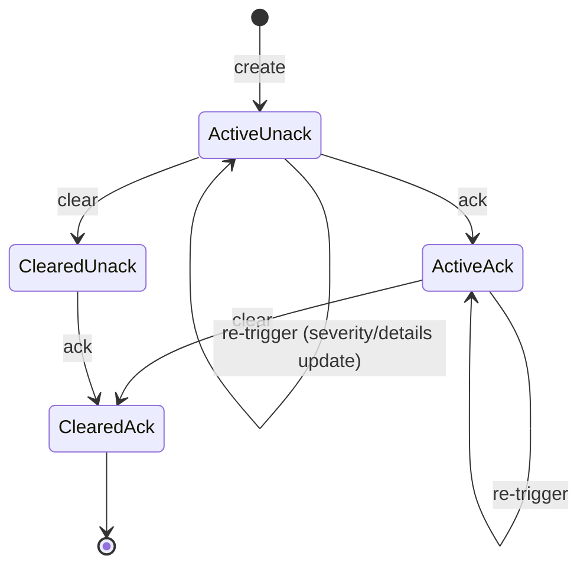
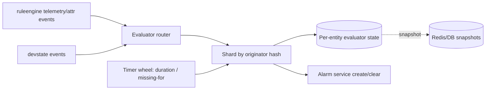

# Service 12 — Alarms & Alarm Rules (`alarm`)

> **Stage:** 5 · **Binary:** `cmd/alarm` (evaluator also embedded in `edge`) · **State:** Postgres + evaluator state snapshots · **Priority:** P0 lifecycle, P1 rules 2.0

## 1. Purpose
(1) **Alarm lifecycle service**: create/update/ack/clear/assign/comment/delete/search with propagation to related entities. (2) **Alarm rule evaluator**: turns telemetry/attributes/activity into alarms using declarative rules (profile-level and entity-level) — including *duration*, *repeating*, *missing-for* and *script* conditions.

## 2. ThingsBoard reference
- Alarm: `type`, originator, `severity` (CRITICAL, MAJOR, MINOR, WARNING, INDETERMINATE), status = (ACTIVE|CLEARED) × (UNACK|ACK), start/end/ack/clear timestamps, `details`, **assignee**, **comments**, propagation (to owner, tenant, entities reached via relation types).
- **One active alarm per (originator, type)**; re-trigger updates severity/details/end time.
- Device-profile alarm rules: create rules per severity, optional clear rule, conditions on telemetry/attributes/constants with typed predicates (string/numeric/boolean/complex), **dynamic values** from current device/customer/tenant attributes, condition spec SIMPLE | DURATION | REPEATING, schedule (any time / specific days+hours / custom), alarm `details` templates, propagation options.
- **4.3 "Alarm Rules 2.0":** rules attachable to device/asset profiles **or directly to a device, asset or customer**; "missing for" operation; script mode; manage rules from the Alarms page; backward compatible.

## 3. Lifecycle

`status = f(acknowledged, cleared)`. A **cleared** alarm is immutable except ack/comment; a new trigger creates a **new** alarm row.

**Idempotent create/update (single statement):**
```sql
INSERT INTO alarm (id, created_time, tenant_id, customer_id, type, originator_id, originator_type,
                   severity, start_ts, end_ts, details, propagate, propagate_to_owner, propagate_to_tenant, propagate_relation_types)
VALUES ($1,$2,$3,$4,$5,$6,$7,$8,$9,$9,$10,$11,$12,$13,$14)
ON CONFLICT (originator_id, type) WHERE cleared = false
DO UPDATE SET severity = EXCLUDED.severity, end_ts = EXCLUDED.end_ts, details = EXCLUDED.details,
              version = alarm.version + 1
RETURNING *, (xmax = 0) AS inserted, (alarm.severity IS DISTINCT FROM EXCLUDED.severity) AS severity_changed;
```
Ack: `UPDATE alarm SET acknowledged=true, ack_ts=$1 WHERE id=$2 AND acknowledged=false RETURNING *`. Clear: `UPDATE … SET cleared=true, clear_ts=$1, end_ts=$1 WHERE id=$2 AND cleared=false`. Both emit events; zero rows updated ⇒ already done (idempotent success).

## 4. Operations
| Op | Notes |
|---|---|
| Create/Update | From rules, rule-engine nodes, REST, SCADA; propagation computed once at creation (and refreshed if relations change — job) |
| Ack / Clear | Permissioned; comment auto-added (`SYSTEM` type) with actor |
| Assign / Unassign | Assignee must be a user with access to originator; emits `ALARM_ASSIGNED`; notification trigger |
| Comments | Types `OTHER` (user) and `SYSTEM` (ack, clear, assign, severity change); edit/delete own comments |
| Delete | Admin only; audit |
| Search | By originator(s), status, severity, type, assignee, time range, text; **cursor pagination**; counts API; filter by entity-group scope |
| Types registry | `GET /alarms/types` for UI filters (from `entity_alarm` index) |
| TTL | Cleared alarms purged after `retention.alarmDays` |
| Flood guard | Coalesce re-triggers per `(originator,type)` to ≤ 1 update/s |

## 5. Propagation
Targets: owner (customer or tenant), tenant, and entities reachable from the originator via configured relation types (direction **TO** the originator, i.e. parents: asset `Contains` device ⇒ asset sees the alarm). Computation: `RelationsQuery(root=originator, direction=TO, types, maxLevel=N)` → rows in `entity_alarm(entity_id, alarm_id, …)`. Dashboards listing "alarms of asset X" query `entity_alarm`, not the whole alarm table. Re-computation job on relation add/remove for active alarms.

## 6. Alarm rule model
```json
{
  "scope": "DEVICE_PROFILE", "targetId": "…", "alarmType": "High temperature", "enabled": true,
  "createRules": {
    "CRITICAL": { "condition": { "type": "DURATION", "durationMs": 60000, "filters": [ … ] },
                  "schedule": { "type": "SPECIFIC_TIME", "tz": "Europe/Paris", "days": [1,2,3,4,5], "from": "08:00", "to": "18:00" },
                  "details": "Temp ${temperature} at ${ts}", "dashboardId": null },
    "MAJOR":    { "condition": { "type": "SIMPLE", "filters": [ … ] } }
  },
  "clearRule": { "condition": { "type": "SIMPLE", "filters": [ … ] } },
  "propagate": { "toOwner": true, "toTenant": false, "relationTypes": ["Contains"] }
}
```
**Condition types:** `SIMPLE` (true on any evaluation), `DURATION` (continuously true ≥ T), `REPEATING` (true ≥ N consecutive evaluations/events), `MISSING_FOR` (no value received for key K for T — timer-driven), `SCRIPT` (`expr` program over arguments returning severity/none).
**Filters:** `{key{type: TIME_SERIES|ATTRIBUTE|ENTITY_FIELD|CONSTANT, key}, valueType, predicate}`; predicate operators as in EDQL; value = constant or **dynamic** `{source: CURRENT_DEVICE|CURRENT_CUSTOMER|CURRENT_TENANT, key, inherit}`.
**Severity evaluation order:** most severe rule first; first match wins; if no create rule matches and the clear rule matches → clear; otherwise unchanged.
**Resolution precedence (2.0):** entity-specific rule for `(entity, alarmType)` **overrides** the profile rule of the same type; customer-scoped rules apply to all devices/assets owned by that customer unless overridden.

## 7. Evaluator design

- **Compile** each rule set per `(entity|profile, version)`: collect referenced keys → subscription index (`key → rule ids`) so an update only evaluates relevant rules.
- **State per (entity, alarmType):** `{lastResult, trueSince, trueCount, lastEventTs, lastSeverity}` — enough for DURATION/REPEATING/MISSING_FOR without re-reading history.
- **Event-time semantics:** DURATION uses the *event timestamps* of data points (with a lateness tolerance, default 30 s) so edge back-fill doesn't create false alarms; timers use server time for MISSING_FOR.
- **Dynamic values** resolved via attribute cache with change subscriptions (re-evaluate when thresholds change).
- **Durability:** state snapshots every N seconds or on transition; on restart rebuild; a short **warm-up** (re-evaluate latest values) avoids missing a continuous condition across restarts.
- **Where it runs:** subscribes to the same partitioned stream as the rule engine (`re.*` after persistence) so ordering per originator holds; emits alarms through the lifecycle API and `alarm.events`.

## 8. Events and integrations
`alarm.events` → `notify` (notification rules), `ruleengine` (`ALARM`, `ALARM_ACK`, `ALARM_CLEAR`, `ALARM_ASSIGNED`, …), `scada` (journal), `realtime` (live alarm tables/counters), `audit`. Webhook/ticketing via rule nodes. **ISA-18.2 extension:** `isa_state` + shelving/suppression fields used by SCADA (doc 24); generic API ignores them.

## 9. API
`POST/GET /alarms`, `GET /alarms/{id}`, `POST /alarms/{id}/{ack|clear|assign|unassign}`, `GET/POST/PUT/DELETE /alarms/{id}/comments`, `GET /alarms/count`, `GET /alarms/types`, `CRUD /alarmRules`, `POST /alarmRules/test` (feed sample series → show evaluation trace).

## 10. Observability
`iotp_alarm_active{severity}`, `…_created_total{severity}`, `…_eval_seconds`, `…_evals_total{result}`, `…_timer_lag_seconds`, `…_state_snapshots_total`, `…_flood_coalesced_total`. Rule test traces stored for debugging.

## 11. Testing
Table-driven condition tests incl. schedules/timezones/DST; time-travel tests with fake clock for DURATION/MISSING_FOR; replay golden datasets; concurrency test for the unique-active-alarm constraint (1 000 parallel triggers → 1 row); load: 100 k evaluations/s per node.

## 12. Task checklist
- [ ] Schema + lifecycle SQL + events; ack/clear/assign/comments
- [ ] Propagation index + recompute job
- [ ] Search/count APIs with cursor pagination
- [ ] Rule model + compiler + subscription index
- [ ] Evaluator (SIMPLE/DURATION/REPEATING) + schedules + dynamic values
- [ ] MISSING_FOR + SCRIPT conditions
- [ ] Entity/customer-scoped rules + precedence
- [ ] State snapshots + warm-up
- [ ] Rule test API + UI trace
- [ ] Flood guard, TTL purge, metrics
