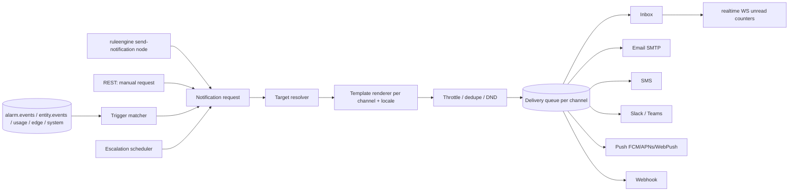

# Service 13 — Notification Center (`notify`)

> **Stage:** 5 · **Binary:** `cmd/notify` · **State:** Postgres + queues · **Priority:** P1 (email + inbox P0)

## 1. Purpose
Turn platform events (alarms, device activity, limits, edge status, system events) into **deliveries** on multiple channels with templates, targets, escalation, throttling and an in-app inbox.

## 2. ThingsBoard reference (3.5+)
- **Targets:** platform users (all / by role / specific users / customer users / tenant admins / affected user / originator's owner users / group), Slack channel, Microsoft Teams.
- **Templates** per delivery method: Web (inbox), Email, SMS, Slack, Teams, Mobile push.
- **Rules:** *trigger* + conditions + **escalation chain** (steps with delay and targets). Triggers include: alarm, alarm comment, alarm assignment, device activity, entity action, rule-engine component lifecycle event, entities limit, API usage limit, rate limits, edge connection / communication failure, new platform version, resource shortage, task failure.
- **Requests:** manual/bulk send with stats. Rule-engine node `send notification` for ad-hoc.

## 3. Pipeline


## 4. Data model
```sql
CREATE TABLE notification_target (id uuid PRIMARY KEY, tenant_id uuid NOT NULL, name text NOT NULL, config jsonb NOT NULL);
CREATE TABLE notification_template (id uuid PRIMARY KEY, tenant_id uuid NOT NULL, name text NOT NULL, type text NOT NULL, -- ALARM, DEVICE_ACTIVITY, GENERAL, ...
  config jsonb NOT NULL);   -- per-channel subject/body/buttons + locales
CREATE TABLE notification_rule (id uuid PRIMARY KEY, tenant_id uuid NOT NULL, name text NOT NULL, enabled boolean NOT NULL DEFAULT true,
  template_id uuid NOT NULL, trigger_type text NOT NULL, trigger_config jsonb NOT NULL, recipients_config jsonb NOT NULL, -- escalation steps
  throttle jsonb);
CREATE TABLE notification_request (id uuid PRIMARY KEY, created_time bigint NOT NULL, tenant_id uuid NOT NULL, rule_id uuid, template_id uuid,
  targets uuid[] NOT NULL, info jsonb, status text NOT NULL, stats jsonb);
CREATE TABLE notification (id uuid PRIMARY KEY, created_time bigint NOT NULL, tenant_id uuid NOT NULL, request_id uuid, recipient_id uuid NOT NULL,
  type text, subject text, body text, info jsonb, status text NOT NULL DEFAULT 'SENT');  -- SENT | READ
CREATE INDEX notification_inbox ON notification (recipient_id, status, created_time DESC);
CREATE TABLE notification_delivery (id uuid PRIMARY KEY, request_id uuid, recipient text, channel text, status text, attempts int, last_error text, next_attempt bigint, sent_ts bigint);
CREATE TABLE notification_pref (user_id uuid, channel text, trigger_type text, enabled boolean, quiet_hours jsonb, PRIMARY KEY (user_id, channel, trigger_type));
```

## 5. Targets, templates, rules
- **Target types:** `PLATFORM_USERS{filter}`, `SLACK{channel, credentials}`, `TEAMS{webhook}`, `WEBHOOK{url, secret}`, `EMAIL_LIST`, `SMS_LIST`. Filters: all users, tenant admins, customer users (of originator's customer), specific users, users with role R, affected user, originator-owner users.
- **Templates:** Go `text/template` with a **safe function set** and variables per trigger (`alarm.type`, `alarm.severity`, `device.name`, `customer.title`, `link`…); legacy `${var}` supported; per-channel overrides (e.g., email HTML + plain text; SMS ≤ 160 chars with truncation policy); **locales** (user language → tenant default → `en`); action buttons (open alarm, ack, open dashboard) rendered as deep links with signed one-click tokens for email ack (time-limited, single-use).
- **Rule engine:** match trigger event → evaluate conditions (severity ≥, alarm type regex, device profile, customer, ack/clear flags) → create request.
- **Escalation:** `steps: [{delay: 0, targets:[…]}, {delay: 15m, targets:[…]}]`; next step is scheduled (durable timer) and **cancelled** if the alarm is acked/cleared (for alarm triggers) before it fires.

## 6. Delivery
| Channel | Implementation | Notes |
|---|---|---|
| Inbox (WEB) | row in `notification` + `realtime` push | unread counters, mark read/all, bulk delete |
| Email | `wneessen/go-mail` SMTP (STARTTLS/TLS, per-tenant or system settings); API providers (SES/SendGrid/Mailgun) optional | DKIM by relay; bounce webhooks → delivery status |
| SMS | Twilio, AWS SNS, SMPP adapters | per-country rate limits; opt-out |
| Slack / Teams | Web API / webhook | thread-by-alarm optional |
| Push | FCM, APNs, WebPush (VAPID) | token registry per user device |
| Webhook | HMAC-SHA256 `X-Signature`, retries | **SSRF protection** (resolve + deny private nets, pin IP) |
Adapter SPI:
```go
type Channel interface {
    Name() string
    Validate(cfg json.RawMessage) error
    Send(ctx context.Context, d Delivery) (Result, error)   // idempotent by d.ID
    RateLimit() Limit
}
```
**Reliability:** at-least-once with `delivery.id` idempotency key; retries with exponential backoff + jitter (e.g., 10 s → 6 h, max 8); permanent failures → status `FAILED` + notification to admins (`TASK_PROCESSING_FAILURE`); **DLQ** for poison.

## 7. Throttling, dedupe, preferences
- **Throttle** per `(rule, recipient)`: max N per window (e.g. 5/10 min) with **digest** mode (batch into one message).
- **Dedupe key** from trigger (`alarmId+status`) to prevent repeats on replays.
- **User preferences:** per channel/trigger enable, quiet hours (DND; critical alarms may bypass if flagged), language, timezone.
- **Global safety:** per-tenant send quotas (email/SMS), spend caps; circuit breaker per provider.

## 8. System notifications
Emit from `core/audit/usage/edge-hub/platform`: entities-limit (80 %/100 %), API-usage warning/disabled, rate-limit exceeded, resource shortage, new platform version, edge offline/communication failures, rule-engine component lifecycle failures, certificate expiry, OTA campaign failures.

## 9. API
`CRUD /notification/targets|templates|rules`; `POST /notification/requests` (+ preview + stats); `GET /notifications` (inbox, cursor), `POST /notifications/{id}/read`, `POST /notifications/read-all`, `GET /notifications/unread-count`; `GET/PUT /notification/preferences`; `POST /notification/templates/{id}/preview`; settings: SMTP/SMS/Slack/push.

## 10. Observability
`iotp_notify_requests_total{trigger}`, `…_deliveries_total{channel,status}`, `…_delivery_seconds{channel}`, `…_retry_total{channel}`, `…_escalations_total`, `…_throttled_total`, `…_queue_depth{channel}`. Alert on failed-delivery ratio and provider breaker open.

## 11. Testing
Template rendering golden tests (locales, escaping — HTML auto-escape); escalation timeline tests with fake clock (cancel on ack); provider adapter contract tests with fakes; SSRF tests; load: 5 k deliveries/s.

## 12. Task checklist
- [ ] Schema + CRUD for targets/templates/rules/requests
- [ ] Trigger matcher on `alarm.events` + `entity.events` + system topics
- [ ] Target resolver (permission-aware)
- [ ] Template engine (+ locales, buttons, signed links)
- [ ] Delivery queue + inbox + realtime counters
- [ ] Email adapter; then SMS/Slack/Teams/push/webhook
- [ ] Escalation scheduler (durable timers, cancel on ack/clear)
- [ ] Throttle/digest/dedupe; preferences + DND
- [ ] Retry/DLQ; metrics; admin UI
