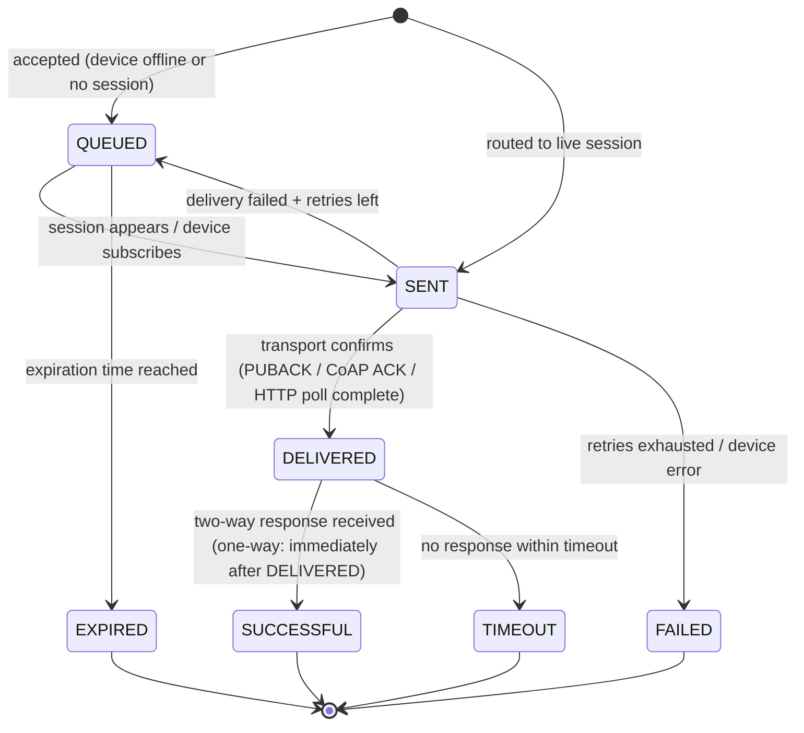

# Service 14 — RPC / Command & Control (`rpc`)

> **Stage:** 7 · **Binary:** `cmd/rpc` · **State:** Postgres + Redis (session map) · **Priority:** P1

## 1. Purpose
Reliable **server → device** commands (one-way/two-way, optionally *persistent*), **device → server** (client-side) requests routed to the rule engine, and delivery tracking across transports and offline periods.

## 2. ThingsBoard reference
- **One-way** (fire-and-forget) and **two-way** (await response) server-side RPC via REST (`/rpc/oneway/{deviceId}`, `/rpc/twoway/{deviceId}`); body `{method, params, timeout, persistent, retries, expirationTime, additionalInfo}`.
- **Persistent RPC** statuses: `QUEUED → SENT → DELIVERED → SUCCESSFUL`; failures `TIMEOUT`, `EXPIRED`, `FAILED`; queued RPC delivered when the device (re)connects/subscribes; REST to read/delete persistent RPC; lifecycle events emitted into the rule engine (`RPC_QUEUED`, `RPC_DELIVERED`, …).
- **Client-side RPC:** device publishes request → platform emits `TO_SERVER_RPC_REQUEST` → rule chain replies with *rpc call reply* node.
- Devices behind gateways receive RPC through gateway topics with device-name envelope.

## 3. State machine (persistent RPC)

Each transition: row update (`status`, `retries`, `response`), `rpc.events` message → rule engine (`RPC_*`), realtime push, audit entry. Transitions are **idempotent and monotonic** (guard `WHERE status IN (allowed_from)`).

## 4. Flows
### 4.1 Server → device (two-way, non-persistent)
1. `POST /rpc/twoway/{deviceId}` (timeout default 10 s, max from tenant profile).
2. Resolve session: Redis `sess:{deviceId}` → `{nodeId, sessionId}`; none → fast-fail `408 DEVICE_OFFLINE` (non-persistent).
3. Produce `RpcRequest` to `notify.transport.{nodeId}`; await correlation on an in-memory waiter keyed by `rpcId` (cluster-wide response routing via `rpc.responses.{rpcNodeId}` topic or Redis pub/sub).
4. Transport delivers; device replies (`v1/devices/me/rpc/response/{id}`) → transport → bus → `rpc` instance holding the waiter → HTTP response.
5. On timeout → `408`.

### 4.2 Persistent
Same, but the row is created first (`QUEUED`), HTTP returns `{rpcId}` immediately (or waits if `awaitResponse=true`); a **delivery scheduler** (per partition of `deviceId`) re-attempts on events: *session connected* (from `devstate.activity` / session events), *subscribe to RPC topic*, and a periodic sweep for stragglers. Ordering per device: `created_time` ascending; configurable **max in-flight per device** (default 1) to preserve command order for devices that can't pipeline.

### 4.3 Client-side RPC
Transport → `re.*` message `TO_SERVER_RPC_REQUEST` (metadata `requestId`, `deviceName`, `sessionNode`) → rule chain → `action.rpc_reply` → `rpc` sends `RpcResponse` downlink to the session node (timeout enforced; default 10 s).

### 4.4 Gateway children
Delivery wraps `{device: name, data: {id, method, params}}`; response correlates by `(gatewaySession, device, id)`.

## 5. Limits and safety
| Control | Default |
|---|---|
| Max timeout (two-way) | 60 s (tenant profile ≤ 1 h) |
| Max persistent expiration | 7 d |
| Max queued RPC per device | 100 (oldest-expired first; reject new beyond) |
| Payload size | 64 KB |
| Rate limit | per device (e.g. `5:1`), per tenant from profile |
| Idempotency | `Idempotency-Key` or client `requestId` → same `rpcId` |
| Dangerous methods | Profile-level **method allow-list/deny-list**; methods flagged `control` require `RPC_CALL` + (for SCADA tags) route via control policy |
| Audit | every call (who, device, method, params hash, result) |

## 6. Broadcast and campaign commands (P2)
`POST /rpc/broadcast {selector(EDQL filter), method, params, rate, maxConcurrent, stopOnFailureRatio}` — creates a **campaign** executed in waves with rate control, aggregated status, pause/resume/cancel; individual RPC rows link to `campaign_id`.

## 7. Data model
```sql
-- rpc table in 03-data-model.md; extensions:
ALTER TABLE rpc ADD COLUMN campaign_id uuid, ADD COLUMN request_id text, ADD COLUMN user_id uuid, ADD COLUMN params_hash bytea;
CREATE UNIQUE INDEX rpc_idem ON rpc (tenant_id, device_id, request_id) WHERE request_id IS NOT NULL;
CREATE TABLE rpc_campaign (id uuid PRIMARY KEY, tenant_id uuid, name text, selector jsonb, method text, params jsonb,
  rate_per_sec int, max_concurrent int, stop_ratio real, status text, stats jsonb, created_time bigint);
```

## 8. API
`POST /rpc/oneway/{deviceId}`, `POST /rpc/twoway/{deviceId}`, `GET /rpc/persistent/{rpcId}`, `GET /rpc/persistent/device/{deviceId}?status=&page=`, `DELETE /rpc/persistent/{rpcId}`, `POST /rpc/broadcast`, `GET /rpc/campaigns/{id}`. Rule-engine nodes: `action.rpc_request`, `action.rpc_reply`.

## 9. Observability
`iotp_rpc_total{mode,status}`, `…_latency_seconds{mode}`, `…_queued{tenant_class}`, `…_expired_total`, `…_redeliveries_total`, `…_waiters`, `…_session_miss_total`. Alert on rising `FAILED/TIMEOUT` ratio and queue growth.

## 10. Failure modes
| Failure | Behaviour |
|---|---|
| Transport node dies after send | No `DELIVERED` → retry on reconnect; at-least-once → devices must be idempotent (document `rpcId` in params metadata) |
| `rpc` instance dies with waiter | Two-way HTTP caller sees 5xx/timeout; persistent RPC unaffected |
| Redis session map stale | Transport rejects unknown session → `rpc` falls back to QUEUED |
| Duplicate response | Ignored (state guard) |

## 11. Testing
State-machine property tests (no illegal transitions, monotonic); chaos (kill transport/rpc mid-delivery); order tests with `maxInFlight=1`; transport contract tests per protocol; load: 5 k RPC/s.

## 12. Task checklist
- [ ] Schema + state machine + events
- [ ] Session routing + waiters + response routing
- [ ] Persistent delivery scheduler (session-connected triggers + sweep)
- [ ] Client-side RPC path + reply node
- [ ] REST API + permissions + audit + limits/allow-lists
- [ ] Gateway child delivery
- [ ] Idempotency; expiry sweeper
- [ ] Broadcast campaigns (P2); UI (control widgets + RPC history)
