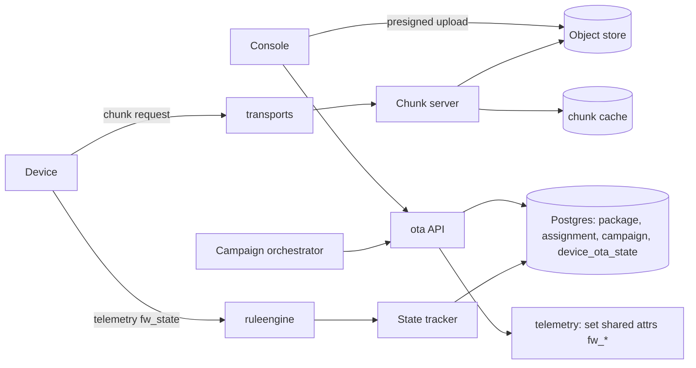
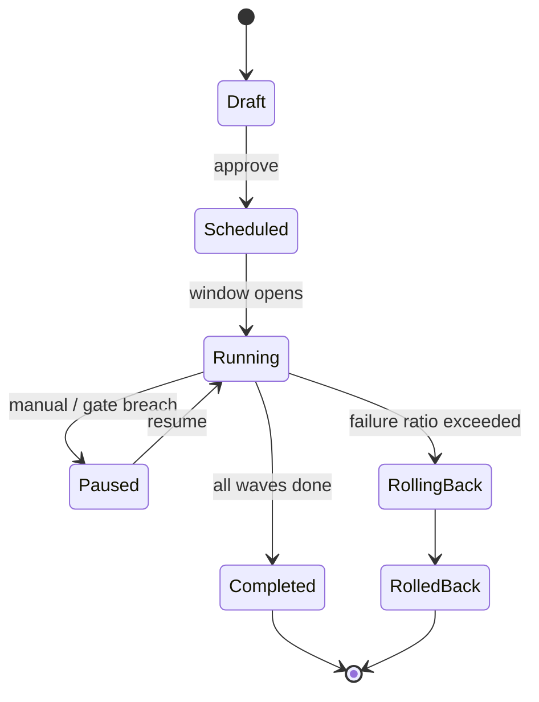

# Service 15 — OTA Updates & Campaigns (`ota`)

> **Stage:** 7 · **Binary:** `cmd/ota` · **State:** Postgres + object store · **Priority:** P1 (packages, state tracking) · P2 (campaigns, signing, delta)

## 1. Purpose
Store firmware/software packages, deliver them to devices over the device's own transport (chunked, resumable, verified), track per-device update state, and orchestrate **rollouts** safely.

## 2. ThingsBoard reference
- Package: `type` FIRMWARE | SOFTWARE, `title`, `version`, `tag`, optional `deviceProfileId`; either **uploaded binary** or **external URL**; `checksumAlgorithm` (MD5, SHA256, SHA384, SHA512, CRC32, MURMUR3_32/128) + checksum.
- Assignment on device profile or device. Platform sets shared attributes (`fw_title`, `fw_version`, `fw_checksum`, `fw_checksum_algorithm`, `fw_size`, `fw_tag`, `fw_url` / `sw_*`); device reports telemetry (`current_fw_title`, `current_fw_version`, `fw_state`, `fw_error` / `sw_*`).
- States: `QUEUED → INITIATED → DOWNLOADING → DOWNLOADED → VERIFIED → UPDATING → UPDATED | FAILED`.
- Delivery: MQTT chunk topics (`v2/fw/request/{id}/chunk/{n}`), CoAP block-wise, HTTP `/firmware`, LwM2M objects 5/9.
- Dashboard "Firmware/Software update" widgets show progress.

## 3. Architecture


## 4. Packages
- **Upload:** presigned multipart to object store (up to `maxOtaSizeMb`, default 512), server verifies checksum asynchronously, scans with ClamAV hook (optional), stores metadata. **URL packages:** platform stores URL + checksum; device downloads directly.
- **Integrity & authenticity (P2):** package **signature** (Ed25519 or cosign/sigstore) stored with metadata; device agent verifies using provisioned public key; optional **TUF-style metadata** (targets/snapshot/timestamp with expiry) for high-security fleets.
- **Delta updates (P2):** generate bsdiff/zstd-dictionary deltas between versions per profile; device reports base version; server picks delta or full.
- Immutable once referenced by an assignment; deprecation flag; retention policy.

## 5. Delivery
| Transport | Mechanism |
|---|---|
| MQTT | Device requests chunk `n` (size `s`) → server replies with raw bytes on response topic; server enforces size caps and per-device rate |
| HTTP | `GET /api/v1/{token}/firmware?title&version[&size&chunk]` with `Range`; `ETag`=checksum |
| CoAP | Block-wise (RFC 7959) |
| LwM2M | Object 5 push (Package URI) or pull; Object 9 for software |
**Chunk server:** reads object-store ranges, caches hot chunks in memory/Redis (fleet-wide downloads hit the same chunks), supports concurrent devices with per-tenant bandwidth shaping (token bucket), signed short-lived internal URLs; returns `404` when the device is not assigned that package version (authorisation by assignment).

## 6. State tracking
Device state arrives as telemetry (`fw_state`, `current_fw_version`, `fw_error`) or protocol-specific signals. `State tracker` consumes via the rule engine (`OTA_STATE` messages) and updates `device_ota_state(device_id, kind, target_pkg, state, progress, error, updated_ts)`. Progress derived from highest chunk requested/size. **Stalled detection:** no progress for `stallTimeout` (default 15 min) → state `STALLED` + retry hint.

## 7. Campaigns (P2) — safe rollouts

**Definition:** `selector` (EDQL filter / profile / group), `target package`, `rollback package` (optional), **waves** (e.g. 1 % canary → 10 % → 50 % → 100 %) with `soak` durations, **health gates** per wave (min success ratio, max error ratio, no new critical alarms from selected alarm types, telemetry sanity predicates e.g. `battery > 3.3 V`), **maintenance windows** (timezone-aware), **rate limits** (devices/min, bandwidth), **retry policy**, **exclusions**.
**Orchestrator loop:** compute eligible devices per wave → assign (set shared attrs/ profile override) → monitor states → evaluate gates → advance/pause/rollback; every decision logged in `campaign_event` and surfaced in UI. Manual overrides always available.

## 8. Data model
```sql
CREATE TABLE ota_assignment (id uuid PRIMARY KEY, tenant_id uuid NOT NULL, kind text NOT NULL, -- FIRMWARE|SOFTWARE
  package_id uuid NOT NULL, scope text NOT NULL, target_id uuid NOT NULL, -- DEVICE_PROFILE|DEVICE|CAMPAIGN
  created_time bigint NOT NULL, UNIQUE (scope, target_id, kind));
CREATE TABLE device_ota_state (device_id uuid, kind text, package_id uuid, state text NOT NULL, progress real, error text, updated_ts bigint NOT NULL,
  attempts int NOT NULL DEFAULT 0, PRIMARY KEY (device_id, kind));
CREATE TABLE ota_campaign (id uuid PRIMARY KEY, tenant_id uuid NOT NULL, name text, kind text, package_id uuid, rollback_package_id uuid,
  selector jsonb, waves jsonb, gates jsonb, window jsonb, rate jsonb, status text, created_by uuid, created_time bigint);
CREATE TABLE campaign_device (campaign_id uuid, device_id uuid, wave int, state text, updated_ts bigint, PRIMARY KEY (campaign_id, device_id));
CREATE TABLE campaign_event (id bigint GENERATED ALWAYS AS IDENTITY PRIMARY KEY, campaign_id uuid, ts bigint, type text, data jsonb);
```

## 9. API
`CRUD /otaPackages` (+ `POST /otaPackages/{id}/upload-url`, `GET /otaPackages/{id}/download` with permission), `POST /devices/{id}/ota/assign`, `POST /deviceProfiles/{id}/ota/assign`, `GET /devices/{id}/ota/state`, `CRUD /otaCampaigns` (+ `/start|pause|resume|abort|rollback`, `GET /otaCampaigns/{id}/devices`).

## 10. Edge self-update
Edge runtime uses the same signed-package format with **A/B + health gate** (doc 23); cloud campaigns can target edges (`kind=EDGE_BINARY`).

## 11. Security
Authorisation by assignment on every chunk; short-lived signed internal URLs; signature verification mandatory when enabled by profile; per-tenant storage quotas; malware-scan hook; no public bucket; audit uploads/assignments/campaign actions; downgrade protection (monotonic `version` unless `allowDowngrade`).

## 12. Observability
`iotp_ota_devices{state}`, `…_chunks_served_total`, `…_bytes_served_total`, `…_chunk_seconds`, `…_stalled_total`, `…_campaign_progress{campaign_class}`, `…_gate_breaches_total`. Dashboards: fleet versions histogram, failure reasons.

## 13. Testing
Resumable-download tests (kill/restart mid-download, Range), checksum/signature negative tests, chunk-cache correctness, campaign simulator with synthetic devices failing at configurable rates (verify gate/rollback logic), load: 50 k devices downloading a 20 MB image with bandwidth shaping.

## 14. Task checklist
- [ ] Package CRUD + presigned upload + checksum verify
- [ ] Assignment + shared-attribute publishing
- [ ] Chunk server (MQTT/HTTP first; CoAP/LwM2M later) + cache + shaping
- [ ] State tracker + stalled detection + dashboard widgets
- [ ] Campaign model + orchestrator + gates + windows
- [ ] Signing/verification; delta updates (P2)
- [ ] Edge binary updates integration
- [ ] Metrics, audit, load tests
