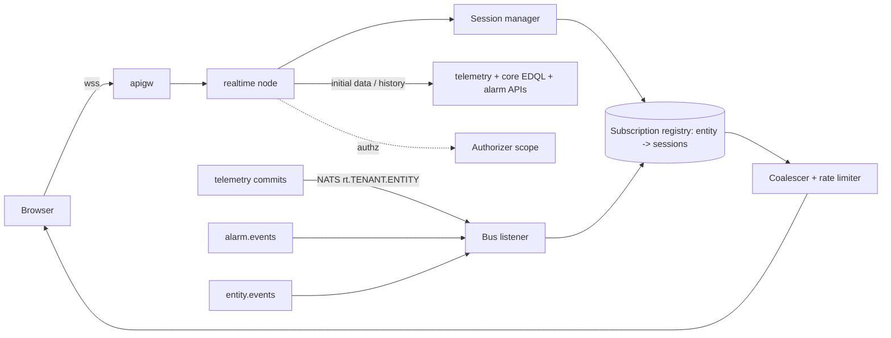

# Service 16 — Realtime / WebSocket (`realtime`)

> **Stage:** 6 · **Binary:** `cmd/realtime` · **Scales by:** WebSocket connections + fan-out rate · **State:** in-memory subscriptions · **Priority:** P0

## 1. Purpose
Push live data to browsers/apps: latest values, time-series windows, alarm tables/counters, entity counts, notifications, rule debug streams — with permission enforcement, coalescing and backpressure.

## 2. ThingsBoard reference
WebSocket plugin API with commands for **entity data** (query + latest + time-series + history), **alarm data**, **entity count**, **alarm count**, **notifications**; dynamic queries refresh periodically; per-session/tenant/customer subscription limits; update rate limiting (`ws updates per session` in tenant profile); legacy per-key subscriptions.

## 3. Architecture

**Fan-out transport:** NATS core subjects (ephemeral, at-most-once) `rt.{tenant}.{entityId}` published by `telemetry`/`alarm`/`devstate`; each `realtime` node subscribes **per active entity** (subscribe on first local subscriber, unsubscribe on last) → no broadcast of all data to all nodes. In lite mode: in-process pub/sub. Missing an update is acceptable because every update carries `ts` and clients re-sync on reconnect.

## 4. Protocol (see `04-protocols-and-api.md §5`)
Frames: `AUTH`, `REAUTH`, `cmds[]` (`ENTITY_DATA`, `ALARM_DATA`, `ENTITY_COUNT`, `ALARM_COUNT`, `NOTIFICATIONS`, `NOTIFICATIONS_COUNT`, `RULE_DEBUG`, `UNSUBSCRIBE`), server `data`/`update` frames, `ERROR`, `PING`. JSON by default; optional MessagePack; `permessage-deflate` negotiated.

## 5. Subscription model
```go
type Subscription struct {
    Session  *Session
    CmdID    int
    Kind     Kind                 // ENTITY_DATA | ALARM_DATA | COUNT | NOTIF | DEBUG
    Query    *edql.Query          // static or dynamic
    Entities map[EntityRef]struct{} // current resolved result set (page)
    Keys     KeySet               // latest keys, ts keys
    TsWindow *Window              // real-time sliding window or history (agg/interval/limit)
    Scope    authz.Scope          // evaluated at subscribe and on scope-version change
}
```
**Lifecycle:** subscribe → authorise → run initial queries (EDQL page, latest values, history) → send `data` → register entity interests → deliver `update` frames. **Dynamic queries** (filters that may match new entities): re-evaluate on `entity.events` for the tenant (debounced 1–5 s) and by a periodic refresh (min interval from limits); diff result set and adjust interests.
**Real-time windows:** server maintains no history per subscription; for a sliding window the client merges `update` points and drops expired; server only guarantees the *initial* history fetch + subsequent points with `ts > lastSent`.

## 6. Coalescing, ordering, backpressure
- **Per-session send queue** (bounded, default 512 frames / 1 MB). Updates for the same `(cmdId, entity, key)` are **coalesced** (latest wins) when the queue is non-empty.
- **Rate limits:** per session `"50:1,500:60"` frames, per tenant from profile; excess → coalesce harder, then drop with a `THROTTLED` notice frame.
- **Slow consumer:** if queue stays full > 10 s → close with `1013 Try Again Later`.
- **Ordering:** per entity key by `ts` (server sends max-ts monotonic per key; out-of-order older points still delivered for time-series cmds but not for "latest" cmds).
- **Heartbeat:** ping every 30 s; idle timeout 70 s; JWT expiry handled by `REAUTH` (server sends `AUTH_EXPIRING` 60 s before).

## 7. Authorisation
Evaluated at subscribe and re-evaluated when the principal's **scope version** changes (role/ownership updates arrive on `entity.events`); results filtered by `authz.Filter` in EDQL; per-entity read permissions for telemetry vs attributes vs alarms. Public dashboards use a **public principal** with an allow-list (dashboard id → entities/keys) and stricter limits.

## 8. Limits
Per tenant/customer/user: max sessions (default 100/1 000 tenant), max subscriptions per session (50) and per tenant (profile), max entities per subscription (page ≤ 1 000), max keys per subscription (50), history max points (50 000). Violations return error frames with codes (`MAX_SUBSCRIPTIONS`, `TOO_MANY_ENTITIES`, …).

## 9. Scaling
~50 k connections per 2 vCPU/4 GB node (coder/websocket, one goroutine per direction, pooled buffers); sticky routing unnecessary (each connection lives on one node); node count by connection and fan-out rate; hot entities (many viewers) handled by per-node subscription dedupe: **one NATS subscription per entity per node**, in-process fan-out to sessions. Rolling deploy: send `1012 Service Restart` with reconnect jitter hint.

## 10. Observability
`iotp_rt_sessions`, `…_subscriptions{kind}`, `…_updates_in_total`, `…_frames_out_total`, `…_coalesced_total`, `…_dropped_total`, `…_send_queue_depth` (histogram), `…_initial_query_seconds{kind}`, `…_slow_consumer_closed_total`. SLO: p99 commit→browser < 1 s at 10 k updates/s/node.

## 11. Testing
Load with 50 k simulated clients (k6/ws or custom); coalescing property tests (final state equals last write); permission-change tests (revoke access → updates stop ≤ 5 s); reconnect storm tests; fuzz protocol frames; browser integration tests (Playwright) for resubscribe after reconnect.

## 12. Task checklist
- [ ] WS server, auth/reauth, framing, limits
- [ ] Subscription registry + NATS per-entity interests
- [ ] ENTITY_DATA (latest + ts + history) with EDQL integration
- [ ] ALARM_DATA / counts / NOTIFICATIONS
- [ ] Dynamic query refresh + diffing
- [ ] Coalescer, rate limit, slow-consumer policy
- [ ] Scope-change re-evaluation; public principal
- [ ] RULE_DEBUG stream for the rule editor
- [ ] Metrics, load/soak tests; client SDK (`web/packages/sdk`)
