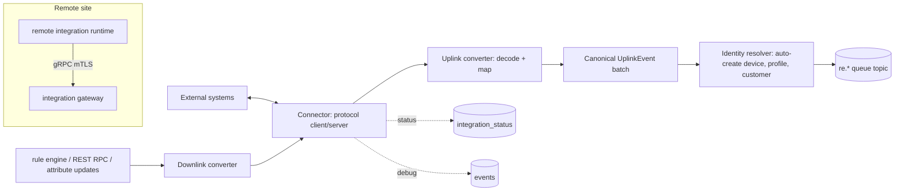

# Service 18 — Integrations & Converters (`integration`)

> **Stage:** 8 · **Binary:** `cmd/integration` (also runs as a **remote integration** at customer sites) · **State:** Postgres + bus · **Priority:** P1

## 1. Purpose
Connect external systems and third-party networks (LoRaWAN servers, cloud IoT hubs, brokers, webhooks, industrial sources) to the platform in both directions using **declarative converters** (payload ↔ canonical platform events), without writing a transport.

## 2. ThingsBoard reference (PE "Platform Integrations")
- **Integration** = connector type + config + credentials + debug mode; **uplink converter** (raw payload → devices/telemetry/attributes) and optional **downlink converter** (platform RPC/attribute update → raw message). Converters are scripts (TBEL/JS) with a payload-decoder API; they emit `{deviceName, deviceType, customerName, groupName, telemetry, attributes}`.
- Families: HTTP, MQTT, TCP/UDP, CoAP, Kafka, AWS (IoT Core, SQS, Kinesis), Azure (IoT Hub, Event Hub), GCP Pub/Sub, LoRaWAN servers (ChirpStack, TTN/TTI, LORIOT), Sigfox, OPC-UA, custom Java integrations. **Remote integrations** run near devices and connect back to the platform.
- Executed by an **integration executor** microservice scaled independently; debug events for each uplink/downlink.

## 3. Architecture

Deployment: **embedded** (lite), **shared executor pool** (cluster, partitioned by integration id), or **remote** (gRPC stream to platform with enrollment like an edge).

## 4. Canonical events
```go
type UplinkEvent struct {
    Device    DeviceRef            // name, type/profile, label, customer, group(s), gateway?
    Telemetry []TsBatch            // {ts, values map[string]any}
    Attributes map[string]any      // client scope
    Server     map[string]any      // optional server-scope
    Meta       map[string]string   // integrationId, rssi, gatewayId, fPort ...
    Raw        []byte              // optional retained payload (debug)
}
type DownlinkEvent struct { Device DeviceRef; Kind string /*RPC|ATTR_UPDATE|ADMIN*/; Method string; Params any; Id string }
```
Identity resolver rules: `create-if-absent` (per integration setting), profile mapping by `deviceType`, customer/group assignment by name, name templating, **dedupe by device name** cache, rate-limited auto-creation (protects quotas).

## 5. Converters
Three authoring modes (progressively powerful):
1. **Declarative mapping (no-code):** JSONPath/JSONata-style rules (`$.payload.temp → telemetry.temperature`), type casts, scaling, units, timestamp parsing (ISO/epoch/custom format), device name template (`${$.devEUI}`), conditionals.
2. **Expression (`expr`):** a single decode expression/function with helper library (`hexToBytes`, `base64Decode`, `readInt16LE`, `bitAt`, `parseCSV`, `parseXML`, `crc16`…).
3. **WASM/JS plugin (P2):** full decoders (e.g., vendor LoRaWAN payload decoders in JS via `goja`, or WASM).
Built-in **payload formats**: JSON, CSV, XML, hex/bytes, protobuf (descriptor), CBOR, SenML, Cayenne LPP, TTN v3 formatters, LoRaWAN ChirpStack/TTI envelopes.
**Test harness (essential UX):** paste sample payload + metadata → run converter → show canonical output and errors; save test cases per converter; CI-style regression when converter edited; **debug capture** of last N uplinks/downlinks per integration with redaction.

## 6. Connector catalog (priority)
| Connector | Pri | Notes |
|---|---|---|
| HTTP/Webhook (server) | P1 | per-integration URL + secret/HMAC/basic/mTLS, replay protection, batch support |
| MQTT client (subscribe topics, publish downlinks) | P1 | TLS, QoS, shared subscriptions, reconnect/backoff |
| Kafka consumer/producer | P1 | consumer groups, offsets, schema-registry hook |
| LoRaWAN: ChirpStack, TTN/TTI, LORIOT, Actility ThingPark | P1 | HTTP/MQTT/gRPC per vendor; downlink queueing, fPort/confirmed flags; join/ADR events as attributes |
| Sigfox callbacks | P2 | |
| AWS IoT Core / SQS / Kinesis / SNS | P2 | IAM role or key; checkpointing for Kinesis |
| Azure IoT Hub / Event Hubs | P2 | consumer groups, partition leases |
| GCP Pub/Sub | P2 | |
| TCP / UDP servers | P2 | framing (newline, length-prefix, delimiter, fixed), keepalive |
| CoAP server | P2 | |
| OPC UA client | P1 | node subscriptions → telemetry (reuses `pkg/connectors/opcua`) |
| Modbus/BACnet/etc. | via `field-gateway` | not duplicated here |
| Custom (gRPC plugin) | P2 | SDK: implement `Connector` in any language |
```go
type Connector interface {
    Type() string
    Validate(cfg json.RawMessage) error
    Start(ctx context.Context, env Env, up Uplink) error      // push raw messages into the pipeline
    Downlink(ctx context.Context, d DownlinkRaw) error        // deliver encoded downlink
    Status() Status                                           // connected, lastError, counters
    Stop(ctx context.Context) error
}
```

## 7. Execution model
- **Partitioned runtime:** each integration is owned by one instance (consistent hash of integration id, lease with fencing). Failover re-starts connectors elsewhere; stateful ones checkpoint offsets (Kafka/Kinesis) in the DB.
- **Pipeline:** `connector → bounded channel → N converter workers → batcher → bus producer`; batch up to 500 events/50 ms; ack upstream after bus ack when protocol allows (Kafka offset commit, HTTP 200, MQTT QoS1 puback after produce).
- **Backpressure:** pause connector reads when bus lagging; HTTP returns 429/503 with `Retry-After`.
- **Limits:** per-integration concurrency, payload size, events/s; per-tenant quotas for integration count and throughput (usage metering).
- **Downlinks:** subscribe to `rpc`/attribute-update events for devices created by the integration (index `device → integration`); encode via downlink converter; delivery tracking (SENT/ACKED/FAILED) feeds RPC state where applicable.
- **Secrets:** credentials by reference to the secrets store; exports contain placeholders.

## 8. Data model
```sql
CREATE TABLE converter (id uuid PRIMARY KEY, tenant_id uuid NOT NULL, name text NOT NULL, direction text NOT NULL, -- UPLINK|DOWNLINK
  mode text NOT NULL, definition jsonb NOT NULL, tests jsonb, version int NOT NULL DEFAULT 1, UNIQUE (tenant_id, name));
CREATE TABLE integration (id uuid PRIMARY KEY, tenant_id uuid NOT NULL, name text NOT NULL, type text NOT NULL, enabled boolean NOT NULL DEFAULT true,
  uplink_converter_id uuid, downlink_converter_id uuid, config jsonb NOT NULL, secrets_ref jsonb, remote boolean NOT NULL DEFAULT false,
  routing_key text, debug_until bigint, version int NOT NULL DEFAULT 1, UNIQUE (tenant_id, name));
CREATE TABLE integration_status (integration_id uuid PRIMARY KEY, state text, last_error text, last_ok_ts bigint, counters jsonb, instance text);
CREATE TABLE integration_checkpoint (integration_id uuid, partition_key text, position bytea, updated_ts bigint, PRIMARY KEY (integration_id, partition_key));
```

## 9. API
`CRUD /converters` (+ `POST /converters/test`), `CRUD /integrations` (+ `/start|stop|restart`, `GET /integrations/{id}/status`, `GET /integrations/{id}/debug`), `POST /integrations/{id}/send-test`, remote: `POST /integrations/{id}/enroll`.

## 10. Observability & security
Metrics: `iotp_int_events_total{type,result}`, `…_decode_seconds`, `…_lag_seconds`, `…_connector_state{type}`, `…_autocreated_devices_total`, `…_downlink_total{status}`. Security: HMAC verification for webhooks, replay windows, mTLS for remote integrations, SSRF-safe outbound, secrets store, payload size caps, converter sandboxing (no network/FS), per-tenant isolation of executor workers.

## 11. Testing
Converter golden tests (vendor payload corpora); connector integration tests with containers (Mosquitto, Kafka, ChirpStack); chaos on connector reconnects; duplicate/ordering tests with checkpointing; load: 20 k events/s per executor pod.

## 12. Task checklist
- [ ] Canonical event + identity resolver + bus pipeline
- [ ] Converter engine: declarative → `expr` → JS/WASM; test harness + debug capture
- [ ] Connectors: HTTP, MQTT, Kafka, ChirpStack, TTN/TTI, OPC UA (first)
- [ ] Partitioned runtime with leases + checkpoints
- [ ] Downlink path + delivery tracking
- [ ] Remote integration runtime + enrollment
- [ ] Secrets integration; quotas/metering
- [ ] UI: integration wizard, converter editor with live tester
- [ ] Remaining connector families; custom gRPC connector SDK
