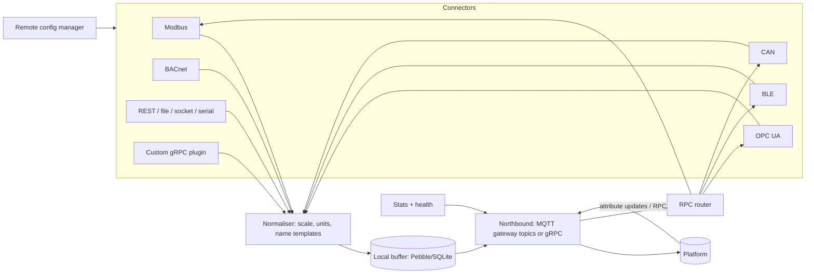

# Service 19 — Field Gateway (`field-gateway`)

> **Stage:** 8 · **Binary:** `cmd/field-gateway` (static Go, `linux/{amd64,arm64,arm}`, Windows service) · **Library:** `pkg/connectors` (shared with `edge`) · **Priority:** Modbus/OPC UA/MQTT P1 · BLE/CAN/BACnet/KNX/S7/serial P2

## 1. Purpose
An on-site agent that speaks **field protocols** (Modbus, OPC UA, BLE, CAN, BACnet, KNX, serial, REST, files, SNMP, OCPP…) southbound and the platform's **gateway protocol** northbound, with local buffering, remote configuration and statistics. Use it when you need protocol conversion but not a full edge runtime (the edge runtime embeds the same connectors).

## 2. ThingsBoard reference (IoT Gateway, Python)
Connectors: MQTT, Modbus (TCP/RTU, master/slave), OPC-UA, BLE, CAN, BACnet, KNX, ODBC, REST client/server, SNMP, FTP/file, socket, XMPP, OCPP, custom extensions. Northbound over MQTT (`v1/gateway/*`) or gRPC; per-device mapping configs (JSON); local **storage** (memory/file/SQLite) with retry; **remote configuration/logging/shell** via shared attributes/RPC; statistics telemetry; provisioning; one gateway device in the platform with many child devices.

## 3. Architecture


## 4. Connector SPI (shared with edge)
```go
type Connector interface {
    Name() string
    Configure(cfg json.RawMessage) error
    Run(ctx context.Context, sink Sink) error            // emits Sample/Event; blocks until ctx done
    HandleWrite(ctx context.Context, w WriteReq) (WriteResp, error)   // attribute update / RPC
    Devices() []DeviceInfo                                // for connect/disconnect lifecycle
    Health() Health
}
type Sink interface {
    Telemetry(dev string, ts int64, kv []KV)
    Attributes(dev string, kv []KV)
    Connected(dev string, meta DeviceMeta)                // creates/updates child device
    Disconnected(dev string)
}
```
Connectors are **plugins at compile time** (build tags) or **out-of-process via gRPC** (language-agnostic custom connectors, with the same `Connector` proto), so the core binary stays small.

## 5. Connector specs (summary)
| Connector | Library | Key features |
|---|---|---|
| **Modbus** | `simonvetter/modbus` | TCP/RTU/ASCII; master (poll) + slave (server) modes; function codes 1–6, 15, 16; register types; endianness/word-swap; scaling `(raw*mul+add)`; bit extraction; block-read coalescing; per-device poll period; retry/backoff; timeout; **write via RPC/attribute update** with verify |
| **OPC UA** | `gopcua/opcua` | Browse/discover, monitored-item subscriptions (sampling/publishing intervals, deadband), data-change vs polling, security policies (None…Aes256), certificates trust store, user/pass & cert auth, reconnect with session recovery, method calls as RPC |
| **MQTT** | paho | Subscribe to third-party topics → JSON path mapping; publish downlinks |
| **BLE** | `tinygo-org/bluetooth` (BlueZ) | Scan, connect, GATT read/notify/write, retry, RSSI as attribute |
| **CAN** | `einride/can-go` | SocketCAN, DBC parsing → signals, J1939 optional |
| **BACnet/IP** | evaluate libs / sidecar | Who-Is/I-Am, ReadProperty/ReadPropertyMultiple, COV subscriptions, WriteProperty with priority |
| **REST client/server** | stdlib | Poll endpoints with templates; accept webhooks locally |
| **File/FTP/serial/socket** | stdlib | CSV/line-based parsers, tail with rotation, framing |
| **S7 / EtherNet-IP / KNX / DNP3 / IEC-104** | per-lib | P2, add on demand |
**Mapping config** (YAML/JSON, validated by schema; hot-reloadable):
```yaml
devices:
  - name: "Pump-${slaveId}"
    type: "pump"
    modbus: { host: 192.168.1.20, port: 502, unitId: 3, pollMs: 1000, timeoutMs: 800 }
    telemetry:
      - { key: speed_rpm, register: holding, address: 100, type: uint16, scale: 1.0 }
      - { key: temp_c,    register: input,   address: 200, type: int16,  scale: 0.1, unit: degC }
    attributes: [ { key: serial, register: holding, address: 10, type: string, length: 8 } ]
    writes:
      - { name: setSpeed, register: holding, address: 101, type: uint16, min: 0, max: 3000 }
```

## 6. Northbound
- **MQTT mode (default, TB-compatible):** gateway device authenticates once (token/X.509); uses `v1/gateway/{connect,disconnect,telemetry,attributes,rpc,claim}`; child device auto-creation per gateway profile; shared-attribute subscription for config/RPC.
- **gRPC mode:** bidirectional stream with batching/compression; same semantics; better for constrained links.
- **Buffering:** all outbound events go through the local buffer (memory → file/Pebble overflow) with **ack-based deletion**, retry/backoff, size caps and drop policy (oldest telemetry first; never drop alarms/events); per-connector rate shaping.
- **Time:** sample timestamps from source if available, else gateway clock (NTP-checked); quality flag when unsynced.

## 7. Remote management
Shared attributes carry **configuration** (versioned JSON; gateway validates, applies atomically, rolls back on failure, reports `config_version`/errors); RPC methods: `restart_connector`, `get_logs`, `set_log_level`, `discover_devices`, `diag_ping`, `update_self` (signed). **Statistics telemetry** every 60 s: per-connector connected devices, polls/s, errors, buffer depth/age, CPU/mem, northbound latency. Remote shell is **not** provided by default (security); a time-boxed audited diagnostic tunnel can be enabled per device.

## 8. Security
mTLS/TLS northbound; secrets (OPC UA certs/keys, passwords) encrypted on disk (keyring/TPM if available); no inbound ports required (except optional local Modbus slave/REST server on LAN); signed self-updates (shared updater with edge); principle of least privilege (drop capabilities, non-root, systemd hardening); per-connector network allow-lists to avoid being used as a pivot.

## 9. Observability and ops
Prometheus endpoint (optional), JSON logs with rotation, `/healthz` local; packaging `.deb/.rpm/.msi/Docker`; config linter CLI (`field-gateway lint config.yaml`); simulator mode for each connector (record/replay) for dev and CI.

## 10. Testing
Protocol simulators (Modbus `diagslave`/`pymodbus`, OPC UA `node-opcua` server, BlueZ mocks); fault injection (timeouts, partial frames, session drops); long-run soak with buffer pressure; interoperability matrix with common PLC vendors (Siemens, Schneider, Beckhoff) in the lab; fuzz decoders (Modbus ADU, CAN frames).

## 11. Task checklist
- [ ] Connector SPI + Sink + normaliser + buffer + northbound (MQTT)
- [ ] Config schema, validator, hot reload, versioned remote config
- [ ] Modbus (master/slave), OPC UA, MQTT connectors
- [ ] RPC/attribute write path with verification
- [ ] Stats/health/diagnostics; signed updater
- [ ] gRPC northbound + out-of-process connector protocol
- [ ] BLE, CAN, REST/file/serial; BACnet; S7/KNX on demand
- [ ] Simulators, interop lab, soak/fuzz suites; packaging
