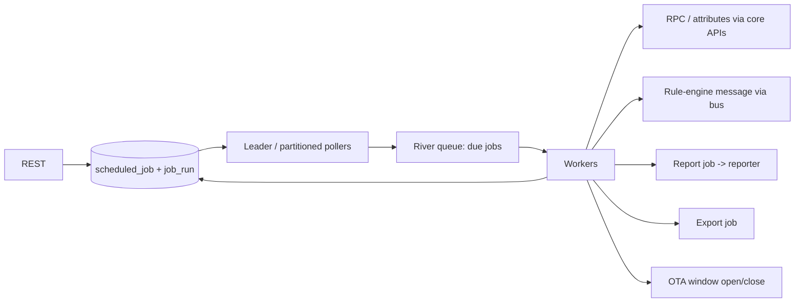

# Service 20 — Scheduler & Reporter (`scheduler`, `reporter`)

> **Stage:** 12 · **Binaries:** `cmd/scheduler`, `cmd/reporter` · **State:** Postgres (+ River jobs) + object store · **Priority:** P1

## 1. Purpose
**Scheduler:** time-based automation (cron/intervals/one-shot) that can send RPC, update attributes, emit rule-engine messages, run reports/exports, trigger OTA windows. **Reporter:** render dashboards/widgets to **PDF/PNG** and export data to **CSV/XLSX/Parquet**, deliver by email/Slack/webhook/object store.

## 2. ThingsBoard reference
PE **Scheduler** events (generate report, update attributes, send RPC to device, custom) with repeat rules and timezones; PE **Reports** (4.2 "Reporting 2.0"): dashboard-to-PDF/PNG, templates, scheduled delivery via email/notifications, tenant-level report management.

## 3. Scheduler design

- **Schedule spec:** `{kind: ONCE|INTERVAL|CRON, tz, startTs, endTs, cron "0 8 * * MON-FRI", interval, misfire: SKIP|RUN_ONCE|RUN_ALL, jitter}`; calendars (holidays, business hours) as optional exclusions.
- **Execution:** at-least-once with `job_run(id, job_id, scheduled_for, started, finished, status, attempt, error)`; unique `(job_id, scheduled_for)` ensures **exactly one logical run per fire time** (idempotent claim via `INSERT … ON CONFLICT DO NOTHING`).
- **Distribution:** pollers claim due rows with `FOR UPDATE SKIP LOCKED` (no leader election needed); River (Postgres-backed queue) for retries/backoff/unique jobs; timers also usable in lite mode with an in-process cron.
- **Targets:** *device/asset/customer selectors* (EDQL) for fan-out (rate-limited, chunked); per-run summary (N targeted, N succeeded).
- **Safety:** per-tenant job quotas, max fan-out, dry-run preview, pause/resume, audit, DST-correct (store IANA tz; compute next fire in tz).
- **Edge:** schedules assigned to an edge are evaluated locally by the edge runtime (same `pkg/schedule`).

## 4. Reporter design
```mermaid
sequenceDiagram
  participant S as scheduler / API
  participant R as reporter
  participant C as Headless Chromium pool
  participant UI as console (print route)
  participant O as Object store
  participant N as notify
  S->>R: ReportRequest{template, dashboard, state, timewindow, filters, format, recipients}
  R->>R: mint short-lived report token (scope: read dashboard + data, TTL 5 min)
  R->>C: open /print/dashboards/{id}?token=...&tw=...
  C->>UI: render; UI signals window.__REPORT_READY__
  C-->>R: PDF/PNG bytes
  R->>O: store (retention policy)
  R->>N: deliver email/Slack/webhook with signed link or attachment
```
- **Rendering:** `chromedp` workers in a **sandboxed pool** (separate pods, seccomp, no network except platform ingress allow-list, memory/CPU limits, per-job timeout 120 s, max concurrent per tenant). A dedicated **print mode** in the React app: fixed viewport, animation off, waits for all widgets to report ready, applies page-size/orientation/margins/header/footer, supports multi-page (per-state/per-widget).
- **Templates:** layout (A4/Letter/custom, landscape), header/footer with variables (`{{tenant}}`, `{{date}}`, `{{page}}`), cover page (logo from white-label), table-of-widgets, language/timezone, theme (light for print).
- **Data exports:** timeseries/alarms/entities → CSV/XLSX (`excelize`)/Parquet (`parquet-go`), streaming to object store; column selection, timezone, units, aggregation; row limits and async job with progress.
- **Delivery:** email (attachment ≤ 10 MB else signed link), Slack/Teams (file upload or link), webhook (signed), S3/GCS copy, retention (default 90 d); delivery status per recipient.
- **Security:** report token limited to one dashboard/state, read-only, IP-pinned to reporter; SSRF guards on any URL fetch; **no user JS execution outside widget sandbox**; PII redaction option; per-tenant quotas (reports/day, pages, storage).

## 5. Data model
```sql
CREATE TABLE scheduled_job (id uuid PRIMARY KEY, tenant_id uuid NOT NULL, name text NOT NULL, enabled boolean NOT NULL DEFAULT true,
  schedule jsonb NOT NULL, action_type text NOT NULL, action jsonb NOT NULL, selector jsonb, next_fire bigint, misfire text, version int NOT NULL DEFAULT 1);
CREATE INDEX scheduled_due ON scheduled_job (next_fire) WHERE enabled;
CREATE TABLE job_run (id uuid PRIMARY KEY, job_id uuid NOT NULL, scheduled_for bigint NOT NULL, started bigint, finished bigint,
  status text NOT NULL, attempt int NOT NULL DEFAULT 1, error text, summary jsonb, UNIQUE (job_id, scheduled_for));
CREATE TABLE report_template (id uuid PRIMARY KEY, tenant_id uuid NOT NULL, name text NOT NULL, config jsonb NOT NULL, version int NOT NULL DEFAULT 1);
CREATE TABLE report_run (id uuid PRIMARY KEY, tenant_id uuid NOT NULL, template_id uuid, source jsonb, format text, status text, storage_key text,
  size bigint, pages int, created_time bigint, expires_ts bigint, error text);
```

## 6. API
`CRUD /scheduledJobs` (+ `/run-now`, `/pause`, `/resume`, `/preview-next?count=10`), `GET /scheduledJobs/{id}/runs`; `CRUD /reportTemplates`, `POST /reports/generate`, `GET /reports/{id}`, `GET /reports/{id}/download`; `POST /exports/{timeseries|alarms|entities}`, `GET /exports/{id}`.

## 7. Observability
`iotp_sched_fires_total{action,result}`, `…_lag_seconds` (scheduled vs started), `…_misfires_total`, `…_fanout_targets`, `iotp_report_render_seconds`, `…_failures_total{reason}`, `…_pool_busy`, `…_export_rows_total`. Alerts: scheduler lag > 30 s, render failure ratio, pool saturation.

## 8. Testing
Fake-clock tests for cron/DST/misfire policies; concurrency tests (N pollers → one run per fire time); report visual tests (golden PNG with tolerance); chaos (kill reporter mid-render → job retried once); load: 10 k jobs/min fires; 50 concurrent renders.

## 9. Task checklist
- [ ] Schedule spec + next-fire computation (tz/DST) + misfire policies
- [ ] DB-claim pollers + River workers + idempotent runs
- [ ] Actions: RPC, attributes, rule message, report, export, OTA window
- [ ] Reporter pool + print mode in UI + templates
- [ ] Exports (CSV/XLSX/Parquet) streaming
- [ ] Delivery channels + retention + quotas + audit
- [ ] Edge-local scheduling; UI (calendar preview, run history)
