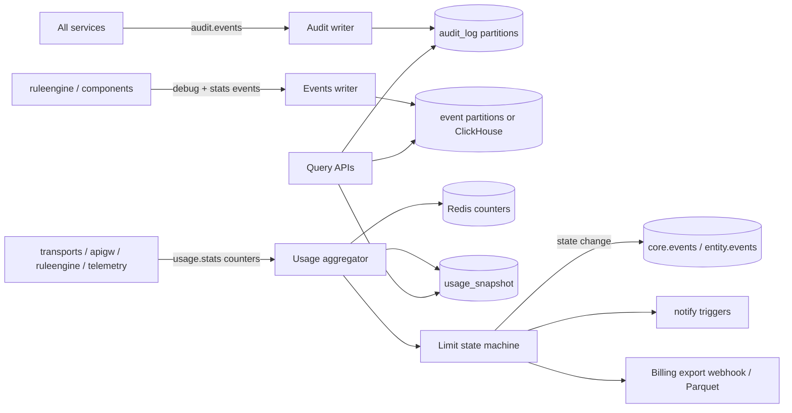

# Service 21 — Audit, Events & Usage (`audit`)

> **Stage:** 3 (events, basic usage), 12 (full audit, metering) · **Binary:** `cmd/audit` (modules: audit, events, usage) · **State:** Postgres/ClickHouse + Redis · **Priority:** P1

## 1. Purpose
Three related operational data planes: **Audit log** (who did what), **Events** (system/debug/statistics records for entities and components), and **Usage & limits** (metering, quotas, API-usage state, billing hooks).

## 2. ThingsBoard reference
- **Audit log:** user actions (CRUD, login, RPC, attribute changes, alarm ops…) with status and details; retention via tenant profile; filterable by user/entity/action/time.
- **Events:** lifecycle, error, **debug** (rule node in/out), **statistics** (rule-engine/queue stats); stored in a dedicated partitioned store (isolation recommended); TTL by tenant profile.
- **Usage/limits:** tenant profile defines entity counts, transport/REST/WS rate limits, monthly counters (transport messages, rule-engine executions, JS executions, data points), **API usage state** per feature (`ENABLED`, `WARNING` at ~80 %, `DISABLED` at 100 %), notifications on thresholds, usage dashboard.

## 3. Architecture


## 4. Audit log
**Record:** `{id, ts, tenant, customer, actor{userId,name,ip,ua,sessionId,impersonator}, action(type,data), entity{type,id,name}, status, failure, traceId}`. Actions: CREATED, UPDATED, DELETED, ASSIGNED_*, ATTRIBUTES_*, RPC_CALL, CREDENTIALS_*, LOGIN/LOGOUT/LOGIN_FAILED, ALARM_*, CONTROL_WRITE, APPROVAL, EXPORT, API_KEY_*, IMPERSONATION, etc.
- **Write path:** services publish `audit.events` (async, non-blocking; local spool if bus down); writer batches into day-partitioned `audit_log`.
- **Tamper evidence:** per-tenant **hash chain** (`hash = SHA256(prev_hash || canonical(record))`), periodic **anchor** (daily root hash signed with a service key and optionally published to object-lock storage / external timestamping); `GET /audit/verify?from&to` re-computes the chain.
- **Privacy:** no secrets/payloads; sensitive fields hashed or redacted by an allow-list serializer; GDPR export/erase for a subject (pseudonymise `user_name/ip` while keeping chain validity via tokenised fields).
- **Export:** syslog (RFC 5424) / Kafka / Splunk HEC / S3 NDJSON for SIEMs.
- **Retention:** `retention.auditDays` (default 365; compliance profiles up to 7 y with cold storage).

## 5. Events
| Event type | Source | Purpose | Default TTL |
|---|---|---|---|
| `LC_EVENT` (lifecycle) | components (rule chains, integrations, edges) | started/stopped/failed | 7 d |
| `ERROR` | components | runtime errors with stack-safe message | 7 d |
| `DEBUG_RULE_NODE` | rule engine | in/out per node (sampled) | 24 h |
| `DEBUG_INTEGRATION` / `DEBUG_CONVERTER` | integration | uplink/downlink payload samples | 24 h |
| `STATS` | rule engine/queues/transports | msgs processed/failed, latency | 30 d (aggregated) |
Storage: partitioned PG table (`event`) by day; **separate DB/cluster for debug-heavy tenants** (prevents debug spikes from hurting entity queries — a lesson from large ThingsBoard deployments); ClickHouse option for volume. Hard caps: payload ≤ 8 KB/field, rate-limited per tenant (e.g., 1 000 debug events/s), automatic debug-off after window.

## 6. Usage, quotas and limits
**Counters (per tenant, per period):** `transportMsgs`, `transportDataPoints`, `ruleEngineExecutions`, `scriptExecutions`, `restCalls`, `wsUpdates`, `emailsSent`, `smsSent`, `storageBytes`, `activeDevices`, `integrationEvents`, `reportPages`, `otaBytes`.
- **Hot path:** components increment **local counters** and flush every 1–5 s to `usage.stats`; the aggregator sums into Redis (`usage:{tenant}:{yyyymm}:{counter}`) and snapshots to Postgres every minute (and on shutdown). Enforcement of **rate limits** is local (token buckets); **monthly quotas** are checked from a cached state map (refreshed ≤ 5 s) — approximate by design (±1 % acceptable).
- **API usage state machine per feature:** `ENABLED → WARNING (≥ 80 %) → DISABLED (≥ 100 %)`; transitions emit events; `DISABLED` makes transports/rule engine reject or drop (policy per feature: reject with 429 / skip persistence / skip execution) until reset (monthly rollover or admin override / plan upgrade).
- **Entity limits** enforced at create (`core`) with counters reconciled.
- **Rate-limit format** shared everywhere: `"N:T,N2:T2"`.
- **Plans:** `tenant_profile` templates (Free/Pro/Enterprise) with overrides per tenant; **grace/overage** policies; admin "boost" with expiry.

## 7. Metering & billing hooks
Immutable **usage ledger** (`usage_ledger(tenant, period, counter, value, source, ts)`), daily rollups, CSV/Parquet export, webhook/Stripe usage-record adapter (idempotency keys), per-customer sub-metering for resellers, invoices out of scope. Dashboards: usage vs limits, forecast to month-end, top consumers (devices/rule chains).

## 8. Data model (excerpt)
```sql
CREATE TABLE usage_state (tenant_id uuid, feature text, state text NOT NULL, period text NOT NULL, updated_ts bigint NOT NULL, PRIMARY KEY (tenant_id, feature));
CREATE TABLE usage_snapshot (tenant_id uuid, period text, counter text, value bigint, updated_ts bigint, PRIMARY KEY (tenant_id, period, counter));
CREATE TABLE usage_ledger (id bigint GENERATED ALWAYS AS IDENTITY, tenant_id uuid, period text, counter text, value bigint, ts bigint, source text);
CREATE TABLE audit_anchor (tenant_id uuid, day date, root_hash bytea, signature bytea, PRIMARY KEY (tenant_id, day));
```

## 9. API
`GET /audit/logs` (cursor, filters), `GET /audit/verify`, `GET /events/{entityType}/{id}?type=&from=&to=`, `DELETE /events/…` (admin), `GET /usage/current`, `GET /usage/history?counter=&from=&to=`, `GET /usage/state`, `POST /usage/override` (sysadmin), `GET /usage/export`.

## 10. Observability
`iotp_audit_events_total{action}`, `…_write_lag_seconds`, `…_chain_verify_failures_total`, `iotp_events_written_total{type}`, `iotp_usage_flush_seconds`, `iotp_usage_state{feature,state}`, `iotp_limit_rejections_total{limit}`. Alert on chain verification failure, writer lag, spool growth.

## 11. Testing
Chain integrity tests (insert/tamper/verify); partition rotation tests; usage counter accuracy under concurrency and restarts (±0.5 %); limit state machine with fake clock (rollover); load: 50 k audit events/s burst with spool; DSR (GDPR) tests.

## 12. Task checklist
- [ ] `audit.events` contract + serializer allow-lists + local spool
- [ ] Audit writer, partitions, queries, export adapters
- [ ] Hash chain + anchors + verify API
- [ ] Events store (partitioned/ClickHouse) + TTL + caps + debug windows
- [ ] Usage counters (local → Redis → snapshot) + state machine + notifications
- [ ] Enforcement hooks in transports/rule engine/api
- [ ] Ledger + exports + billing adapters
- [ ] Dashboards (usage, audit), retention jobs, GDPR tooling
