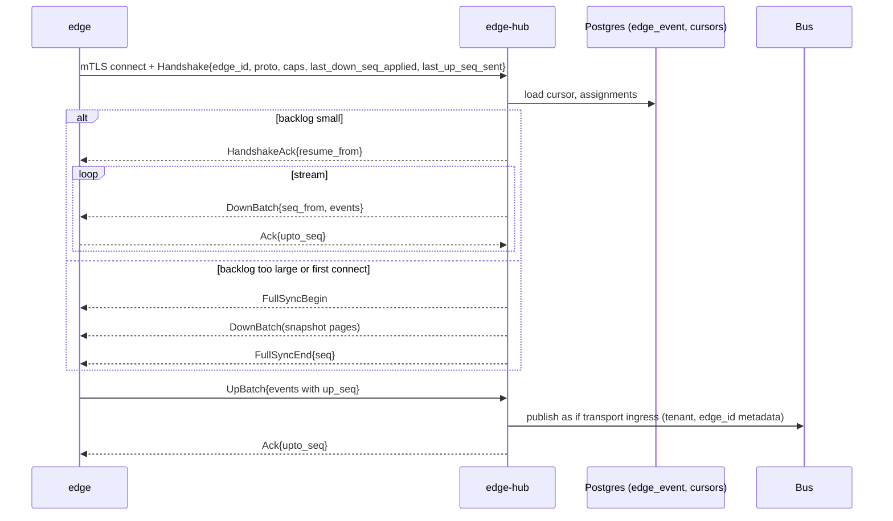

# Service 22 — Edge Hub (`edge-hub`, cloud side of edge sync)

> **Stage:** 9 · **Binary:** `cmd/edge-hub` · **Scales by:** number of connected edges (one stream each) · **State:** per-edge cursors in Postgres, stream leases in Redis · **Priority:** P1

## 1. Purpose
Cloud control plane for edges: **enroll** edges, **assign** cloud entities to them, **stream configuration down** (devices, profiles, rule chains, dashboards, SCADA tags…), **ingest data and events up**, track health, and perform remote operations — correctly across arbitrary disconnections.

## 2. ThingsBoard reference (what we replicate)
- Edge is created on the server → **edge key + secret** → installed on the edge. One long-lived **bidirectional gRPC stream** (default port 7070) carries everything; handshake is a `ConnectRequestMsg` including protocol version.
- **Uplink:** edge persists events in a local `cloud_event` table; a *Cloud Manager* reads batches (default 50) and sends `UplinkMsg`; server replies `UplinkResponseMsg` (ack). Ordered delivery after reconnect.
- **Downlink:** entities assigned to an edge are written to a per-edge queue and sent as `DownlinkMsg`; edge replies `DownlinkResponseMsg`.
- `SyncRequestMsg(fullSync=true)` triggers re-push of all assigned entities, rule chains, dashboards, credentials. Message size default cap 4 MB. Rule nodes *push to cloud* / *push to edge* bridge rule engines. Newer versions: queue events in Kafka, edge clustering, secrets/encryption keys synced to edge.

## 3. iotp design


### 3.1 Enrollment and identity
1. Admin creates **Edge** (name, type, root rule chain template) → one-time **enrollment token** (TTL 24 h).
2. Edge presents token over TLS → hub's **internal CA** issues a **client certificate** (SPIFFE-style ID `spiffe://iotp/tenant/{t}/edge/{e}`), returned once; edge stores private key (TPM/secure element if present).
3. Subsequent connections use **mTLS**; certificates auto-renew at 2/3 lifetime over the stream; revocation = serial denylist checked at handshake and every 5 min.
4. TB-style routing-key/secret may be offered as a *compat mode* (secret stored as HMAC; rotate on demand).

### 3.2 Protocol (protobuf over gRPC)
```proto
service EdgeSync { rpc Stream(stream UpMsg) returns (stream DownMsg); }

message UpMsg { oneof m { Handshake handshake=1; Ack ack=2; UpBatch batch=3; Heartbeat hb=4;
                          FullSyncRequest sync=5; Metrics metrics=6; BlobChunk blob=7; } }
message Handshake { string edge_id=1; uint32 protocol_version=2; string edge_version=3;
                    repeated string capabilities=4; uint64 last_down_seq_applied=5; uint64 last_up_seq_sent=6; }
message UpBatch   { uint64 seq_from=1; repeated UpEvent events=2; }
message UpEvent   { uint64 seq=1; int64 ts=2; oneof e {
    TelemetryBatch telemetry=10; AttributesBatch attributes=11; AlarmEvent alarm=12;
    DeviceCreate device_create=13; RpcResponse rpc_response=14; RuleMsg rule_msg=15;
    EventBatch events=16; OtaStatus ota=17; ScadaEvents scada=18; } }

message DownMsg { oneof m { HandshakeAck hello=1; DownBatch batch=2; Ack ack=3; FullSyncBegin sync_begin=4;
                            FullSyncEnd sync_end=5; Command command=6; BlobChunk blob=7; } }
message DownBatch { uint64 seq_from=1; repeated DownEvent events=2; }
message DownEvent { uint64 seq=1; string action=2;      // UPSERT | DELETE | ASSIGN | UNASSIGN
                    string entity_type=3; bytes entity_id=4; uint64 entity_version=5; bytes body=6; }
message Ack       { uint64 upto_seq=1; uint32 code=2; string reason=3; }
```
Properties: **dense per-direction sequence numbers**; acks are cumulative; **at-least-once** with idempotent apply (`entity_version` guards stale downlinks; `up_seq` dedupes uplink). Max message 4 MB; larger payloads (OTA, images, report files) use `BlobChunk` with resumable offsets.

### 3.3 Assignment model
`edge_assignment(edge_id, entity_type, entity_id, via)` stores explicit assignments; the **resolver** computes the dependency closure: device → device profile → default rule chain(s) → referenced dashboards/resources/SCADA tags/UDTs/calculated fields/alarm rules → credentials. Reference counts (`via`) make unassign safe (entity removed from edge only when no assignment path remains). Assigning a **customer/asset subtree** can auto-include children by relation query (policy).

### 3.4 Downlink pipeline
`core` outbox events → **assignment filter** (is this entity assigned to edge X?) → `edge_event(seq, edge_id, …)` rows → stream pump reads `seq > cursor` in windows (≤ 200 events / 1 MB in flight), waits for acks, advances `edge_cursor.down_seq`.
**Compaction:** keep only the latest UPSERT per entity for events older than 5 min; if backlog > 50 k events or edge offline > 7 d → **fullSync** instead of replay.

### 3.5 Uplink pipeline
| Uplink event | Cloud handling |
|---|---|
| `TelemetryBatch`, `AttributesBatch` | Publish to ingress topics with `metadata.edge_id`; devices must belong to the edge's assigned set or be edge-created |
| `AlarmEvent` | Upsert alarm by `(originator,type)`; edge-origin flag; conflicts: cloud-ack wins on `ack/clear` timestamps |
| `DeviceCreate` | Create device under the edge's tenant/customer with the permitted profile; return credentials downlink |
| `RpcResponse`, `OtaStatus` | Route to `rpc` / `ota` services |
| `RuleMsg` (push-to-cloud node) | Inject into cloud rule engine with originator mapping |
| `EventBatch`, `ScadaEvents` | Audit/event store; SCADA alarm journal |
Dedup window: `(edge_id, up_seq)` persisted as `edge_cursor.up_seq` (monotonic) — anything ≤ cursor is re-acked and dropped.

### 3.6 Conflict policy
| Data class | Source of truth | Rule |
|---|---|---|
| Configuration entities | Cloud | Edge edits rejected unless entity flagged `edge_editable` (then LWW by `entity_version` with cloud arbitration) |
| Telemetry | Edge (origin) | Append-only, timestamp-keyed upsert |
| Server/shared attributes | Cloud (shared) / either (server) | Version vector `(version, writer)`; LWW with writer priority cloud > edge |
| Alarms | Both | Idempotent on `(originator,type)`; ack/clear = max timestamp |
| RPC | Cloud | Edge executes; response goes up |

### 3.7 Versioning and compatibility
`protocol_version` + `capabilities[]` negotiated at handshake. Hub supports **N-2** protocol versions; below that, handshake fails with an actionable error and (if the edge supports it) triggers self-upgrade command. Downlink bodies are protobuf messages with additive evolution (`buf breaking` in CI).

### 3.8 Flow control and scale
Per-stream credit window (bytes + events), gRPC keepalive (30 s), per-edge rate limits, bounded in-memory buffers. **Stream ownership:** consistent hashing of `edge_id` to hub instances via LB + Redis lease with fencing token (`lease:{edge}` → `{instance, gen}`); a second connection for the same edge replaces the first. Budget ≈ 30–50 KB per idle stream → 10 k edges/instance.

## 4. Management features
- **Status:** connected/last seen, protocol & edge versions, queue depths (up/down), resource metrics (CPU, mem, disk), link quality, clock skew.
- **Remote commands:** force sync, restart, collect logs, upgrade (OTA with health-gated rollback; see doc 23), rotate certs, open diagnostic tunnel (time-boxed, audited).
- **Templates:** edge rule-chain templates (root template with *push to cloud*), SCADA/alarm packs, default dashboards.
- **Edge groups & hierarchy (P2):** assign by group; edge-of-edge via hub-and-spoke (child edges connect to a parent hub endpoint).
- **Edge-specific widgets/pages:** connection health, backlog, replay controls.

## 5. Security
mTLS only; per-edge authorisation (assigned entities only); hub never sends other tenants' data; certificate pinning on edge; secrets/encryption keys synced only over the stream and sealed with the edge key; audit every enrollment/command; rate-limit enrollment endpoint; enrollment tokens single-use.

## 6. Observability
`iotp_edgehub_streams`, `…_down_lag_events{edge_class}` (bucketed, not per-edge), `…_up_events_total{type}`, `…_fullsync_total{reason}`, `…_ack_latency_seconds`, `…_reconnects_total`, `…_cert_expiring_total`. Alert on edges offline > threshold (feeds notification rules).

## 7. Testing
Network-partition simulation (toxiproxy: latency, loss, resets, half-open); property test: *for any interleaving of disconnects, applied downlink state converges and up-seq has no gaps/dupes*; soak with 5 k simulated edges; upgrade matrix N-2..N; large blob resume tests; cert rotation under load.

## 8. Task checklist
- [ ] Proto + `buf` + gRPC server skeleton, lease + fencing
- [ ] Enrollment + internal CA + cert renewal/revocation
- [ ] `edge_event`/cursor tables, pump with windows/acks, compaction
- [ ] Assignment resolver (closure + refcount) + policies
- [ ] Uplink handlers per event type + dedupe cursor
- [ ] FullSync snapshot pager
- [ ] Conflict handling + versioning rules
- [ ] Capability negotiation + N-2 support
- [ ] Remote commands + status/metrics API
- [ ] UI: edge list/detail/backlog/assign
- [ ] Partition/chaos/soak tests
