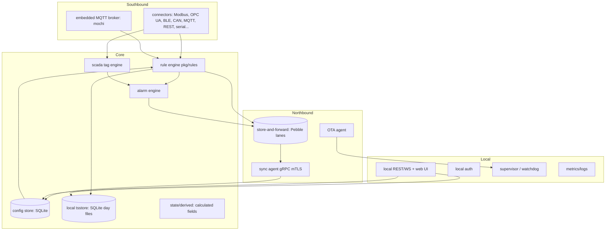

# Service 23 — Edge Runtime (`edge`)

> **Stage:** 9 · **Binary:** `cmd/edge` (single static Go binary, `linux/{amd64,arm64,arm}`) · **State:** local config DB + queues + time-series · **Priority:** P1 (core), P2 (clustering, hierarchy)

## 1. Purpose
A **lightweight autonomous platform node** deployed near devices (gateway PC, industrial PC, Raspberry-class board). It collects data from local devices and protocols, runs rules/alarms/SCADA logic locally, keeps working when the cloud is unreachable, and synchronises with `edge-hub` when it is.

## 2. Why not "a full copy of the platform"?
ThingsBoard Edge is a full instance (PostgreSQL required, JVM, own UI). It works, but resource use and upgrade logistics are heavy at fleet scale. iotp ships two profiles from one codebase:

| Profile | Contents | Target resources |
|---|---|---|
| **edge-lite (agent)** | connectors, local rules, store-and-forward, sync agent, OTA agent | ≤ 64 MB RSS, 1 core |
| **edge-full** | lite + local broker, local REST/WS API, embedded web UI, local dashboards/SCADA runtime, local alarm engine | ≤ 150 MB RSS for 10 k tags (ARM A53, 512 MB RAM min, 1 GB recommended) |

Startup < 3 s; binary ≤ 40 MB (UPX optional); no cgo (pure-Go SQLite via `modernc.org/sqlite`).

## 3. Module map

All "Core" modules are the **same Go packages** as the cloud (`pkg/rules`, `pkg/tsstore/sqlite`, `pkg/alarm`, `pkg/scada`, `pkg/connectors`) wired by a different composition root.

## 4. Storage layout (`/var/lib/iotp-edge`)
| Path | Engine | Content | Durability |
|---|---|---|---|
| `config.db` | SQLite (WAL, `synchronous=NORMAL`) | Synced entities (devices, profiles, rule chains, dashboards, tags, credentials), edge identity metadata | Rebuildable from cloud (except identity) |
| `queue/` | Pebble | Northbound store-and-forward lanes | fsync batched (group commit ≤ 20 ms) |
| `ts/ts_YYYYMMDD.db` | SQLite day files | Local time-series + latest | Retention = delete file |
| `state/` | bbolt | Cursors, dedupe windows, timers, alarm state | fsync |
| `secrets/` | files `0600` or TPM/secure element | Client key, cert, API tokens | Encrypted at rest (AES-GCM, key sealed to TPM if available) |

## 5. Store-and-forward queue (northbound)
**Lanes (priority order):** `L0 commands/acks & alarms`, `L1 events & state changes`, `L2 telemetry`, `L3 bulk (logs, files)`.
- Key: `q/{lane}/{seq(be64)}`; each event has `{type, ts, payload}`; `head` (next to send) and `acked` cursors per lane persisted atomically.
- Writer: group-commit batches (`pebble.Batch`, sync on timer or size).
- Sender: round-robin with weighted priority (L0 always first), sends windows over the stream, deletes via `DeleteRange` after cumulative ack.
- **Capacity policy** when disk quota reached: `L0` never dropped (alert + reserve space); `L1` drop-oldest after hard cap; `L2` **downsample** (min/max/avg per minute for numeric, last-state for others) then drop-oldest; `L3` drop-newest.
- Idempotency: each event carries `up_seq` assigned at enqueue; hub dedupes.
- Replay throttling after long outages (token bucket) to avoid saturating the uplink or the cloud.

```go
type Lane uint8
const (L0 Lane = iota; L1; L2; L3)

type Queue interface {
    Enqueue(ctx context.Context, lane Lane, ev Event) (seq uint64, err error)
    NextBatch(ctx context.Context, maxEvents, maxBytes int) ([]Event, error) // priority-aware
    Ack(uptoSeq uint64) error                                               // cumulative, per global seq
    Stats() QueueStats                                                      // depth, bytes, oldest age per lane
}
```

## 6. Sync agent loop
```go
func (a *Agent) Run(ctx context.Context) {
    bo := backoff.New(1*time.Second, 2*time.Minute, 0.3) // exp + jitter
    for ctx.Err() == nil {
        err := a.session(ctx) // dial mTLS, handshake, pump up/down until error
        a.metrics.Disconnected(err)
        select { case <-time.After(bo.Next()): case <-ctx.Done(): return }
    }
}
func (a *Agent) session(ctx context.Context) error {
    stream, err := a.client.Stream(ctx); if err != nil { return err }
    if err := a.handshake(stream); err != nil { return err }  // resume cursors
    g, ctx := errgroup.WithContext(ctx)
    g.Go(func() error { return a.pumpUp(ctx, stream) })       // queue -> stream, wait acks
    g.Go(func() error { return a.pumpDown(ctx, stream) })     // stream -> apply -> ack
    g.Go(func() error { return a.heartbeat(ctx, stream) })
    return g.Wait()
}
```
**Apply downlink transactionally:** write to `config.db` in one SQLite transaction per batch, bump `last_down_seq_applied`, *then* ack; hot-reload affected runtimes (rule chains, tags, connectors) after commit. Idempotent by `entity_version`.

## 7. Local intelligence
- **Rules:** edge rule chains (templates synced from cloud) executed by the same engine; nodes `push to cloud` (→ L1/L2 lane) and `push to edge` (cloud → edge RuleMsg downlink) available; script engines `expr` and WASM (no `goja` by default to save RAM).
- **Alarms:** device-profile/entity alarm rules evaluate locally; alarm events go to L0 with local timestamps; cloud reconciles.
- **SCADA:** tag engine, quality, deadband/compression, ISA-18.2 state machine, control with SBO — **fully local**; HMI served by the embedded UI. Commands issued from cloud arrive as L0 downlink and pass the same safety checks locally.
- **Calculated fields:** subset (simple/script/geofencing) evaluated locally.
- **Local MQTT broker:** devices on the plant network publish with the same TB-compatible topics → identical device firmware works against cloud or edge.
- **Local auth:** cached user directory (hashed, with offline token signing key) so operators can log in during an outage; permissions enforced locally.

## 8. Time handling
Monotonic clock for durations; wall-clock sanity via NTP/Chrony and **drift detection** against hub (`Heartbeat.server_ts`); RTC-less boards: queue stamps `boot_id + monotonic` and are corrected after first sync; samples tagged `ts_quality ∈ {synced, estimated}`; maximum accepted backward jump 2 s without alarm.

## 9. Self-update (A/B) and watchdog
- Layout: `/opt/iotp/{current,previous,staging}`; supervisor (tiny separate binary or systemd) runs `current`.
- Update: download to `staging` (resumable, verify Ed25519 signature + SHA-256) → stop → atomic symlink swap → start → **health gate** (connect to hub, apply config, heartbeat OK within 2 min, no crash loop) → else **auto-rollback** to `previous` and report failure.
- Watchdog: systemd `WatchdogSec` + internal liveness (event-loop ticks); crash-loop breaker (3 crashes/10 min → rollback or safe mode: connectors only).
- Config drift: local config is derived; if `config.db` corrupt → rebuild via fullSync.

## 10. Security
Outbound-only connectivity (no inbound ports needed except optional local ones on the plant LAN); mTLS identity; secrets sealed to TPM/secure element when available, else file key with OS permissions; optional LUKS disk encryption; local API bound to LAN with TLS and rate limits; **diagnostic tunnel** is outbound, time-boxed, audited; signed updates only; minimal container/OS surface (distroless/static); SBOM published.

## 11. Observability
Local Prometheus endpoint + rotating JSON logs (size-capped); compressed **health snapshot** every 60 s to L1 (queue depth/age per lane, connector status, CPU/mem/disk, clock skew, tag counts, alarm counts). Remote log fetch command; crash dumps captured (last 1 MB log + goroutine dump).

## 12. Packaging
Static binaries via goreleaser; `.deb/.rpm/.apk`, systemd unit, Docker image (distroless), Yocto/Buildroot recipe notes; provisioning flow: install package → set enrollment token (file/env/QR) → first-boot enroll → cloud pushes config.

## 13. Testing
- **Power-loss:** randomised `kill -9` and `echo b > /proc/sysrq-trigger` loops during writes; assert no corrupted DB, no lost L0/L1 events, queue replays exactly once after dedupe.
- Offline soak: 72 h disconnected at 5 k tags/1 Hz → verify disk caps, downsampling, ordered drain.
- Constrained hardware CI (QEMU ARM, cgroup memory limits at 128/256 MB).
- Connector simulators (Modbus, OPC UA) with fault injection; clock-jump tests.

## 14. Task checklist
- [ ] Composition root + profiles (lite/full), config loader
- [ ] `config.db` schema + transactional downlink apply + hot reload
- [ ] Pebble lane queue + group commit + capacity policies + downsampler
- [ ] Sync agent (handshake, pumps, backoff), cert enrollment/renewal
- [ ] Embed `pkg/rules`, alarm, scada, connectors, tsstore/sqlite
- [ ] Local broker + API + auth + embedded UI bundle
- [ ] Time quality handling
- [ ] A/B updater + supervisor + rollback + signing
- [ ] Health snapshot, remote commands (logs, restart, tunnel)
- [ ] Packaging (deb/rpm/docker), provisioning flow
- [ ] Power-loss, offline-soak, constrained-hardware tests
