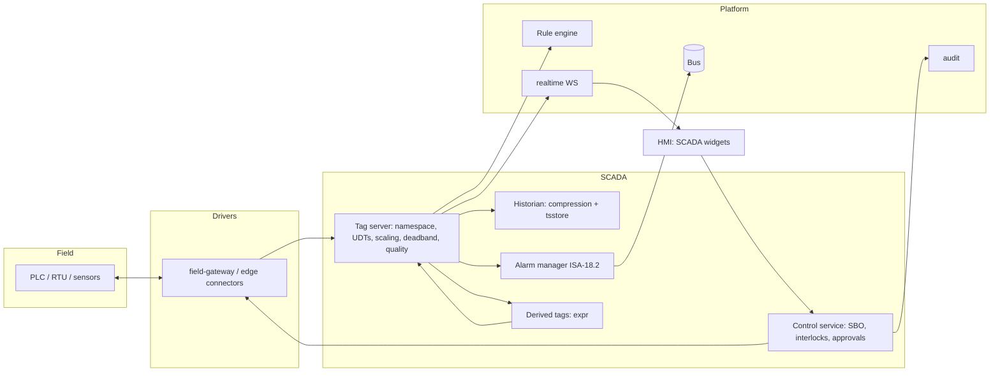
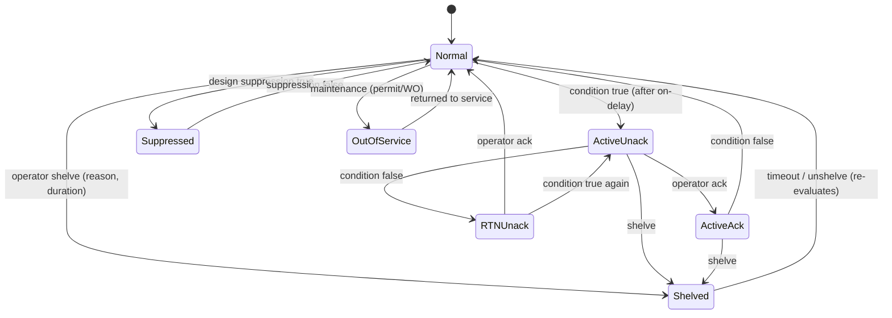
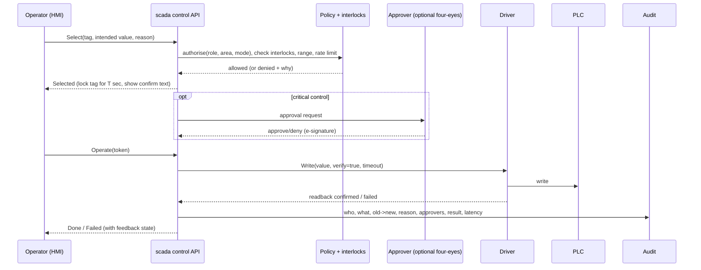

# Service 24 — SCADA Subsystem (`scada`)

> **Stage:** 10 · **Binary:** `cmd/scada` (library `pkg/scada` also embedded in `edge`) · **Priority:** P2 differentiator (visual layer P1 in `frontend/04`)

## 1. Purpose
Add **real SCADA semantics** on top of the IoT core: a tag server with quality and engineering units, driver management, a historian with compression, ISA-18.2-style alarm management, safe control (select-before-operate, interlocks, four-eyes), and HMI binding — usable in the cloud and fully autonomous on the edge.

## 2. ThingsBoard reference and the gap
ThingsBoard SCADA (3.8+) = SVG **symbols** with *tags* (named SVG elements), *behaviors* (value/action/widget-action) and *properties*; a SCADA dashboard layout (fixed column grid); 100+ built-in symbols; high-performance variants. It binds symbols to entities' telemetry/attributes and RPC.
**It does not provide:** a tag namespace/server, quality codes, a driver layer beyond the IoT Gateway, ISA-18.2 alarm lifecycle (shelve/suppress/flood KPIs), select-before-operate control workflows, historian compression, redundancy, recipes. → our differentiation.

## 3. Architecture

Tags are **first-class entities** (`scada_tag`) that *bind to* a device key (so the generic platform — rules, dashboards, alarms — still works on the same data).

## 4. Tag model
```go
type Quality uint32 // OPC UA-compatible StatusCode: top 2 bits => Good(00) / Uncertain(01) / Bad(10)

type Tag struct {
    ID, TenantID uuid.UUID
    Path        string        // "Plant1/AreaA/Line2/Pump1/Speed" (hierarchical namespace)
    Type        DataType      // Bool, Int32, Int64, Float32, Float64, String, Enum, Array
    Unit        string        // UCUM/QUDT id
    Scaling     *Scaling      // raw[min,max] -> eng[min,max]; linear | sqrt | table
    Deadband    Deadband      // abs | percent-of-range | none
    Limits      Limits        // LL, L, H, HH, ROC, range clamp
    Source      Source        // driver binding: protocol, address, scan class, access R|W|RW
    Historize   HistPolicy    // none | on-change | periodic | deadband | swinging-door(tol)
    UDTInstance *UDTRef       // template instance + parameter bindings
    Expr        string        // for derived tags
    Alarms      []AlarmDef    // per-tag alarm definitions (ISA-18.2 properties)
    Control     *ControlDef   // writable? SBO? interlocks? approvals? confirm text?
}
type Sample struct { Tag uuid.UUID; V Value; Q Quality; SourceTs, ServerTs int64 }
```
**UDTs (templates):** parametrised sets of tags/alarms/faceplates (Pump: `Speed`, `Run`, `Fault`, `Cmd.Start`…) with inheritance and per-instance overrides; instantiate 500 pumps from one definition; edit once → all instances update.
**Quality propagation:** derived tags inherit the *worst* input quality; stale-data detection marks `Uncertain/LastUsable` after `staleAfter`; comm loss → `Bad/NotConnected`.

## 5. Drivers and scan classes
Drivers are `pkg/connectors` (Modbus TCP/RTU, OPC UA client, S7, EtherNet/IP, MQTT incl. **Sparkplug B**, BACnet, IEC 60870-5-104, DNP3 as available) with a unified interface:
```go
type Driver interface {
    Connect(ctx context.Context, cfg json.RawMessage) error
    Subscribe(ctx context.Context, items []Item, onChange func([]Sample)) error   // report-by-exception when protocol supports
    Read(ctx context.Context, items []Item) ([]Sample, error)
    Write(ctx context.Context, w Write) (WriteResult, error)                     // with verify + timeout
    Status() DriverStatus
}
```
**Scan classes** (e.g., `fast=250 ms, normal=1 s, slow=10 s`) group polling; subscription preferred (OPC UA monitored items, Sparkplug). Block-read optimisation for Modbus (coalesce contiguous registers). **OPC UA server mode** exposes the tag namespace to third parties (read-mostly; secured).

## 6. Historian
- Samples enter `tsstore` through a **compression stage** per tag policy: *deadband*, *on-change*, *periodic*, or **swinging-door trending** (tolerance in eng units) which stores only points needed to reconstruct the signal within tolerance.
- Raw side-store for 24 h (optional) so compression settings can be tuned retrospectively.
- Interpolation on read (step for discrete, linear for analog), **time-aligned multi-tag queries**, aggregates (min/max/avg/integral/time-weighted avg), quality-aware (exclude Bad by default).
- Late/out-of-order samples accepted within a window; edge backfill merges by `(tag, ts)`.

## 7. Alarm management (ISA-18.2 / EEMUA 191 aligned)
**Alarm properties (rationalisation fields):** priority (Critical/Major/Minor/Advisory), classification, consequence, expected operator response, response time, corrective action, area/zone, on-delay, off-delay, deadband, repeat/chatter suppression, design-suppression condition.

**State machine**

**Rules:** shelving requires permission + reason + max duration, auto-unshelve; out-of-service requires work-order/permit reference and is audited; **first-out** detection groups cascading alarms by causal window; **alarm flood** detection (> 10 alarms/10 min/operator) triggers suppression suggestions; **KPIs** per EEMUA 191 (avg alarms/operator/hour, peak 10-min count, stale alarms > 24 h, chattering top-N, % time in flood, priority distribution) in a built-in report.
**Mapping to platform alarms:** the generic `alarm` row stores `isa_state`; ACTIVE/CLEARED × ACK semantics remain available for generic consumers; SCADA UI uses the richer state.

## 8. Control and safety

**Controls:** permission by *(role × area × tag class)*; control modes (**Auto / Manual / Maintenance / Lockout**); interlock expressions (`expr`) referencing other tags; value range/step/rate-of-change limits; selection timeout (default 10–30 s); duplicate-command suppression; write **verification** (readback within tolerance) and **pending/confirmed/failed** feedback tags; command authority arbitration between cloud and edge (edge-local lock wins during outage; reconcile on reconnect).
**Recipes:** versioned setpoint sets with approval workflow; download as a transactional multi-write with rollback on partial failure.

## 9. HMI binding (see `frontend/04-scada-hmi-editor.md`)
Symbols bind to **tag paths** (not raw device keys); animation expressions reference tag value/quality/alarm state; faceplates open UDT-specific popups; operator actions call the control API (never raw RPC). Alarm banner, summary, and history views come from `ALM`.

## 10. Redundancy and resilience
Active/standby `scada` instances (lease + heartbeat) with state replication of tag values/alarm states via the bus; driver ownership follows the active node; **edge** nodes run autonomously and re-sync journals (alarm history, SOE) on reconnect; **Sequence-of-events (SOE)** records with source-timestamp precision (ms or better where the protocol provides).

## 11. Security (IEC 62443 / Purdue-aware)
Outbound-only edge connections; OT network segmentation guidance (L0–L2 local, L3.5 DMZ via edge, L4–5 cloud); OPC UA `Basic256Sha256` / `Aes128_Sha256_RsaOaep` policies with certificate trust lists; per-driver credentials in secrets store; control actions require recent re-auth (step-up) for critical tags; full audit with tamper-evident chain; optional 21 CFR Part 11 e-signatures; deny-by-default write permissions.

## 12. Data model (excerpt)
```sql
CREATE TABLE scada_tag (
  id uuid PRIMARY KEY, tenant_id uuid NOT NULL, path text NOT NULL, data_type text NOT NULL,
  unit text, scaling jsonb, deadband jsonb, limits jsonb, source jsonb, historize jsonb,
  udt_id uuid, udt_params jsonb, expr text, control jsonb, bound_device_id uuid, bound_key text,
  version integer NOT NULL DEFAULT 1, UNIQUE (tenant_id, path)
);
CREATE TABLE scada_udt (id uuid PRIMARY KEY, tenant_id uuid NOT NULL, name text NOT NULL, definition jsonb NOT NULL, version integer NOT NULL);
CREATE TABLE scada_alarm_def (id uuid PRIMARY KEY, tag_id uuid NOT NULL, kind text NOT NULL, priority text NOT NULL,
  setpoint jsonb, on_delay_ms int, off_delay_ms int, deadband jsonb, rationalization jsonb, suppress_expr text);
CREATE TABLE scada_control_log (id uuid PRIMARY KEY, ts bigint NOT NULL, tenant_id uuid NOT NULL, tag_id uuid NOT NULL,
  user_id uuid, old_value jsonb, new_value jsonb, reason text, approvers uuid[], result text, latency_ms int, hash bytea, prev_hash bytea);
CREATE TABLE scada_alarm_event (id uuid, ts bigint, tenant_id uuid, tag_id uuid, kind text, from_state text, to_state text, user_id uuid, value jsonb, PRIMARY KEY (id, ts)) PARTITION BY RANGE (ts);
```

## 13. Scale targets
200 k tags / 20 k updates/s per cloud node; 10 k tags / 2 k updates/s on a 1 GB edge; alarm evaluation < 5 ms p99 per update; HMI screen with 1 000 animated elements at 30 fps on a mid-range laptop.

## 14. Validation
FAT/SAT checklists generated from tag/alarm/control definitions; simulation driver (replayable scenarios) for training and regression; alarm KPI baselines; chaos tests (driver flaps, clock jumps, duplicate commands, partition between cloud and edge during a control action).

## 15. Task checklist
- [ ] Tag model, namespace API, UDT engine, bindings to device keys
- [ ] Quality model + stale/comm-loss handling; derived tags (`expr`)
- [ ] Driver SPI + Modbus/OPC UA/Sparkplug first; scan classes; write path
- [ ] Historian: compression (deadband, SDT), interpolation, aggregates
- [ ] ISA-18.2 alarm manager + shelving/suppression/OOS + KPI reports
- [ ] Control service: SBO, interlocks, approvals, verify, feedback, audit chain
- [ ] OPC UA server (read-mostly), Sparkplug host application
- [ ] HMI integration contracts + alarm banner/summary APIs
- [ ] Redundancy + edge reconciliation + SOE
- [ ] Recipes with approval workflow
- [ ] Security hardening + FAT/SAT generator + simulation driver
