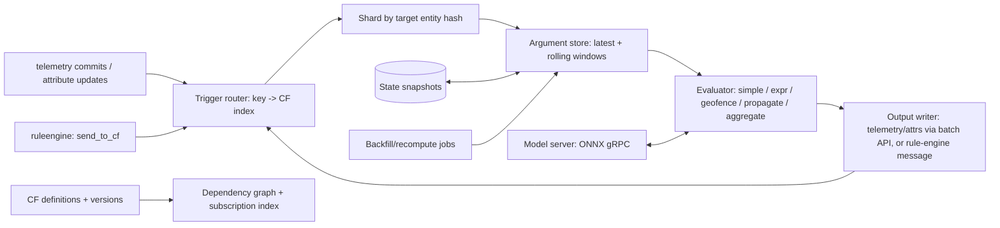

# Service 25 — Analytics: Calculated Fields, Stream Analytics, ML (`analytics`)

> **Stage:** 11 · **Binary:** `cmd/analytics` (calculated-field engine also embedded in `edge`) · **State:** partitioned memory + snapshots · **Priority:** P1 (calculated fields), P2 (anomaly, forecasting, AI)

## 1. Purpose
Produce **derived data** from raw telemetry/attributes: per-entity calculated fields, relation-based aggregation/propagation, geofencing state, windowed stream analytics, anomaly detection, forecasting and model scoring — and help users author them (AI-assisted).

## 2. ThingsBoard reference
- **Calculated fields (4.0+; expanded in 4.3):** defined on a device/asset (or profile); **arguments** = attribute, latest telemetry, or **time-series rolling window**; types **SIMPLE** (one expression), **SCRIPT** (multi-step, multiple outputs), **GEOFENCING** (INSIDE/OUTSIDE state and ENTERED/LEFT events against zone groups), **PROPAGATION** (copy/transform values up/down a relation path), **RELATED_ENTITIES_AGGREGATION** (min/max/avg/sum/count across related entities), **ENTITY_AGGREGATION** (across all entities of a profile). **Output:** telemetry or attribute; **output strategy** can write directly to storage bypassing rule chains; rule node *Send to calculated fields* chains CFs; AI-assisted configuration; debug + test-expression tooling.
- **AI request rule node (4.2)** for LLM calls from rule chains. **Trendz** = separate analytics product (we cover a subset natively).

## 3. Architecture


## 4. Calculated-field model
```go
type CalculatedField struct {
    ID, TenantID uuid.UUID
    Name         string
    Scope        Scope            // ENTITY | PROFILE
    Target       EntityRef        // or profile id
    Type         CFType           // SIMPLE | SCRIPT | GEOFENCING | PROPAGATION | REL_AGG | ENTITY_AGG
    Arguments    map[string]Arg   // name -> {kind: ATTR|LATEST_TS|TS_ROLLING, entity: self|related, key, scope, window, limit, default}
    Expression   string           // expr program (SIMPLE/SCRIPT)
    Output       Output           // {kind: TELEMETRY|ATTRIBUTE(scope), key mapping, unit, decimals, strategy: RULE_ENGINE|DIRECT, ttl}
    Config       json.RawMessage  // type-specific (zones, relation path, aggregation fns)
    Debug        DebugSettings
    Version      int
}
```
**Evaluation triggers:** any argument key change on the target (or related entities for propagation/aggregation); explicit *send_to_cf*; schedule (optional "every N s" for time-based windows); definition change (recompute).
**Semantics**
- **Event-time:** output `ts` = max input `ts` (or configured); late data within `latenessMs` (default 60 s) re-evaluates and upserts; older data requires explicit backfill.
- **Rolling windows:** per `(entity, key)` ring buffers sized by `limit`/`window`, rebuilt from the time-series store on assignment, trimmed on arrival; memory-bounded per tenant.
- **Idempotent outputs:** deterministic `(entity, key, ts)`; DIRECT outputs go through the batch write API (same dedupe/strategies as ingestion).
- **Dependency graph:** CF outputs may feed other CFs (**DAG enforced**; cycles rejected at save; max depth 8; each hop increments a counter).
- **Quotas:** per-tenant max CFs, max evaluations/s, max window memory; budget exhaustion → CF auto-paused + notification.

### Type specifics
| Type | Behaviour | Notes |
|---|---|---|
| SIMPLE | `expr` arithmetic over named args (`(a - b) / c`), null handling policy (skip/zero/last) | compiled once, typed |
| SCRIPT | `expr` program with local variables, conditionals, windows (`avg(window('temp'))`), multiple outputs | sandboxed, no I/O |
| GEOFENCING | Inputs: lat/lon (+ optional accuracy); zones from attributes/relations/geo-assets (polygon/circle); outputs: per-zone `INSIDE|OUTSIDE` state key + `ENTERED/LEFT` events with debounce (`minInsideMs`, `minOutsideMs`, hysteresis meters) | R-tree index per zone group; handles anti-meridian; event → rule-engine message |
| PROPAGATION | Path (e.g. `device <-Contains- asset <-Contains- site`), direction up/down, value transform (`expr`), conflict policy (last/avg/min/max), optional by-profile filter | incremental via change events |
| REL_AGG | Aggregations over related entities (min/max/avg/sum/count/last/first), optional filter, freshness window (exclude stale children) | **incremental accumulators** per parent (sum/count add/remove); recompute on relation change or periodic reconcile |
| ENTITY_AGG | Aggregate across all entities of profile/tenant (e.g. fleet average) | sharded partial aggregates merged on a schedule (1–60 s) |

## 5. Stream analytics (P2)
- **Windows:** tumbling, sliding (hop), session (gap) over event time with **watermarks** (late tolerance) — implemented in-process for small windows and via **TimescaleDB continuous aggregates / ClickHouse materialised views** for heavy ones (declarative `CREATE ANALYTIC` abstraction generates the DDL).
- **Joins:** latest-of-B joined to stream A by entity/relation; reference-data enrichment.
- **Patterns (CEP-lite):** sequences within a time bound (`A then B within 5m`), absence patterns — emit rule-engine messages or alarms.
- **KPI library:** OEE (availability × performance × quality), MTBF/MTTR, energy intensity, load factor, degree-days — shipped as parametrised CF/analytic templates (see solution templates, doc 26).

## 6. Anomaly detection and forecasting (P2)
| Capability | Approach |
|---|---|
| Point anomalies | Rolling z-score, **MAD**, EWMA control charts; per-signal baselines with seasonality-aware bands (hour-of-week profiles) |
| Seasonal/trend | STL decomposition residuals; Holt-Winters |
| Change points | CUSUM/Page-Hinkley; PELT in batch |
| Multivariate | Isolation forest/autoencoder via **ONNX models** served by a `model-server` sidecar (gRPC, batching, GPU optional) |
| Forecasting | Holt-Winters/ARIMA in Go for light cases; Prophet/NeuralProphet/LightGBM via model server batch jobs; outputs written as future-dated telemetry (`key_forecast`) with confidence bands |
| Alerts | Anomaly score key → alarm rule (`score > 0.8 for 5 min`) — keeps one alarm pipeline |
**Model registry:** `model(id, name, version, framework, input_schema, output_schema, artifact_uri, metrics, status{draft,shadow,active})`; **shadow mode** runs a candidate alongside the active model and records divergence; rollbacks one click; training is **external** (notebooks/pipelines) — we provide **point-in-time feature export** (no leakage) and a scoring API.

## 7. AI-assisted authoring (P2, human-in-the-loop)
- **Natural language → draft artefacts:** "alert when pump vibration > 7 mm/s for 5 minutes, notify the maintenance team" → LLM with *tool schemas* (alarm rule JSON schema, CF schema, rule chain schema, dashboard schema, entity/key discovery tools) → **draft** shown in a diff/preview with test-on-history; user approves → saved as normal versioned entities. No auto-activation.
- **Explainers:** "why did this alarm fire?" → assemble rule, input series window, state trace → LLM summary with links.
- **Guardrails:** tenant opt-in, model/provider allow-list (incl. self-hosted), **PII/secret redaction** before prompts, token/cost budgets per tenant, prompt/response audit (hashed or stored per policy), deterministic validation of generated JSON against schemas, sandboxed test runs only.
- **Rule node `external.ai_request`:** prompt template + structured-output schema + timeout + budget; output validated before continuing.

## 8. Data model (excerpt)
```sql
CREATE TABLE calculated_field (id uuid PRIMARY KEY, tenant_id uuid NOT NULL, name text NOT NULL, type text NOT NULL, scope text NOT NULL,
  target_type text NOT NULL, target_id uuid NOT NULL, definition jsonb NOT NULL, enabled boolean NOT NULL DEFAULT true,
  schema_version smallint NOT NULL DEFAULT 1, version int NOT NULL DEFAULT 1, UNIQUE (tenant_id, target_id, name));
CREATE TABLE cf_state_snapshot (cf_id uuid, entity_id uuid, state bytea, updated_ts bigint, PRIMARY KEY (cf_id, entity_id));
CREATE TABLE cf_backfill_job (id uuid PRIMARY KEY, cf_id uuid, from_ts bigint, to_ts bigint, status text, progress real, created_time bigint);
CREATE TABLE model (id uuid PRIMARY KEY, tenant_id uuid NOT NULL, name text NOT NULL, version int NOT NULL, framework text, io_schema jsonb, artifact_uri text, status text, metrics jsonb);
```

## 9. API
`CRUD /calculatedFields`, `POST /calculatedFields/test` (sample inputs/series → outputs + trace), `POST /calculatedFields/{id}/backfill`, `GET /calculatedFields/{id}/debug`, `CRUD /models`, `POST /models/{id}/score`, `POST /ai/draft` (NL → artefact draft), `GET /analytics/kpis`.

## 10. Observability
`iotp_cf_evals_total{type,result}`, `…_eval_seconds{type}`, `…_window_bytes`, `…_lag_seconds`, `…_paused_total{reason}`, `…_backfill_rows_total`, `iotp_ml_score_seconds{model}`, `iotp_ai_tokens_total{provider}`. Debug traces per CF (inputs, outputs, duration) with sampling.

## 11. Testing
Deterministic evaluator tests with event-time fixtures (late/out-of-order); property tests (aggregation incremental = recompute from scratch); geofence edge cases (poles, anti-meridian, jitter); backfill idempotency; load: 200 k evals/s/node for SIMPLE; ML scoring p99 < 50 ms with batching; prompt-injection tests for AI authoring (must never execute actions).

## 12. Task checklist
- [ ] CF model + registry + index + DAG validation
- [ ] Argument store (latest + rolling windows) + snapshots + rebuild
- [ ] SIMPLE/SCRIPT evaluator (`expr`) + outputs (DIRECT/RULE_ENGINE)
- [ ] GEOFENCING, PROPAGATION, REL_AGG, ENTITY_AGG
- [ ] Backfill/recompute jobs; quotas; pause/notify
- [ ] Test/debug APIs + UI tooling
- [ ] Stream windows/CEP-lite; KPI templates
- [ ] Anomaly detectors; model registry + model server; forecasting
- [ ] AI authoring + `external.ai_request` with guardrails
